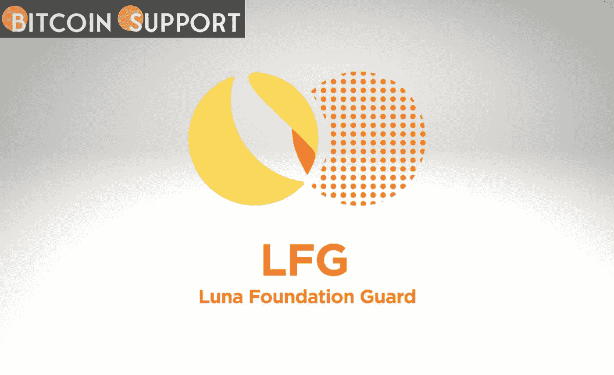

# LFG 将投资 15 亿美元加强与美元的挂钩，并建立 BTC 储备

> 原文：<https://medium.com/coinmonks/lfg-will-invest-1-5-billion-to-strengthen-the-usd-peg-and-establish-btc-reserves-52bd04ec2f5e?source=collection_archive---------46----------------------->

**For full blog visit:-**[**https://bitcoinsupports.com/lfg-will-invest-1-5-billion-to-strengthen-the-usd-peg-and-establish-btc-reserves/**](https://bitcoinsupports.com/lfg-will-invest-1-5-billion-to-strengthen-the-usd-peg-and-establish-btc-reserves/)

LFG 表示，最初将向场外交易公司贷款价值 7.5 亿美元的 BTC，以管理资本和“帮助保卫”UST。在本周比特币(BTC)和更广泛的加密市场严重下跌之后，卢纳基金会卫队(LFG)将部署价值 15 亿美元的资金来“帮助保护”泰拉美元与美元的挂钩。

作为 Terra (LUNA)生态系统的一部分，总部设在新加坡的组织 LFG 受托担保该网络的算法稳定货币 UST，以维持其与美元的挂钩，并管理该网络的储备。

LFG 今天早些时候在推特上表示，它将首先向场外交易公司贷款价值 7.5 亿美元的 BTC，以便管理和交易这些资金。为了重新平衡其储备，一旦市场平静下来，LFG 将获得 7 . 5 亿 UST 贷款，很可能来自 Terraform Labs。LFG 补充说，在注意到过去几天 BTC、UST 和卢纳的“巨大”市场波动后，委员会决定实施这一战略。

[https://twitter.com/LFG_org/status/1523512201088143360](https://twitter.com/LFG_org/status/1523512201088143360)

Terraform Labs 的创始人道权(Do Kwon)在推特上解释说，“LFG 并没有试图清算其比特币头寸”，最终是利用短期内的资本在短期内提振 UST，以便从长期来看增加其在 BTC 的持股。

**“虽然美国国债的买卖目前没有明显的方向性，但我们认为在当前市场中拥有可用于部署的资金是有利的。随着市场复苏，我们打算在 BTC 偿还贷款，从而扩大我们的总储备。”**

[https://twitter.com/stablekwon/status/1523532474860539905](https://twitter.com/stablekwon/status/1523532474860539905)

由于 LFG 29.1 亿美元的储备大部分由 BTC 支持(91%或 27 亿美元)，资产价值的下降要求该组织重新平衡其财政，以保持 UST 的联系汇率。在撰写本文时，BTC 价格在过去一周下降了 12.7%，约为 33，600 美元，而 UST 价格略低于 0.99 美元。Terra 的本土资产 LUNA 在过去一周也遭受了严重损失，暴跌 24.5%，至 62.15 美元，该资产通过燃烧和铸造过程为维持 UST 的联系汇率做出了贡献。

**完整博客访问:-**[**https://bitcoinsupports . com/LFG-will-invest-1-50 亿-to-strength-the-USD-peg-and-establish-BTC-reserves/**](https://bitcoinsupports.com/lfg-will-invest-1-5-billion-to-strengthen-the-usd-peg-and-establish-btc-reserves/)

**免责声明:以上为作者观点，不应视为投资建议。读者应该自己做研究。**

> 加入 Coinmonks [电报频道](https://t.me/coincodecap)和 [Youtube 频道](https://www.youtube.com/c/coinmonks/videos)了解加密交易和投资

# 另外，阅读

*   [最佳比特币保证金交易](/coinmonks/bitcoin-margin-trading-exchange-bcbfcbf7b8e3) | [萝莉点评](/coinmonks/lolli-review-e6ddc7895ad8) | [比特币保证金交易](https://coincodecap.com/bityard-margin-trading)
*   [创造并出售你的第一个 NFT](https://coincodecap.com/create-nft) | [密码交易机器人](https://coincodecap.com/best-crypto-trading-bots)
*   [如何在 CoinDCX 上购买柴犬(SHIB)币？](https://coincodecap.com/buy-shiba-coindcx)
*   [CBET 评论](https://coincodecap.com/cbet-casino-review) | [库科恩 vs 比特币基地](https://coincodecap.com/kucoin-vs-coinbase) | [拜比特 vs 比特币基地](https://coincodecap.com/bybit-vs-coinbase)
*   [折叠 App 回顾](https://coincodecap.com/fold-app-review) | [LocalBitcoins 回顾](/coinmonks/localbitcoins-review-6cc001c6ed56) | [Bybit vs 币安](https://coincodecap.com/bybit-binance-moonxbt)