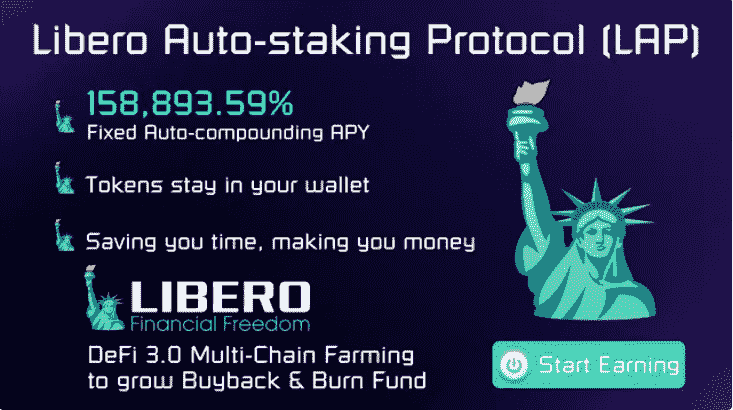
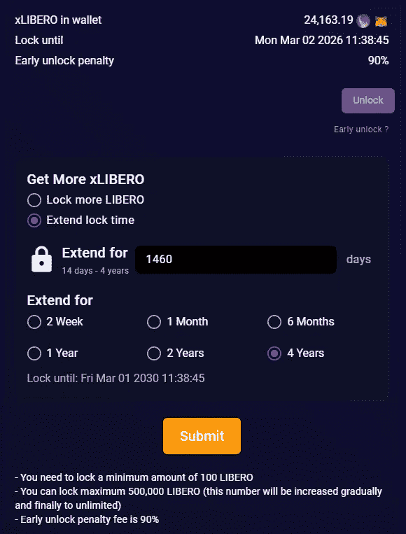
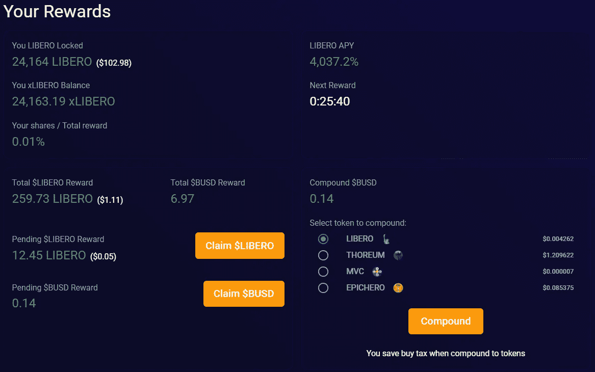

# libero Financial——无人谈论的隐性被动收入 DeFi gem

> 原文：<https://medium.com/coinmonks/libero-financial-hidden-passive-income-defi-gem-no-one-is-talking-about-90222b9ca877?source=collection_archive---------2----------------------->

DeFi 继续用被动收入机会让我大吃一惊——我最近写了一篇短文，讲述了我如何通过滴滴、滴滴花园、Titano 和动物农场迅速接近每天 500 美元的被动收入——结果却花了一个月的时间搜索风景，试图找出下一个不会包括隐性通胀、违规或不良合同的大项目。

我绝对不想成为在媒体或社交媒体上推广糟糕项目的人，这就是为什么我上个月一直在看《自由金融》,等着看这是一个时尚的抽水和倾倒还是合法的被动收入机会。在 Titano 呆了三个月，在 Libero 呆了一个多月，我很乐意和每个人分享这个机会。让我们进入细节:

# **什么是自由金融？**

简而言之，它是流行的 Titano finance 自动下注协议的一个分支。

为了让您了解一些关于 Libero 的趣闻，以下是他们白皮书中的几个要点:

*   **简单安全** —当您购买$LIBERO 时，我们会为您的钱包提供自动赌注。无需将您的代币移至我们的网站。从你购买的那一分钟起，你就被下注了，并开始接受 rebase 奖励。DeFi 中最简单的自动赌注。
*   **158，893.59% APY，所有区块链中最高的固定 APY**—浮动的年息意味着你永远不知道你会收到多少代币。其他 DeFi 协议支付的 APY 很高，一天内可能波动 90%。LAP 向$LIBERO 持有者支付 2.04%的固定日利率或 158，893.59%的年复利，这是行业最高水平。
*   **每 30 分钟快速重置基础奖励。**其他流行的赌注协议每 8 小时支付一次基础奖励，这意味着如果你想取消赌注，你必须计时以获得最大奖励。Libero 自动赌注协议每 30 分钟支付一次，即每天支付 48 次，这使它成为加密中最快的自动赌注协议。
*   **Defi 3.0 支持的底价多链养殖利润:**我们将使用购买&销售税来创建无风险价值基金和多链养殖的国库基金。RFV 基金与其他 EVM 兼容的区块链相连接，如 Avalanche、Fantom、Solana、Metis、Polygon 等。在最高的 APY 农场耕种，利润归 RFV 基金所有。我们的目标是每年提供约 50%或更多的额外回报，以更好地支持 LIBERO 价格下限。**我们有信心支持比其他高 APY 项目高 50%的 APY，同时保持可持续发展。**

点击查看完整的白皮书[。](https://docs.libero.financial/)

# **自由银行**

快进到他们的时间锁定赌注协议——Libero Bank——这是我写这篇文章的唯一原因，我想在没有人谈论它的时候抓住这个被动收入机会。在我向您详细介绍我在该协议中的体验之前，这里有一些摘自白皮书的关于 Libero Bank 的详细信息:

# 1.什么是自由银行？

*   您将 LIBERO(最多 4 年)锁定在 LIBERO 银行，以接收 xLIBERO token 作为收据
*   您锁定的时间越长，收到的 xLIBERO 就越多。
*   只要持有 xLIBERO，每天你都可以从 7%的 LIBERO 交易量中获得 BUSD 回报，外加 1.02%的 LIBERO 利息(自动复利为你获得 4，037.2%%的 APY)。
*   xLIBERO 持有人将获得其他利益，如未来的多连锁农场利润
*   xLIBERO 持有人可以在 LIBERO DAO 治理中就交易税变更等重要因素进行投票…
*   您可以提前解锁 xLIBERO，但 90%的锁定 LIBERO 将归当前 xLIBERO 持有者所有。

# 2.为什么自由银行是一个有助于自由系统长期发展的创新功能？

自由银行将在保持自由银行的长期可持续性方面发挥重要作用，为什么？

第一名。越多的人将他们的 Libero 锁定为 xLibero，通常从 2 周到 4 年，Libero 在流通中就越少。代币的价格基于供给/需求。因此 xLIBERO 有助于减少供应，更好地支持 LIBERO 价格。自由银行是一个创新的系统，目前没有其他固定的 APY 项目。

第二。锁定的自由人越多，印刷的新自由人就越少。因为当你将 LIBERO 锁定为 xLIBERO 时，你会从 7%的 LIBERO 交易量和大约 1.02%的 LIBERO 回报中获得 BUSD，每天的复合年回报率为 4037.2%。如果你不锁定你的自由，你将每天获得 2.04%的奖励。因此，50%的 LIBERO 少印为所有锁定 xLIBERO 意味着更少的通货膨胀。

第三。xLIBERO 是 LIBERO 持有者获得 BUSD 奖励的一种方式，因此他们不再需要出售他们的 LIBERO，否则他们将减少出售，以实现他们对 BUSD 的利润。因此，抛售压力越小，支撑价格越好。

第四。你可以看到，秘密营销正处于恐惧期，许多人会欣赏他们在 BUSD 的收入，因为它感到安全。在这个市场上奖励 BUSD 让 LIBERO 在潜在买家的眼中更有吸引力，增加购买压力和降低销售压力，这对项目的长期发展非常重要。

点击阅读完整白皮书[。](https://docs.libero.financial/libero-bank)

# **我在自由银行的经历**

让我们直接开始吧。

一旦进入平台，你会在“自由银行”标签中看到这个区域，在这里你可以选择购买自由银行后的时间锁定选项。我选择在四年内投入大约 24，000 个 libero，看看在不到 24 小时内我会产生什么样的 BUSD/xLIBERO 奖励。

不到 24 小时——这就是我看到的:259 libero 和大约价值 7 美元的 BUSD，来自大约 100 美元的投资——疯狂的回报！。从那里，你有机会要求奖励或复合回到协议免税！我选择认领 BUSD，把自由人放回协议中，以确保它起作用，它确实起作用了。

请注意，如果你选择在时间锁定结束前解锁你的股份，你将损失 90%的初始投资。

# **我对自由人的策略**

我对 Libero 的策略非常简单明了——每天申领我的$BUSD，将我通过银行赚取的所有 Libero 重新组合到协议中，并继续将我已经通过自动下注协议赚取的 Libero 的 50%放入 Libero 银行。

风险自负，但就像 Titano 一样，我认为这些自动下注协议类似于彩票，如果你愿意长期下注的话。具体到 Libero Bank，我目前没有在社交媒体上看到任何人谈论它，这就是为什么现在是这么低的市值的一个很好的切入点。巨大的增长空间！

# **自由银行推荐！**

如果最后没有推荐，这些文章有什么用处呢？

[https://libero . financial/ref = 0x 6 E3 f 93 Fe 43 c 88 af 7a 21167 BD 02 b 95 a 42 C1 BF 33 e 5](https://libero.financial/?ref=0x6e3F93fE43C88AF7a21167Bd02b95A42c1BF33E5)

如果你注册使用我的推荐代码，我会送你 1000 自由作为感谢！在这里给我留言或不和谐来确认你的推荐。

[**不和谐**](https://discord.gg/DhGNDdRUyk) :我的不和谐服务器刚刚上线！在这里 加入服务器 [**讨论滴滴、DeFi，以及任何与加密货币相关的东西。**](https://discord.gg/DhGNDdRUyk)