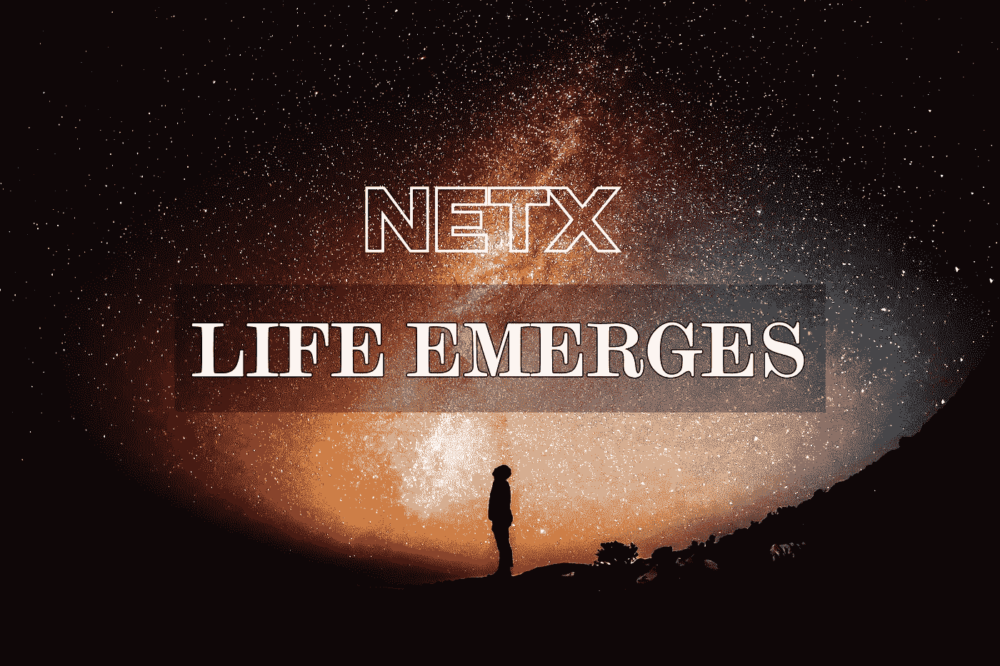

# 生命出现了

> 原文：<https://medium.com/coinmonks/life-emerges-9ebf26304cd4?source=collection_archive---------13----------------------->

第二章第一部分 Web 3.0 有机体正在崛起

TL；速度三角形定位法(dead reckoning)

*   有机体以两种截然不同的方式出现。
*   人类智慧用工具解决问题，推动人类进化。
*   Web 3.0 是人类文明走向失控的转折点。

点点滴滴汇成汹涌的深潭，一路奔腾不息。气流带来呼啸的风，穿过山脉和海洋。有机体从它的起源出现。万物的诞生也是如此。

> **什么是涌现？**

系统中的个体遵循简单的规则。新的属性或规则出现在系统层面，因为局部的相互作用促进了整个系统的诞生。量变之上的质变解释了涌现是如何发生的。它不干涉个人的规则，但也不能被那些规则证明是正当的。我们理解，当细胞分裂并分裂成树木、鲸鱼或人类时，所有的种类都会出现。但是生物体的范围和边界仍然很广。在上一篇文章中，我们为读者提供了《失控的 T4》一书和“蜂群思维”理论的简要概念。蜜蜂也会出现。对于两种不同的生物，它们的出现方式分为两个层次。

在第一个层次上，生物起源于分子间的相互作用，每个分子都遵循自己的物理法则。随着分子的聚集，原生生物超越了整个群体。生命并不反映在单个分子的物理属性中，单个分子无法给任何其他分子以秩序。所有的过程和奥秘都只能在系统相互作用的过程中被追溯。

在第二个层面上，一滴水不足以形成漩涡，就像一撮沙子不足以引发雪崩一样。涌现需要大量的实体、群众、集体、暴民等等。这种群体中的涌现形成了一个群体模型。在蚁群中，一只蚂蚁只能用它简单的神经系统进行简单的思考。然而，当大量蚂蚁相互作用时，就会形成一种等级制度。研究证明，蜂王不会直接给工蚁下达命令，没有一只蚂蚁知道整个王国的地图。简单的规则引导蚂蚁觅食、筑巢、分工等。蚂蚁王国是建立在整个蚁群基础上的新生事物。

总结一下，第一个层次是任何物种的出现，第二个层次是任何集体体系内生命形式的出现。其中，随着地球的进化，人类成为最重要的有机体。

> 人类社会内部出现了智能

今天，与 40 亿年前相比，已经出现了 3000 多万个新物种。我们相信人类不会是进化的最终形式。进化像无线电波一样在世界范围内传播和延伸。无论是人类还是其他物种，在过去的 40 亿年里，我们都有着相似的轨迹。然而，人类在所有物种中脱颖而出。人类文明引领我们，我们发明技术，探索未知。渐渐地，人类的智慧也随之而来。我同意这是人类进化的最终目的地。人类的智慧以最独特的方式创造了可能性和新的存在形式。

人类的智慧解决问题，但也面临挑战和障碍。人类通过工具、算法和数据打破壁垒。然而，这个概念应该有更广泛的含义。任何能让我们快速走出困境的机器或东西都属于这一类。

蒸汽机开创了蒸汽时代，蒸汽动力促进了机械工作。当电力照亮室内环境时，灯泡迎来了电力时代。计算机宣告了人类交流和社会互动变得更加容易的互联网时代。我不是物理学家。我只想强调计算机是如何极大地改变了我们的生活。计算机是高级智能的产物，也是人类进化的主要工具。在我看来，人类社会乃至世界范围内的生物最终将如何存在，将会在计算机的影响下显现出来。我们将以分散的方式工作，同时在物理和虚拟存在之间取得平衡。届时，人类文明将实现史诗般的飞跃。

> **Web 3.0 的出现**

进化从不停顿。电脑让人类的智慧在各方面大放异彩。以前的文章已经描绘了软件、区块链以及 Web 3.0 的轨迹，所有这些都是随着人类社会的前进而出现的。

文明终将失控。随着进化的发展，事物不断涌现。中央集权的世界将逐渐把火炬传递给去中心化。Web 3.0 不是生命的最终形式，它将迈出关键的一步，重塑权力/权威的拥有方式。蜜蜂随着花朵的开放而聚集。随着区块链技术的繁荣、比特币的流通和以太坊社区的震动，寻求者聚集在一起。渐渐地，社区一个接一个地萌芽。有的写代码，有的传播知识，有的社交，有的干脆存在。它们自己开发、提供和反映。这就是 Web 3.0 的出现。

** Web 3.0 有机体是什么样子的？我将在全新的一章《Web 3.0 有机体正在崛起》中阐述我对此的想法，这一章包括三个部分:这个新兴有机体的诞生、存在和我的思考。记得我们已经在 NetX 上发布了三篇文章(👇)?它们都属于第一章背景。我们试图以一种良好的连接方式将它们缝合在一起。每当进入一个新的篇章，我们都非常兴奋地分享我们的发现和想法。请加入我们的旅程！*

# 📚必读

[NetX 系列 1.1](/triaslab/rethinking-the-it-industry-d101384e801) | [NetX 系列 1.2](/coinmonks/a-letter-from-satoshi-nakamoto-345a45d012bb) | [NetX 系列 1.3](/coinmonks/out-of-control-the-post-it-evolution-dd64e05ff5bc)

***NetX，面向数字生活的可信可靠的智能自治系统链原生互联网(***[***Trias***](https://www.trias.one/)***)***

[***铁人三项***](https://www.triathon.space/#/)***|***[***Ethanim***](https://www.ethanim.network/)***|***[***tu Sima***](https://www.tusima.network/#/)***| behemotius | leviam | Divina***

> 加入 Coinmonks [电报频道](https://t.me/coincodecap)和 [Youtube 频道](https://www.youtube.com/c/coinmonks/videos)了解加密交易和投资

# 另外，阅读

*   [3 商业评论](/coinmonks/3commas-review-an-excellent-crypto-trading-bot-2020-1313a58bec92) | [Pionex 评论](https://coincodecap.com/pionex-review-exchange-with-crypto-trading-bot) | [Coinrule 评论](/coinmonks/coinrule-review-2021-a-beginner-friendly-crypto-trading-bot-daf0504848ba)
*   [莱杰 vs Ngrave](/coinmonks/ledger-vs-ngrave-zero-7e40f0c1d694) | [莱杰 nano s vs x](/coinmonks/ledger-nano-s-vs-x-battery-hardware-price-storage-59a6663fe3b0) | [币安评论](/coinmonks/binance-review-ee10d3bf3b6e)
*   [加密交易机器人](/coinmonks/crypto-trading-bot-c2ffce8acb2a) | [Bingbon 评论](https://coincodecap.com/bingbon-review)
*   [Bybit Exchange 审查](/coinmonks/bybit-exchange-review-dbd570019b71) | [Bityard 审查](https://coincodecap.com/bityard-reivew) | [Jet-Bot 审查](https://coincodecap.com/jet-bot-review)
*   [3 commas vs crypto hopper](/coinmonks/3commas-vs-pionex-vs-cryptohopper-best-crypto-bot-6a98d2baa203)|[赚取加密利息](/coinmonks/earn-crypto-interest-b10b810fdda3)
*   最好的比特币[硬件钱包](/coinmonks/hardware-wallets-dfa1211730c6) | [BitBox02 回顾](/coinmonks/bitbox02-review-your-swiss-bitcoin-hardware-wallet-c36c88fff29)