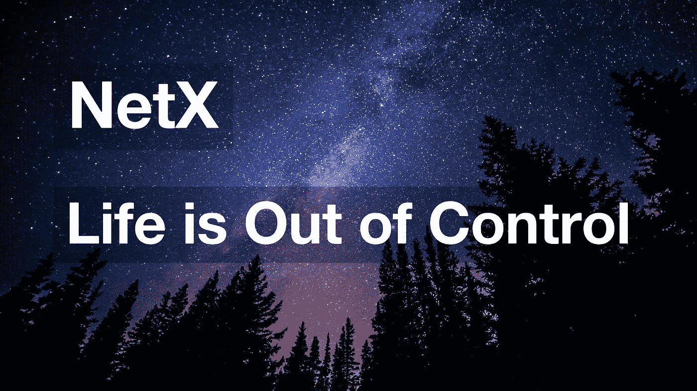

# 生活失去了控制

> 原文：<https://medium.com/coinmonks/life-is-out-of-control-9f8e5b7b4b99?source=collection_archive---------10----------------------->

第二章第二部分 Web 3.0 有机体正在崛起

TL；速度三角形定位法(dead reckoning)

*   当没有个体给群体下命令时，群体系统就会失控。
*   《失控》以其韧性经受住了历史的考验。
*   人类正在走向一个没有控制的未来。随着互联网的出现，Web 3.0 走进了人们的生活，并隐藏着失控。

一个 nt 蚁群不会因为几只养家糊口的蚂蚁死于乔丹鞋而遭受食物短缺。当一只蜜蜂撞上一个池屋时，蜂巢不会溶解。群体系统是有弹性的。一个小小的生存碎片就能带来一丝复苏的希望。这种强劲的反弹是由失控的结构推动的。

> **什么是失控？**

指挥团队的个人位于权力金字塔的顶端，做出最终决定。如果没有个体给群体下命令，群体系统就会失控。

蜂群和蚁群的集体系统，经典的失控，没有人发出指令。从更大的图景来看，许多动物群落、植物群落和生物群体以同样的方式运作。从狭义的角度来看，单个有机体也是不受控制地被构造的。

以人体为例。一个成年人大约有 40 到 60 万亿个细胞，每个细胞各司其职。它们相互连接并传递物质。它们形成人体组织和器官。器官通过管道传输和分配物质。这样，一个人体就形成了。在这数十亿个细胞中，没有一个细胞可以操纵他人做任何事情，无论是营养物质、神经递质的传递，甚至是食物和排泄物的传递。从这一点上，我们可以看出，人体不是由中央控制的，而是由相互依赖的细胞编织而成的。

通常被认为是最终决策者的人脑处于失控状态。大脑的每个不同部分都扮演着不同的角色。任何部分都不能凌驾于其他部分之上。成千上万个相互连接的神经元相互传递信息，共同完成大脑的任务，如记忆等。在此期间意识和智慧出现。这种机制给人们留下了其决策权威的虚假印象。

> **什么导致失控？**

脱离控制的群体系统显示出强大的生命力。不受自上而下命令的约束，单个部件设法以自己的方式完成工作。随着个人的选择和决定得到积极的反馈和好处，群体中的其他成员倾向于跟随和进化。鸥群吸取了教训，避免了类似的错误，因为一部分做出了错误的决定并消亡了。具体来说，没有控制的群体系统允许高容错性。正反馈和负反馈都需要进化。无论个人是学习还是犯错，团队都会提高并扩大自己的优势。同时，该系统属于一个更广泛的系统。这表明，无论一个系统有多大，最终都会失去控制。

最后一篇文章解释了为什么人类文明最终会失控，这沿着历史的轨迹找到了它的线索。过去几千年来，许多政治或金融独裁者被历史潮流抛弃，沦为人类进化的垫脚石。任何国家或企业都不能凌驾于一切之上；任何人不得垄断公民权利或利益。

以当代垄断资本主义为例。20 世纪后期，著名的新古典经济学家马歇尔将垄断定义为一种“例外”。后来，随着英国开始主导日益发展的当代垄断资本主义，以前繁荣的自由竞争资本主义被削弱了。20 世纪 30 年代，由于制度升级，垄断资本主义获得了合法地位。70 年代，二战结束，诞生近百年后，垄断资本主义被推翻，新的自由竞争资本主义打着旋回到舞台。

向前看，控制的心态将逐渐消失，无论是在大的还是小的人类群体中。没有人或事有绝对的权威。一个群系统以分布式的方式被广泛地布置。进化是通过淘汰或选择发生的。每一个控制，垄断，或排他性的权力都来自于试错，但也先于人类文明的进化。也就是说，人类文明最终会失控。

> **Web 3.0，又一次失控**

Web 3.0 出现在互联网时代。当代垄断资本主义注定要消失；自由竞争注定要到来。同样，所有的集中化企业，即使是谷歌，在未来的几十年里，也可能无法在与各种企业的激烈竞争中生存。只有事情失控了，才会发光。Web 3.0 是一个自由竞争、不受控制的互联网繁荣的地方。

我们想要创造的后 IT 生活形态是伴随着互联网出现的 Web 3.0 生活形态。当众多节点交互、连接、集成和协作时，它们不断地在互联网上寻找“蜂蜜”。随着节点的进化，一个看似无序，但内部组织失控的生命形式最终到来。大量的底层节点可能会犯各种错误。然后，进化从自我调整、自我纠正的错误中产生。

无论是新兴的 Web 3.0，还是即将到来的失控的 Web 3.0，我们所做的只是让进化快速发生，以更快的速度将 swarm 系统推向失控。我们不是这个存在的主人，而只是它的摆渡人。

** Web 3.0 有机体是什么样子的？我将在全新的一章《Web 3.0 有机体正在崛起》中阐述我对此的想法，这一章包括三个部分:这个新兴有机体的诞生、存在和我的思考。记得我们已经在 NetX 上发布了三篇文章(👇)?它们都属于第一章背景。我们试图以一种良好的连接方式将它们缝合在一起。每当进入一个新的篇章，我们都非常兴奋地分享我们的发现和想法。请加入我们的旅程！*

# 📚必读

[NetX 系列 1.1](/triaslab/rethinking-the-it-industry-d101384e801) | [NetX 系列 1.2](/coinmonks/a-letter-from-satoshi-nakamoto-345a45d012bb) | [NetX 系列 1.3](/coinmonks/out-of-control-the-post-it-evolution-dd64e05ff5bc) | [NetX 系列 2.1](/coinmonks/life-emerges-9ebf26304cd4)

***NetX，面向数字生活的可信可靠的智能自治系统链原生互联网(***[***Trias***](https://www.trias.one/)***)***

[***铁人三项***](https://www.triathon.space/#/)***|***[***Ethanim***](https://www.ethanim.network/)***|***[***tu Sima***](https://www.tusima.network/#/)***| behemotius | Leviatom | Divina***

> 加入 Coinmonks [电报频道](https://t.me/coincodecap)和 [Youtube 频道](https://www.youtube.com/c/coinmonks/videos)了解加密交易和投资

# 另外，阅读

*   [最佳比特币保证金交易](/coinmonks/bitcoin-margin-trading-exchange-bcbfcbf7b8e3) | [萝莉点评](/coinmonks/lolli-review-e6ddc7895ad8) | [比特币保证金交易](https://coincodecap.com/bityard-margin-trading)
*   [创造并出售你的第一个 NFT](https://coincodecap.com/create-nft) | [密码交易机器人](/coinmonks/crypto-trading-bot-c2ffce8acb2a)
*   [如何在 CoinDCX 上购买柴犬(SHIB)币？](https://coincodecap.com/buy-shiba-coindcx)
*   [CBET 评论](https://coincodecap.com/cbet-casino-review) | [库科恩 vs 比特币基地](https://coincodecap.com/kucoin-vs-coinbase) | [拜比特 vs 比特币基地](https://coincodecap.com/bybit-vs-coinbase)
*   [折叠 App 回顾](https://coincodecap.com/fold-app-review) | [LocalBitcoins 回顾](/coinmonks/localbitcoins-review-6cc001c6ed56) | [Bybit vs 币安](https://coincodecap.com/bybit-binance-moonxbt)
*   [加密保证金交易交易所](/coinmonks/crypto-margin-trading-exchanges-428b1f7ad108) | [赚取比特币](/coinmonks/earn-bitcoin-6e8bd3c592d9) | [Mudrex 投资](https://coincodecap.com/mudrex-invest-review-the-best-way-to-invest-in-crypto)