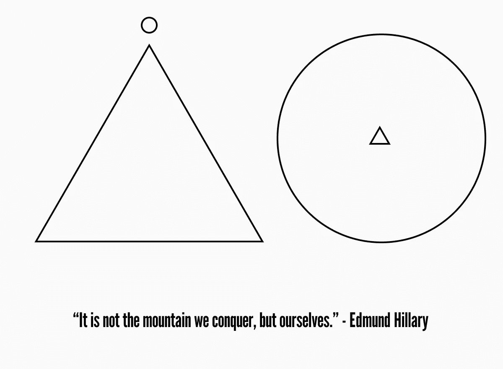

# 人生 101-12 课人们学得太晚了

> 原文：<https://medium.com/coinmonks/life-lessons-101-12-life-lessons-people-learn-too-late-3ccd689be99e?source=collection_archive---------45----------------------->

我们生活中有太多的事件给我们上了非常重要的人生课，彻底改变了我们的性格。就像有些事情我们没有及时学会，当我们意识到的时候，时间已经过去了，我们遭受了很多。在这里，我们将讨论一些要点，如果及时学会，可以使我们免受痛苦。

**内容**

*   一切都是暂时的
*   没有人能感受到你的痛苦
*   你的知识永远不会完整
*   我们的思想是我们最好的朋友和最坏的敌人
*   生活是不公平的
*   最大的风险是不冒险
*   一生不是永远
*   人们对你的看法和感受并不重要
*   幸福是一种选择
*   你不能满足你的贪婪
*   愤怒的背后总是恐惧
*   过度思考会让事情变得更大

Image by Author — Conquer yourself

# 1-一切都是暂时的

你需要学习的第一件事是，无论是个性还是祝福都不会在你的生活中永久存在。当你明白这一点，你就不再强迫人们留在你的生活中，让想离开的人离开，你就不再强迫任何关系。

这让你在精神上变得非常强大，因为当你不再强迫别人留在你的生活中时，就没有其他人能让你快乐或悲伤。你成为你快乐和悲伤的唯一原因。简而言之，你变成了一个恋童癖。

# 2-没有人能感受到你的痛苦

另一个与期望间接相关的重要人生教训是，没有人能感受到你的现状。唯一能理解你处境的人是经历过那种处境的人。如果你的生活中没有这样的人，你就不能指望生活给予那个人或者指望一个人理解你的处境，这是不可能的。

没有人能过你的生活，就像你不能过别人的生活一样。每个人都有自己的生活问题，需要自己解决，不需要别人的帮助。所以做一个勇敢的战士，对挑战说是。

# 3-你的知识永远不会完整

今天要学的非常重要的一课是，你的知识总是不完整的。每个人到死都处于学习阶段，因为生活在每一步都教你新的一课。

所以永远不要认为你的知识是完整的，因为这是傻瓜的说法。做一个好的倾听者，努力从你每天遇到的每一个人身上寻求知识。

# 4-我们的思想是我们最好的朋友和最大的敌人

最后一堂人生课是关于我们的思想。如前所述，你是发生在你身上的每一件事情的唯一原因。你的心态是决定你成败的因素。

如果你的思想激励你大胆思考，探索事物，并帮助你应对前进道路上的每一个挑战，那么你的思想就是你最好的朋友，很快就会让你成为维多利亚时代的人。但是如果你的思想仅仅因为别人的负面观点而使你气馁和失去动力，你的思想就扮演了一个敌人的角色。如果你想成为赢家，你需要改变你的想法。

# 生活是不公平的

其次，你必须明白没有人被赋予完美的生活，你必须让它完美。因为当我们开始毫无顾忌地期待早餐桌上的每一份祝福时，我们只是在欺骗自己。我们想要的生活就在我们不想做的努力的另一边。

所以你必须停止期待，开始工作。你应该开始改善你不完美的生活，让它变得完美，因为只有你能把你的生活塑造成你所期待的奇迹。

# 最大的风险是不冒险

在当今这个世界已经成为一个地球村，生活日益进步的时代，承担风险已经成为一种义务。如果你试图深入考察成功人士的生活，你会发现每个成功人士都是行动者。

虽然如果你冒险就有可能会失败，但是如果你不冒险，你已经失败了，而且这种失败比第一次失败更有害。如果你不冒险，原地不动，世界会把你压垮，然后继续前进。现在全靠你了。

# 7-一生不是永远

你需要记住的另一件非常重要的事情是，这种生活不是永久的。这有助于你明智地做出决定，并相应地设定你的优先事项。我们都知道，生活就是设定优先事项和做出正确的决定。

你应该设定目标，进行投资，建立关系，记住你所拥有的时间。尤其是你必须明智地投资你的时间，这比金钱更重要，而且是不可再生的。

# 人们对你的看法和感受并不重要

及时学会的最大的人生课是“如何克服对被评判的恐惧？”因为当你开始考虑别人对你的看法时，你会变得意志消沉，并可能开始憎恨自己。这导致你内心感觉不好。

所以你要学会别人对你的看法与你无关。你只要走自己的路，不管别人怎么想。一旦达到目标，人的思想就自动改变了。

# 幸福是一种选择

另一个要学习的人生课程是，幸福是你自己的选择。能让自己开心的只有自己。百分之九十的快乐来自你的内心，你可以自己掌控自己的情绪。如果你期望其他人进入你的生活，让你快乐，你永远不会快乐。

另一方面，如果你开始忽视别人，开始花时间和自己在一起，幸福就会自动围绕着你。只有当你自己快乐时，你才能让别人快乐。所以从今天开始花时间和自己在一起，看看你焦虑的生活是如何变成快乐幸福的生活的。

# 10-你不能满足你的贪婪

这一点关系到每个人的天性。人的贪婪之碗永远无法填满，这是人的本性。你应该学会满足自己拥有的每一份祝福，努力实现自己没有的。

因为男人的欲望是没有句号的。你不可能完美，除非你和别人竞争，事实上这会增加你的贪婪。解决这种情况的唯一方法是不要和别人竞争，而是和你过去的版本竞争。如果你从过去变得更好，你就在正确的轨道上。

# 愤怒的背后总是恐惧

第三步，在情绪控制你之前，先控制自己的情绪。尤其是你需要控制最终导致恐惧的愤怒，而这种恐惧会导致消极。当消极情绪征服了你的大脑，你的大脑就会停止工作，随之而来的是一场灾难。

当你能控制自己的愤怒时，你就能冷静地处理任何具有挑战性的情况，多才多艺的元素会增加你的个性。冷静的大脑实际上是天才的大脑。

# 12-你只是通过过度思考让事情变得更大

过度思考是一个非常广泛的话题，因为它的领域非常广泛，今天每个人都患有这种疾病。过度思考是消极的第二个名字。思考是一件好事，除非它是分析性的。但是过度思考与分析性思维完全相反。

当你过度思考时，你会看到一个小障碍，比如一个非常大的障碍，你会立刻失去动力，最终放弃你的目标。因此，你需要做的事情是轻松地对待问题，并以冷静的心态通过计划来解决它们。

***“昨天我很聪明，所以我想改变世界。今天我是明智的，所以我在改变自己。”—鲁米*T3**

***“别这么谦虚，你没那么伟大。”—果尔达·梅厄***

***谓天赋是上帝赐予的。要谦虚。名声是人给的。心存感激。自负是自己给的。要小心。”—约翰·伍登***

感谢您的阅读，在您离开之前…

> 点击“关注”加入好奇求知者的社区，获取关于金融、健康、哲学、心理学和技术的每周文章。如果您想要电子邮件更新，请单击“信封+”标志。
> 
> 在| [脸书](https://www.facebook.com/thequantumthinker) | [推特](https://twitter.com/QuantumThinker)|[insta gram](https://www.instagram.com/the_quantum_thinker/)|[LinkedIn](https://www.linkedin.com/company/quantumthinker/)|[Pinterest](https://www.pinterest.com/quantum_thinker/)|[Reddit](https://www.reddit.com/r/the_quantum_thinker/)|
> 
> 加入 Coinmonks [电报频道](https://t.me/coincodecap)和 [Youtube 频道](https://www.youtube.com/c/coinmonks/videos)了解加密交易和投资

# 另外，阅读

*   [瓦济里克斯 NFT 评论](https://coincodecap.com/wazirx-nft-review) | [比茨盖普 vs 皮奥克斯](https://coincodecap.com/bitsgap-vs-pionex) | [坦吉姆评论](https://coincodecap.com/tangem-wallet-review)
*   [如何使用 Solidity 在以太坊上创建 DApp？](https://coincodecap.com/create-a-dapp-on-ethereum-using-solidity)
*   [加密交易机器人](/coinmonks/crypto-trading-bot-c2ffce8acb2a) | [OKEx vs 币安](https://coincodecap.com/okex-vs-binance)
*   [币安 vs FTX](https://coincodecap.com/binance-vs-ftx) | [最佳(SOL)索拉纳钱包](https://coincodecap.com/solana-wallets)
*   [如何在 Uniswap 上交换加密？](https://coincodecap.com/swap-crypto-on-uniswap) | [A-Ads 评论](https://coincodecap.com/a-ads-review)