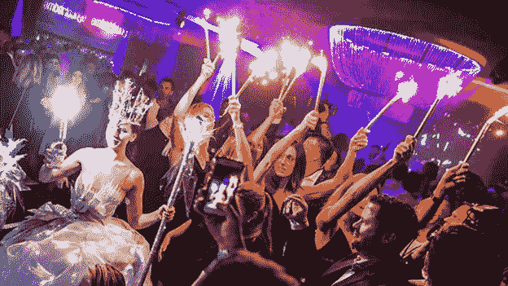

# Amber Lounge 豪华活动终身会员标志着 NFTs 的新使用案例

> 原文：<https://medium.com/coinmonks/lifetime-memberships-at-amber-lounge-luxury-events-mark-new-use-case-for-nfts-c8b840fddf8f?source=collection_archive---------56----------------------->

在高端奢侈品市场，金钱不是目标，有时是金钱买不到的东西。科技巨头埃隆·马斯克最近反思了他过去的支出，并分享了他对体验高于商品的新观点。

肩负着设计超越平凡的产品的任务，品牌现在正利用最新的技术为他们的顶级客户——价值数万亿美元的 1500 万挥金如土的人——提供[永恒的体验](https://beincrypto.com/luxury-brands-continue-to-push-nfts-metaverse-adoption/)。

# 作为地位和社会资本的非功能性交易

据奢侈生活方式公司 Amber Lounge 首席执行官 Cher Ng 称，在一个有趣的使用案例中，该公司已开始提供终身 VIP 俱乐部会员资格[不可替代的](https://beincrypto.com/learn/non-fungible-tokens/)代币(NFT ),可用于参加其独家高调活动。

Amber Lounge 将 NFTs 定位为高端夜生活领域的下一个大事件，围绕[一级方程式宇宙](https://beincrypto.com/mercedes-f1-team-partners-with-ftx-exchang/)举办豪华活动，为一线名人和运动员提供互动的专属平台。在该公司的活动中，以前的名字包括刘易斯·汉密尔顿，尼科·罗斯伯格，贾斯汀比伯，金·卡戴珊，理查德·布兰森，戈丹·拉姆齐和其他人。

其名为“Amber X”的 NFTs 概念以排他性为前提，只有 1888 名 NFT 会员通过邀请出售。Cher Ng 表示，用户购买身份是因为 NFTs 让他们可以终身接触高净值和有影响力的个人，包括亿万富翁和名人。

对于大多数人来说，区块链是金融投资的目的地，Amber X 的角度是社会资本。这遵循了将财富转化为超越金钱的维度的新重点。说到被〖中〗央加密，Cher Ng 说道:

> *“我们确实相信这些 NFT 会员资格提供了很多价值，因为它们将使我们的会员能够通过我们的 Amber Lounge 签名活动、社交活动、私人晚宴等，直接接触到备受瞩目的成功人士社区。事实上，这些都是终身会员，这也意味着这种价值有巨大的潜力继续增长。”*

# 通过 VIP 俱乐部享受专属待遇

奢侈品市场估计价值 2430 亿美元，通过向顾客提供特殊产品的预发布渠道，可以帮助创造专属空间。在像古驰和普拉达这样的品牌，最有价值的顾客被提供独特的购物体验和专属特权。

贵宾俱乐部利用了这种独特性，这正是贵宾俱乐部的吸引力所在——贵宾通道，与名人和上流社会接触的机会。随着过去两年非传统艺术券的兴起，人们的兴趣不再仅仅是区块链的包容性，而是排他性，即代币授予最高出价者的地位和文化资本。

Cher Ng 表示，Amber X 为 30 名专属“顶级”NFT 持有者留出了额外的特权，包括 Amber 签名活动中价值高达 3 万美元的贵宾席，私人活动邀请，以及限量版定制设计的香槟盒套装 NFT 点滴。

他补充说，这项举措是在东南亚领先的互联网集团 Catcha 今年收购 Amber Lounge 之后实施的。

Amber Lounge 的赛后和赛道边一级方程式派对跟随摩纳哥、新加坡、阿布扎比、墨西哥城和上海等主要目的地，通常以原创一级方程式车手时装秀和有现场 DJ 的通宵派对为特色。接下来的一个月，该公司将把这种体验带到新的城市，包括迈阿密、拉斯维加斯、巴厘岛和伊比沙岛。

# 可重新下载的会员资格

琥珀集团董事总经理 Jeannette Tan 告诉 Be[In]Crypto，今年大奖赛的新加坡活动将采用“国际音乐艺术家、身临其境的剧场卡巴莱和马戏团主题表演”。

该公司还将接受一些加密货币作为支付方式，因为它希望扩展到大奖赛以外的不同赛事。

Amber Lounge 在一份[声明](https://finance.yahoo.com/news/amber-lounge-world-most-exclusive-091500810.html)中指出:“由于 100%数字化和无纸化，人们永远不必担心失去会员资格……它可以很容易地从云中重新下载。”。“多亏了区块链技术，现在可以绝对肯定地证明身份和会员资格，即使会员在私人销售或礼品中改变了所有权。”

随着新冠肺炎的退出，高端奢侈品市场的参与者正在区块链等尖端技术领域重新崛起。事实很可能会证明，科技优势在吸引千禧一代和 Z 世代的挥金如土方面具有决定性作用。

[*来源*](https://beincrypto.com/memberships-amber-lounge-luxury-events-use-case-nfts/)

> 加入 Coinmonks [电报频道](https://t.me/coincodecap)和 [Youtube 频道](https://www.youtube.com/c/coinmonks/videos)了解加密交易和投资

# 另外，阅读

*   [如何匿名购买比特币](https://coincodecap.com/buy-bitcoin-anonymously) | [比特币现金钱包](https://coincodecap.com/bitcoin-cash-wallets)
*   [币安 vs FTX](https://coincodecap.com/binance-vs-ftx) | [最佳(SOL)索拉纳钱包](https://coincodecap.com/solana-wallets)
*   [比诺莫评论](https://coincodecap.com/binomo-review) | [斯多葛派 vs 3Commas vs TradeSanta](https://coincodecap.com/stoic-vs-3commas-vs-tradesanta)
*   [Capital.com 评论](https://coincodecap.com/capital-com-review) | [香港的加密借贷平台](https://coincodecap.com/crypto-lending-hong-kong)
*   [如何在 Uniswap 上交换加密？](https://coincodecap.com/swap-crypto-on-uniswap) | [A-Ads 评论](https://coincodecap.com/a-ads-review)
*   [WazirX vs CoinDCX vs bit bns](/coinmonks/wazirx-vs-coindcx-vs-bitbns-149f4f19a2f1)|[block fi vs coin loan vs Nexo](/coinmonks/blockfi-vs-coinloan-vs-nexo-cb624635230d)
*   [本地比特币审核](/coinmonks/localbitcoins-review-6cc001c6ed56) | [加密货币储蓄账户](https://coincodecap.com/cryptocurrency-savings-accounts)