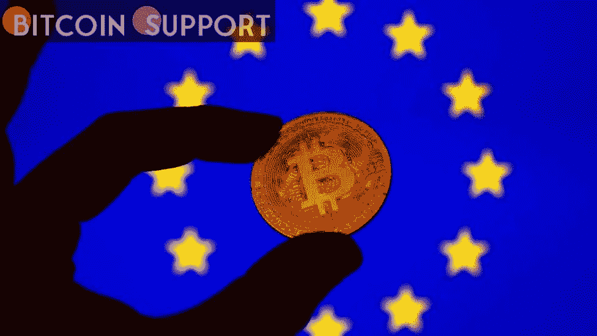

# 绿色之光:欧盟对加密货币的态度在环境和监管问题之间达成了妥协

> 原文：<https://medium.com/coinmonks/light-in-green-the-eu-s-approach-to-cryptocurrency-strikes-a-compromise-between-environmental-5438ce392c7c?source=collection_archive---------41----------------------->

**Visit our website:-** [**https://bitcoinsupports.com/**](https://bitcoinsupports.com/)

Policymakers in Europe have backed down from enacting legislation that would have unfairly punished Bitcoin for environmental grounds.

Bitcoin (BTC) escaped a regulatory bullet in the European Union last week when draught cryptocurrency legislation was changed to remove a prohibition on proof-of-work (PoW)-based crypto assets. The relative secrecy of crypto transactions, as well as their environmental impact, had aroused a number of worries among policymakers. Some experts, such as Tim Frost, the founder and CEO of Yield App, feel the “climate change” angle is a covert attempt to outlaw Bitcoin. But why is that?

The proposed EU regulation on Markets in Crypto Assets (MiCA) can be viewed as a hybrid approach, in which crypto assets are treated as securities at times and as currency at other times. The European Council, which is made up of delegates from several nations, believes the European Banking Authority (EBA) should be the new crypto watchdog, whilst the European Parliament believes the European Securities and Markets Authority should be in charge (ESMA).

**Protectionism and green accords are two terms that come to mind when thinking about the environment**

While an explicit prohibition on proof-of-work, which would have crippled Bitcoin, has been averted, the environmental rhetoric surrounding the EU’s regulatory campaign continues. This illustrates a trend in EU policy toward “green protectionism”: the EU is using environmental concerns as a rallying cry to preserve its market and institutions (in this case, its currency, which is less than a decade older than BTC).

The EU’s trade partners have already expressed their displeasure with this strategy. The EU officially stated its “Green Deal” target of net-zero greenhouse gas emissions by 2050 in 2019, shortly after European Commission President Ursula von der Leyen took office. This came after a wave of green victories in the European Parliament the previous year. The notion of a “Green Deal” was first proposed by the Democratic Party in the United States, but it was met with opposition by former President Donald Trump, prompting Europeans to adopt it.

The EU wants to achieve this target by switching to renewable energy sources for power generation, improving energy efficiency in dwellings, and developing “smart infrastructure.” In the first decade, the program’s cost was set at one trillion euros. “The symbolic significance is as follows: the EU declares itself a global leader in advancing the climate issue and establishes new benchmarks for cooperation between the state, business, and society in combating climate change,” according to the Valdai Club.

**Is it possible that you’re green with envy? Euro compared. Bitcoin**

Since the euro was introduced as a unified currency within the eurozone in 1999, the European banking sector has seen many major crises, including the financial crisis of 2008, the 2011 euro sovereign debt crisis, and the COVID crisis. Negative inflation and difficulty coordinating monetary policy have forced the EU to rely on many stronger countries, such as Germany, to bail out weaker ones such as Portugal, Italy, Greece, and Spain when they are in trouble. This has prompted concerns about the currency’s long-term viability.

To make matters worse, austerity mandates have frequently enabled populist leaders, such as Italy’s Five Star party, to threaten euro exit. This has harmed Brussels’ ambitions to portray the euro as a “global reserve currency” alternative to the US dollar. While the global number of euro transactions surpasses that of cryptocurrencies, it’s reasonable that eurocrats would prefer to avoid competition with a liquid medium of exchange.

**The financial goals of Europe**

“There has been little work undertaken to truly understand the actual environmental impact of mining cryptocurrencies, not least compared to the oil and gas industry, which the EU and other global governments are still very happy to support through kickbacks and incentives,” says Tim Frost, founder and CEO of fintech firm Yield App. “If policymakers were serious about the environmental impact of companies, Bitcoin would undoubtedly be the last industry to be considered,” he adds.

Given that the proof-of-work system originally targeted by legislators was an essential part of the architecture of Bitcoin, which accounts for the lion’s share of the cryptocurrency economy, Frost expressed scepticism about singling out cryptocurrency in the environmental debate, which he described as “somewhat lopsided, if not suspicious.”

However, both the euro and cryptocurrencies have their own set of political concerns because they are not linked to traditional states conducting traditional monetary policy. EU regulators have already been accused of attempting to “punish” the United Kingdom for Brexit as a deterrent to other possible leavers, so it’s not unreasonable to believe that efforts to stifle cryptocurrency are motivated more by self-interest than environmental concerns.

**Brussels as a regulatory standards exporter**

Setting new trade standards is considered as a success for European legislators in and of itself. Many people believed that during Donald Trump’s presidency, the United States could no longer be considered “the leader of the free world” in terms of policy efforts, and that the country was putting “America first.”

In the opinion of Europeans, the United States had abandoned global regulatory ambitions. The most devastating example of this was Washington D.C.’s decision to withdraw from the Paris Climate Agreement. Trump’s withdrawal from the Iran nuclear deal was yet another sign that the United States had shifted to supporting unilateral policymaking and was willing to “weaponize” its role in the global economy, as well as the dollar’s.

As a result, the EU has a window of opportunity to take the lead. While international formats like the G-20 and the Organization for Economic Cooperation and Development (OECD) had greater aggregate economies, they lacked the EU’s expertise as a consensus-based supranational union capable of setting and sustaining standards.

The OECD had taken the lead in developing new worldwide legislation to discourage firms from using low-tax jurisdictions in the late 1990s, when the internet and global banking were just getting started. The OECD created a “blacklist” of uncooperative tax havens in 2000, and by 2002, it had identified 31 of them. The OECD countries controlled the majority of the global economy at the time. They were able to compel all of them to follow its transparency and information-sharing criteria.

Taken together, these forces underpin what appears to be a push in the EU’s future crypto regulation to highlight environmental concerns.

**Visit our website:-** [**https://bitcoinsupports.com/**](https://bitcoinsupports.com/)

**Disclaimer: These are the writer’s opinions and should not be considered investment advice. Readers should do their own research.**

> 加入 Coinmonks [电报频道](https://t.me/coincodecap)和 [Youtube 频道](https://www.youtube.com/c/coinmonks/videos)了解加密交易和投资

# 另外，阅读

*   [如何开始用加密贷款赚取被动收入](https://coincodecap.com/passive-income-crypto-lending)
*   [BigONE 交易所评论](/coinmonks/bigone-exchange-review-64705d85a1d4) | [电网交易机器人](https://coincodecap.com/grid-trading)
*   [氹欞侊贸易评论](https://coincodecap.com/anny-trade-review) | [CoinSpot 评论](https://coincodecap.com/coinspot-review)
*   [新加坡十大最佳加密交易所](https://coincodecap.com/crypto-exchange-in-singapore) | [购买 AXS](https://coincodecap.com/buy-axs-token)
*   [投资印度的最佳加密软件](https://coincodecap.com/best-crypto-to-invest-in-india-in-2021) | [WazirX P2P](https://coincodecap.com/wazirx-p2p)
*   [7 个最佳零费用加密交易平台](https://coincodecap.com/zero-fee-crypto-exchanges)