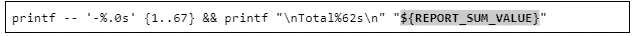
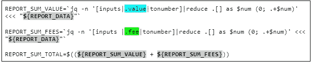

# 命令行中的闪电

> 原文：<https://medium.com/coinmonks/lightning-at-the-command-line-4b98fccf5c36?source=collection_archive---------16----------------------->

介绍如何使用 LND 工具创建发票和付款报表

作者@ vicariousdrama

714130–714326

# 摘要

本文的目的是指导用户使用一些命令行操作来查询他们的 lightning 节点，并使用基本的格式和 JSON 处理工具生成摘要报告。本文假设您已经有一个运行 LND 的 lightning 节点，并且可以访问命令提示符。如果你还没有一个 lightning 节点，可以考虑检查一下[各种各样的节点项目](https://bitcoiner.guide/node/)，或者甚至使用 [voltage.cloud](https://voltage.cloud/) 建立一个节点。命令以一种逐渐构建整体结果的方式呈现，以便我们可以更好地理解结果中的每个部分。如果你只想复制-粘贴最终结果，你可以跳到主要部分的末尾。

# 发票

发票是从闪电节点发起的付款请求，另一个节点应该为其付款。请求的创建超出了本文的范围，通常是使用应用程序或接口创建的，如 ThunderHub、Ride The Lightning 或支持 Lightning 的钱包。

## 列出发票

在命令行中，我们可以使用`lncli`工具，即带有 listinvoices 命令的 lightning 网络守护程序(lnd)的控制平面。

这将输出一些 JSON 格式的发票。我们可以使用`jq`命令轻松地应用一些格式和颜色语法着色来提高可读性。稍后我们也将使用这个工具进行过滤。

如果有发票，它们将以 JSON 格式列出，每个发票有几个字段。虽然所有这些字段都有其用途，但我们最关心的报告字段是`memo`、`value`、`settled`、`creation_date`、`settle_date`、`amt_paid_sat`和`state`。在后续部分中，此处突出显示的颜色将包含在命令中，以引起对其使用位置的注意。

## 仅列出已支付的发票

这是过滤结果的命令，只显示那些已付费的结果

## 仅列出失败的发票

该命令改变过滤器，以显示那些由于支付前超时而最终被取消的。

## 列出一段时间内支付的发票

为了将发票限制在一段时间内，我们将建立一些变量，并更新那些被选择的发票的过滤器。`date`命令将返回从 epoch 开始的秒数，并从当天的第一秒开始。每天由 86400 秒组成。对于结束日期，我们希望将结果提前一天，减去一秒钟，以确保全天都包含在周期中。

同样，我们可以将选择的发票限制在一个月内

## 控制发票的输出

到目前为止，我们的输出只是 JSON。出于报告目的，我们将开始逐行清理输出以报告信息。有了选定的对象，我们可以进一步使用`jq`命令行 JSON 处理器来直接输出一个字符串的串联值。

以下是从字符串格式化的示例结果

让我们使用一些简单的格式，通过在左侧创建空格来右对齐值字段。这使得在有多行时更容易阅读数字。在这个例子中，我们使用内置的`tostring`函数将`value`字段转换成一个字符串。然后，将使用内置的`length`函数，用空格将它写出来，直到 8 减去值的长度。例如，如果值是 123，则它的长度为 3，为了使它的总长度为 8，将在前面写 5 个空格。

下面是修改后的示例结果，显示了值左侧的额外空格填充。

为了显示我们排列的值，让我们对所有发票运行相同的报告。为此，我们将把开始日期更改为更早的时间。您的结果将根据您过去的发票数量而有所不同。

下面是一些显示值对齐的示例结果。

## 获取发票的过滤结果

接下来，我们将对数据集执行多个查询。为了避免给服务本身带来不必要的负担，并确保我们在查询之间总是使用相同的数据，我们可以将结果捕获到一个变量中，并在格式化中使用它。

这里，我们将数据捕获到一个名为`REPORT_DATA`的变量中

现在让我们使用它，并更改我们的输出，以可读的格式显示日期，然后是 memo 字段，最后是右对齐的金额。

为了转换日期，我们获取字符串，使用内置的`tonumber`函数将其转换为数字，然后在解析其中的年、月和日部分之前，将其传递给另一个内置函数`todateiso8601`。

memo 字段将是左对齐的，而右对齐的字段在它之前创建空格，我们希望在它的值之后写出额外的空格。

最后，对于值字段，让我们扩展长度，这将在以后更好地说明一个头。

这是我们用新格式修改后的样本结果。

## 为发票创建标题

我们可以在报告中添加一个标题，为呈现的数据提供上下文。让我们添加该时间段的报告标题以及列名。

对于这段时间，我们将以秒为单位的数字开始和结束日期转换回可读的时间戳。列标题将被隔开以匹配数据，最后，我们将在标题和数据之间创建一条线。

我们的样本结果

让我们将它们结合起来，这样命令输出就可以一起运行，而不需要分散命令行提示符。

页眉现在看起来干净多了。

## 计算发票页脚的总额

如果我们总结一下这段时间收到的 sat 总数，将会很有帮助。我们可以这样做:接受输入，将值转换为数字，减少数组，初始化临时变量，并为数组中的每一项添加值。这听起来可能比实际更复杂，但是不要担心，通过命令和结果会变得很清楚。结果我们将存储在另一个变量中。

要了解其价值，我们可以将它显示出来

样本结果

有了总数，我们现在可以把它放入页脚。我们将画另一条线来封闭数据并报告总数

示例页脚

## 发票总报告

现在让我们把上面的所有部分合并成一个简单的命令集。我们可以把它保存到一个文件中，以备后用。

这是发票的样本报告

# 支付

对于付款报告，我们将假设发票部分中概述的一些相同的概念。

## 列出付款

为了列出成功的支付，我们可以使用带有`listpayments`操作的`lncli`命令，然后使用`jq` JSON 处理器进行过滤。

如果有付款，它们将以 JSON 格式列出，每个都有几个字段。虽然所有这些字段都有其用途，但我们最关心的报告字段是`value`、`creation_date`、`fee`和`status`。在后续部分中，此处突出显示的颜色将包含在命令中，以引起对其使用位置的注意。

在`htlcs`字段(散列时间锁合同)中，有更多关于支付所采用的路由路径的细节，以及为每一跳支付的精确到毫微微秒的费用。对于这个基本报告，我们将坚持到下一个星期六的基本费用汇总。

## 获取过滤后的支付结果

让我们设置报告的开始和结束日期，并将匹配的付款捕获到一个变量中。

## 获取付款总额

接下来，出于报告目的，让我们合计已支付的发票总额、费用和总总额。

## 付款总报告

与发票报告类似，我们准备一份付款报告，它有一个标题块，后面是数据行，然后是一个页脚，上面有计算出的金额。

下面是一个示例报告输出

# 结论

使用命令行，我们为通过 lightning 服务创建的发票构建了一个报告。按日期周期进行基本过滤可以让我们的报告更加灵活。数据的文本对齐、日期格式化以及页眉和页脚的创建有助于生成有用的摘要报告。然后，我们将相同的概念应用于创建支付报告。您可以考虑将此作为获得更多报告和自动化的垫脚石。如果你认为我应该创建更多这样的指南，或者对它进行扩展，请在文章上留下评论。

> 加入 Coinmonks [电报频道](https://t.me/coincodecap)和 [Youtube 频道](https://www.youtube.com/c/coinmonks/videos)了解加密交易和投资

# 另外，阅读

*   [加密货币储蓄账户](/coinmonks/cryptocurrency-savings-accounts-be3bc0feffbf) | [YoBit 审核](/coinmonks/yobit-review-175464162c62)
*   [Botsfolio vs nap bots vs Mudrex](/coinmonks/botsfolio-vs-napbots-vs-mudrex-c81344970c02)|[gate . io 交流回顾](/coinmonks/gate-io-exchange-review-61bf87b7078f)
*   [CoinFLEX 评论](https://coincodecap.com/coinflex-review) | [AEX 交易所评论](https://coincodecap.com/aex-exchange-review) | [UPbit 评论](https://coincodecap.com/upbit-review)
*   [AscendEx 保证金交易](https://coincodecap.com/ascendex-margin-trading) | [Bitfinex 赌注](https://coincodecap.com/bitfinex-staking) | [bitFlyer 点评](https://coincodecap.com/bitflyer-review)
*   [Bitget 回顾](https://coincodecap.com/bitget-review)|[Gemini vs block fi](https://coincodecap.com/gemini-vs-blockfi)cmd |[OKEx 期货交易](https://coincodecap.com/okex-futures-trading)