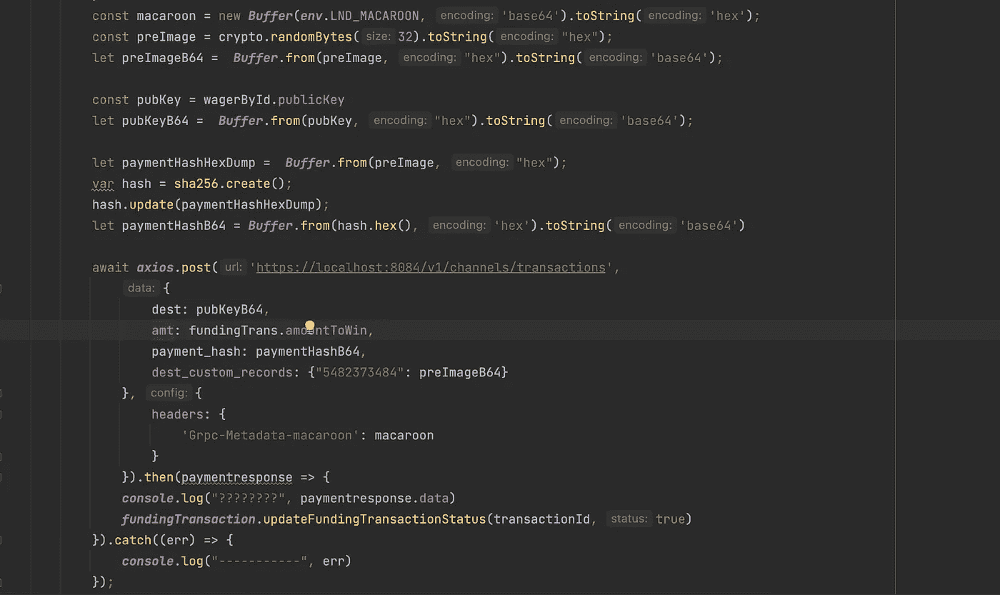

# 闪电钥匙

> 原文：<https://medium.com/coinmonks/lightning-keysend-2df3fef4f4b4?source=collection_archive---------8----------------------->

# 闪电是什么？

要让比特币像万事达卡(MasterCard)、维萨卡(Visa)等其他支付处理器一样处理交易，它需要扩大规模。比特币网络上发生的每一笔交易都需要被中继、挖掘和确认，这成为比特币网络扩大规模并与其他支付处理器竞争的障碍。解决这一可扩展性问题的竞赛催生了闪电网络。Lightning 是建立在比特币区块链之上的“第二层”解决方案，使用支付通道使比特币高效交易。有了闪电网络，双方可以以更快更便宜的速度相互发送和接收付款。

# 什么是 Keysend？

要进行闪电支付，收款人需要生成 BOLT 11 发票，然后通过电子邮件发送给付款人，显示为二维码或其他方式。你可以把这张发票想象成比特币网络中的一个比特币地址，尽管它的工作方式本质上是不同的。主要的困难是当接收者不能与付款者互动时(例如，因为他不知道谁/什么时候他得到付款，比如匿名捐款，或者当接收者没有与付款者交谈的渠道时)。另一种情况是收款人需要接受不同金额的重复支付。这就是闪电 Keysend 闪耀的地方。Keysend 在付款时不再需要发票。取而代之的是，资金接收方只需分享一次他们的节点 ID(一个公钥)，然后支付方就可以在未来的任何时间支付任何金额。Keysend 不需要更改网络，但是接收节点需要启用 Keysend 支持。

# 我为什么选择 keysend？

根据我的应用程序 的 [*的特性，我需要在每次下注赢了之后给用户付款。要求用户每次提款都生成发票会给人不好的体验，并减慢下注过程。在《掌握闪电网络》(Mastering the Lightning Network)一书中读到 Keysend 之后，我认为这是一个好方法，我可以在不需要用户开具发票的情况下向他们支付费用。*](https://github.com/omoniyi24/BetJay)

Bet App built on Ligthning keysend

# 我对 keysend 有什么体验？

在网上冲浪了几天之后，我就是找不到任何代码来真正完成我想要做的事情。甚至我使用的 [*lnrpc 库*](https://github.com/RadarTech/lnrpc) 也不能为 keysend 工作，因为它不能对 keysend 支付进行响应。lightning 文档也没有精确描述 keysend 的实现。

使用 Keysend，付款人将原图像包装在散列中，因此只有收款人可以在付款通知到达他或她时读取它。使用 5482373484 将原像添加到自定义记录中。如果你在本地使用 LND，*。应用程序选项中的配置文件*需要在接收方(收款方)节点上设置为 *accept-keysend=1* 才能使 keysend 工作*。*在这里 看 lndcli sendpayment [*的— keysend 标志后面是什么。*](https://github.com/lightningnetwork/lnd/blob/master/cmd/lncli/cmd_payments.go#L358)

# keysend 中的数据是如何发送的？

在 BOLT 11 基于发票的闪电支付中，收款人挑选一个名为*原像*或*支付秘密*的随机数，然后对其应用加密哈希，然后将包含支付哈希的发票交给付款人。

对于 Keysend 支付，付款人选择原图像，将其包含在发送给接收人的洋葱包装中*，并将 HTLC 路由给接收人。然后，接收者解密洋葱净荷，并使用包含的原像来结算付款。洋葱包裹的数据沿着一条对移动支付的节点隐藏的路线传输。随着支付沿着跳数行进到其最终目的地，该数据包逐渐被解开。*

以下是我的 typescript keysend 代码片段，完整代码请访问 [*此处*](https://github.com/omoniyi24/BetJay) :

Keysend payment via REST API

# 使用 Keysend 有什么缺点？

使用 keysend 的一个主要缺点是，由于付款人选择了原图像，付款人无法证明他们已经付款。因此，收款人可以拒绝付款。此外，Lightnin NodeID (pubKey)可能会泄漏大量关于节点的信息，例如您的对等方、费率等等。你可能要小心和谁分享这些。即使 BOLT 11 发票也可以被解码以暴露您的公钥

# 结论

要使 Keysend 工作，接收器需要手动启用该功能。它消除了在从支付流中进行支付之前让接收方共享特定金额的发票的复杂性。它允许任何节点向任何其他节点发送付款，而不需要发票。Keysend 擅长某些支付方式，比如捐款。

希望这有助于理解和实现 Keysend。如果你觉得这篇文章有用，请分享给你在脸书和推特上的朋友！

# 另外，阅读

*   [3 商业评论](/coinmonks/3commas-review-an-excellent-crypto-trading-bot-2020-1313a58bec92) | [Pionex 评论](https://coincodecap.com/pionex-review-exchange-with-crypto-trading-bot) | [Coinrule 评论](/coinmonks/coinrule-review-2021-a-beginner-friendly-crypto-trading-bot-daf0504848ba)
*   [莱杰 vs n rave](/coinmonks/ledger-vs-ngrave-zero-7e40f0c1d694)|[莱杰 nano s vs x](/coinmonks/ledger-nano-s-vs-x-battery-hardware-price-storage-59a6663fe3b0) | [币安评论](/coinmonks/binance-review-ee10d3bf3b6e)
*   [Bybit Exchange 审查](/coinmonks/bybit-exchange-review-dbd570019b71) | [Bityard 审查](https://coincodecap.com/bityard-reivew) | [Jet-Bot 审查](https://coincodecap.com/jet-bot-review)
*   [3 commas vs crypto hopper](/coinmonks/3commas-vs-pionex-vs-cryptohopper-best-crypto-bot-6a98d2baa203)|[赚取加密利息](/coinmonks/earn-crypto-interest-b10b810fdda3)
*   最好的比特币[硬件钱包](/coinmonks/hardware-wallets-dfa1211730c6) | [BitBox02 回顾](/coinmonks/bitbox02-review-your-swiss-bitcoin-hardware-wallet-c36c88fff29)
*   [BlockFi vs 摄氏度](/coinmonks/blockfi-vs-celsius-vs-hodlnaut-8a1cc8c26630) | [Hodlnaut 审核](/coinmonks/hodlnaut-review-best-way-to-hodl-is-to-earn-interest-on-your-bitcoin-6658a8c19edf) | [KuCoin 审核](https://coincodecap.com/kucoin-review)