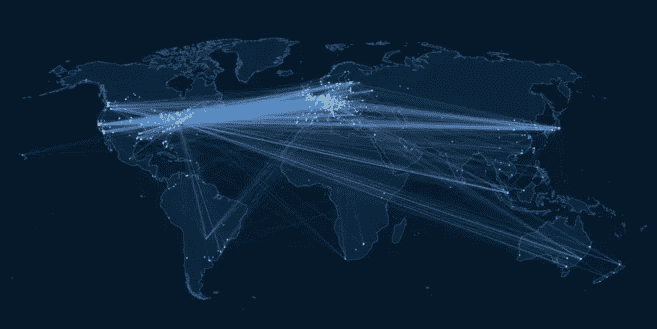
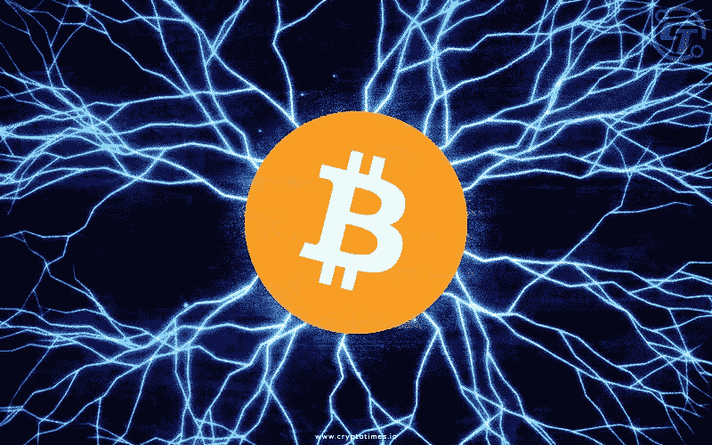
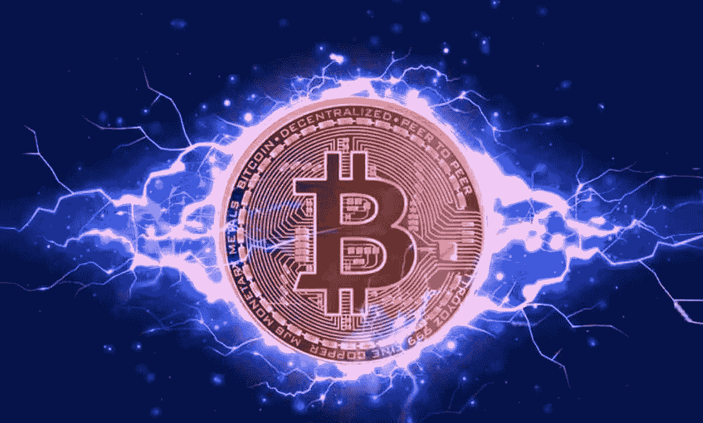

# 闪电网络

> 原文：<https://medium.com/coinmonks/lightning-network-7c4353a487ea?source=collection_archive---------35----------------------->

该协议源于提高比特币效率的需要。LN 的开发是为了在不增加成本的情况下提高比特币的可扩展性。它实际上是 2 级，所以它连接到比特币网络。
当我们谈论比特币低效率时，我们大多是指每秒的交易量。比特币的目标是成为一种允许在全球范围内支付的数字货币。为了实现这一点，在不修改基础设施的情况下，有必要使用第 2 层作为 LN。

闪电网络是如何工作的

该技术基于多个用户之间的支付渠道。支付渠道是多重签名交易。为了达成交易，双方都需要签字。一个优势肯定是交易速度。这是因为一旦通道关闭，交易将被验证并包含在比特币块中。为了确保平稳运行，LN 网络使用智能合同技术。
有研究称，LN 网络可以让比特币达到一百万 TPS。此外，LN 网络的安全性也很高。
这项技术主要针对我们日常进行的小额支付和付款。
要打开和关闭频道，你必须支付佣金，但这允许相关用户在操作期间不支付佣金。

目前，闪电网络仍在开发中，所以有困难和可能的错误是正常的，但条件真的很好。因为如果比特币一直因其安全水平和技术而受到称赞，目前我们无法在世界各地使用它进行即时支付。我的意思是，它无法在不导致拥塞问题和网络速度下降的情况下支持每秒数千个事务。
LN 的发展至关重要，因为如果他们能够在不损害任何东西的情况下解决问题，比特币作为一种数字货币可能会变得非常有趣。

> 加入 Coinmonks [电报频道](https://t.me/coincodecap)和 [Youtube 频道](https://www.youtube.com/c/coinmonks/videos)了解加密交易和投资

# 另外，阅读

*   [有哪些交易信号？](https://coincodecap.com/trading-signal) | [Bitstamp vs 比特币基地](https://coincodecap.com/bitstamp-coinbase) | [买索拉纳](https://coincodecap.com/buy-solana)
*   [ProfitFarmers 点评](https://coincodecap.com/profitfarmers-review) | [如何使用 Cornix Trading Bot](https://coincodecap.com/cornix-trading-bot)
*   [西班牙 5 大最佳文案交易平台](https://coincodecap.com/copy-trading-spain)
*   [Pionex 双投](https://coincodecap.com/pionex-dual-investment) | [AdvCash 审核](https://coincodecap.com/advcash-review) | [坚持审核](https://coincodecap.com/uphold-review)
*   [面向开发者的 8 个最佳加密货币 APIs】](https://coincodecap.com/best-cryptocurrency-apis)
*   [十大最佳加密货币博客](https://coincodecap.com/best-cryptocurrency-blogs) | [YouHodler 评论](https://coincodecap.com/youhodler-review)