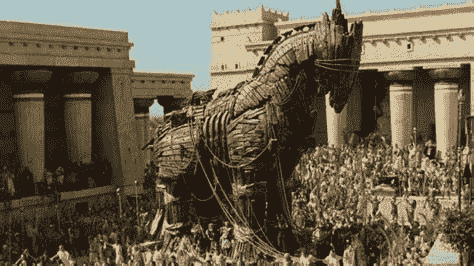
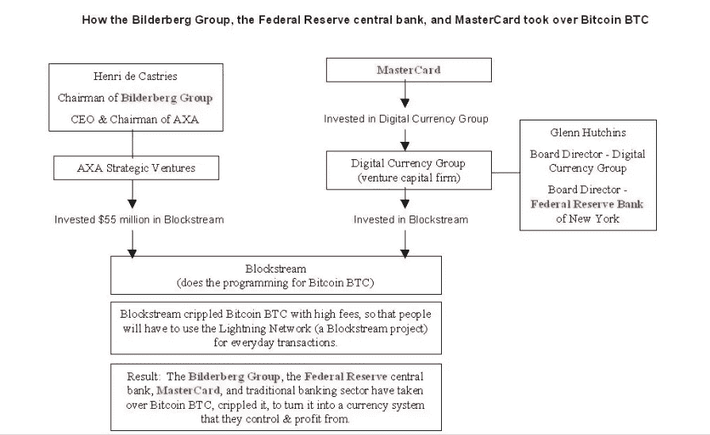
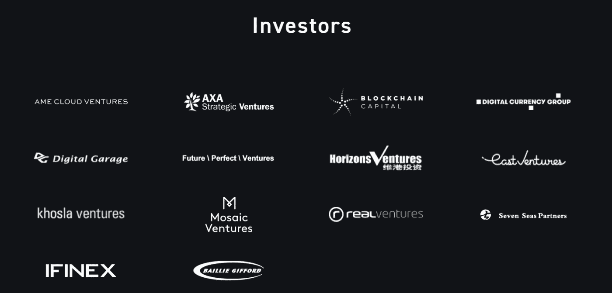

# 闪电网络:密码行业的特洛伊木马

> 原文：<https://medium.com/coinmonks/lightning-network-the-trojan-horse-of-the-crypt-industry-f26e3cc8cd46?source=collection_archive---------5----------------------->

特洛伊的马是一种战争策略。

一个巨大的木马形状的小玩意，根据这个故事，是阿卡奥斯用来进入坚固的特洛伊城的。特洛伊人把这匹巨大的马作为胜利的标志，并被带进巨大的城墙里，不知道里面藏着几名敌军士兵。夜里，战士们从马上出来，杀死哨兵，打开城门让军队进入，这导致了特洛伊的最终陷落。

这个故事不是重复的而是押韵的。银行家们用同样的策略对抗可以赚到钱的颠覆性技术，比特币区块链。

# 交易缩放允许比特币成为 P2P 货币

精英们最不希望看到的是，人们把加密货币与“为人民服务的货币”或“互联网货币”或“金融独立于银行”联系在一起。

银行家们明白区块链技术具有颠覆性，并假装掌握控制权。当维基解密宣布采用比特币时，提醒精英们注意银行系统的金融稳定。

随后几年，比特币继续快速扩张，甚至被微软、Steam 和 Twitch 接受为支付方式。

比特币目前是金融机构的敌人，也是银行和精英在游戏中保持相关性的一种方式。

因此，银行机构正在积极破坏加密货币，因为比特币仍然是旗舰产品，他们主要关注它，期望败坏整个行业的名声，当其他加密货币有良好的使用效果时，他们就会攻击它们。

> Satoshi:政府有利于削减像 Napster 这样集中控制的网络头，但 Gnutella 和 Tor 这样的纯 P2P 网络似乎在抵制。

每个人都应该意识到，加密货币处于为个人争取更多权力和自由的全球斗争的前沿，但它们也可以被用来奴役和剥夺权力。

像所有区块链一样，比特币在 L1 也有规模交易的限制。

区块链三元悖论是由 Vitalik Buterin 提出的，它表明区块链的运行牺牲了三个基本特征中的一个，即去中心化、安全性或可扩展性，然后是其他两个。

许多人想知道为什么会有 BTC 最大化主义者，为什么他们支持其他加密货币一文不值的观点，这对初学者来说是一个明确的信息，特别是针对比特币现金，反应总是非常极端。

> 比特币现金缓解了三难困境，在不牺牲去中心化或安全性的情况下实现了攀升，增加了区块大小。一个简单的改进给了他巨大的动力。

一般来说，第二层是任何区块链的攀爬解决方案，但安全问题最好在 L1 解决，而不是在规模的侧链(L2)中解决。

比特币也能抵抗审查。当然，只是在他的 L1。

开发商正在研究的任何其它解决方案，都不会是避免交易审查的更好选择。

这个策略背后的公司是 Blockstream，没想到会有这种来自比特币社区和比特币现金的分叉的阻力。

# 闪电网络是一个集中的工具

闪电网络由 Blockstream 开发，其中一些程序员也是比特币核心团队的一部分。

LN 是一个 Sidchain 网络，只有当用户关闭状态通道时，才会验证比特币区块链中的交易，同时，该通道中的交易仍保留在一个星云中，在一个会计草案中。

不运行自己的节点的用户被迫使用闪电集线器，这增加了审查的几率。

闪电中枢可以被网络控制，任何时候打开和关闭频道的闪电用户都可以在交易中受到审查。

> LN 应该是关于小额交易(即购买一杯咖啡或一杯苏打水)，但是 LN 频道的打开和关闭需要支付(两个)L1 的采矿费率。BTC 房价为 50 美元，你会花 100 美元来提神或喝杯咖啡吗？

闪电网络:技术问题，错误，故障和漏洞列表。来源: [GitHub](https://github.com/davidshares/Lightning-Network)

Blockstream 是由银行创建和资助的，其唯一目的是延迟进展，因为它似乎有可能将银行卡特尔的金融权力转移到加密货币的金融网络。

# 块流

Blockstream 背后的力量是防止加密货币成为一种平等对待世界上所有人的货币工具，因为这将是最好的产品，并将使银行过时。他们只是将比特币展示为“富人的另一种工具”。

区块流有效瘫痪了比特币。这个盒子里装着不可否认的事实，解释了银行为了阻止比特币的普及走了多远。

区块链的队伍中有几个比特币核心团队的开发者(现在的和古代的)。

我们可以看到，在块流投资者中有银行家。这个图表解释了 BTC 连接和彼尔德伯格集团。万事达卡、安盛和灰度，以及 BlockStream 如何链接和融资:

[Reddit](https://www.reddit.com/r/btc/comments/7m046d/how_the_bilderberg_group_the_federal_reserve/)

安盛战略风险投资:[https://AXA . com/en/magazine/AXA-Strategic-Ventures-区块链](https://t.co/rkP1l8uYDS)

万事达卡:【https://coingeek.com/the-mastercard-bitcoin-conspiracy/ 

此外，由于闪电网络是在世界经济论坛中任命的，因此体制的干扰是明显的:[https://www.weforum.org/organizations/ligning-labs](https://www.weforum.org/organizations/ligning-labs)

2015 年，万事达卡投资了数字货币集团(DCG)，该集团是 Blockstream 的主要投资者之一，该公司当时雇佣了几乎所有的比特币开发者。

其他开发人员由一些公司支付，包括由杰弗里·爱泼斯坦资助的麻省理工学院媒体实验室数字货币倡议，以及欧洲保险公司 AXA 的风险资本子公司，该公司的首席执行官当时也是彼尔德伯格集团的总裁。。

在这些投资之后，几乎所有关于连锁升级的对话都被压制，试图推动对话的人都受到了社会工程和 DDoS 攻击的影响。

数字货币集团为您的企业创造投资基金，灰度投资；灰度把比特币品牌变成了“数字黄金”，宣传它是一种投资，而不是数字货币。“GBTC”基金拥有 350 亿美元的 Aum，并为机构投资者认为比特币旨在成为数字黄金做出了重大贡献，这完全是一个谎言。

数字货币集团投资于几个竞争对手，以提供比特币在协议变更和取消之前最初能够做的事情:

闪电网络用于链中的第二层“快照”交易，而不是链中的即时交易，

BTC 智能合约的 RSK，而不是使用现已废弃的比特币脚本，

Ripple 在自己的区块链进行即时交易，

奇偶校验，谁创造了波尔卡多区块链，使智能合同，

…以及更多。

现在，所有这些应用都有自己独立的私人解决方案和投机令牌，而不是整合到比特币链中。

[Blockstream](http://blockstream.com/about/)

数字货币集团拥有(部分)和指导 Blockstream。

谁领导数字货币集团:

1.  格伦·哈钦斯:克林顿总统的演讲。哈钦斯是纽约州美联储银行董事会的成员，他在那里再次当选为 B 类董事，任期三年，到 2018 年 12 月 31 日为止。
2.  巴里·希尔伯特(Barry Silbert):数字货币集团(由万事达卡资助)的首席执行官，也是低调组合霍利亨的前投资银行家。这就是那个认为 SW2X 是个好主意的家伙。
3.  劳伦斯·h·萨默斯:1991 年至 1993 年世界银行首席经济学家。1993 年，萨默斯被任命为克林顿政府时期美国财政部负责国际事务的副部长。1995 年，在他的前政治导师罗伯特·鲁宾的指导下，他被提升为财政部副部长。1999 年，他接替鲁宾担任财政部长。在克林顿政府工作期间，萨默斯在美国应对 1994 年墨西哥经济危机的过程中发挥了重要作用。1997 年亚洲金融危机和俄罗斯金融危机。
4.  布莱斯·马斯特斯:“摩根大通前高管。她目前是金融技术公司 Digital Asset Holdings 的执行董事，该公司为批发金融服务开发分布式会计技术。Masters 被广泛认为是信用违约互换这一金融工具的创造者。
5.  DCG 也是 Bitgo 的投资者，Bitgo 旨在成为一种避免重复支出的“服务”。虽然比特币将这种安全性纳入了其协议中，但只有在交易没有在区块链中得到确认，并且在例如闪电网络、区块流开发技术等侧链中得到确认的情况下，该服务才是有用的。

[liberlion.com](http://liberlion.com)

> 加入 Coinmonks [电报频道](https://t.me/coincodecap)和 [Youtube 频道](https://www.youtube.com/c/coinmonks/videos)了解加密交易和投资

# 另外，阅读

*   [比特币基地僵尸程序](/coinmonks/coinbase-bots-ac6359e897f3) | [AscendEX 审查](/coinmonks/ascendex-review-53e829cf75fa) | [OKEx 交易僵尸程序](/coinmonks/okex-trading-bots-234920f61e60)
*   [如何在印度购买比特币？](/coinmonks/buy-bitcoin-in-india-feb50ddfef94) | [WazirX 审查](/coinmonks/wazirx-review-5c811b074f5b)
*   [CryptoHopper 替代品](/coinmonks/cryptohopper-alternatives-d67287b16d27) | [HitBTC 审查](/coinmonks/hitbtc-review-c5143c5d53c2)
*   [CBET 评论](https://coincodecap.com/cbet-casino-review) | [库库恩 vs 比特币基地](https://coincodecap.com/kucoin-vs-coinbase)
*   [折叠 App 审核](https://coincodecap.com/fold-app-review) | [Kucoin 交易机器人](/coinmonks/kucoin-trading-bot-automate-your-trades-8cf0ca2138e0) | [Probit 审核](https://coincodecap.com/probit-review)