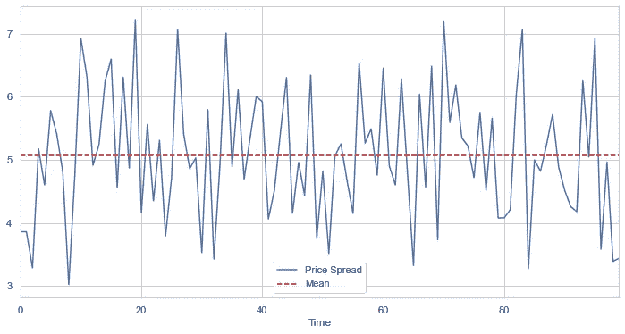

# 线性均值回复策略|加密货币

> 原文：<https://medium.com/coinmonks/linear-mean-reverting-strategy-cryptocurrency-55ec4a4f13ac?source=collection_archive---------8----------------------->

在量化交易领域有两种主要的策略，即均值回归和动量交易。今天我们将介绍均值回复的一个简单的线性概念。

[](/@Dr.Bankruptcy/how-to-get-usdt-future-data-from-binance-python-api-13b20d937bdd) [## 如何从币安 python API 获取 USDT 未来数据

### 你需要数据来研究和测试交易策略。币安是一个很好的数据来源。在这里，我们将展示如何…

medium.com](/@Dr.Bankruptcy/how-to-get-usdt-future-data-from-binance-python-api-13b20d937bdd) 

你可以根据我的另一个故事来获得所需的数据。今天我们将学习 ETH/BTC 配对。

大多数均值回复策略基于平稳性的思想。虽然你可以在维基百科上查看平稳过程的数学定义，但我想用图形来描述这个概念。


左边的时间序列是平稳的。很明显，它在平均值附近振荡。在右侧，该系列是趋势性的，即存在非零漂移。

为了测试平稳性，可以应用 ADF (Augmented Dickey Fuller)测试。这个函数在许多统计库中被广泛定义，例如，在 python:

```
from statsmodels.tsa.stattools import adfuller
```

可以通过调用以下命令来检查 p 值:

```
pvalue = adfuller(X)[1]
```

如果 p 值小于 0.01 或 0.05，则检查平稳性。

如果我们发现一个金融工具的价格，一对金融工具(如黄金-白银 etc 联邦储蓄银行等)的价差，甚至一个资产组合或资产之间的一些比率确实是平稳的，会怎么样呢？



对于上面的综合价差，我们可以看到它在其平均值附近是稳定的。均值回归策略是，当你看到价值足够大于其均值时，你做空资产，因为你知道它最终会回到均值以获取利润(因此得名均值回归策略)，反之亦然，当价值远小于均值时。

让我们检查一下 BTC 联邦理工学院的案例:


如果我们将回顾期设置为 240，即 4 小时，我们可以看到以下内容(显示前 10 天):

```
lookback = 240
price = df['Close'].iloc[:1440*10]
mean = np.mean(price)plt.figure(figsize=(12,6))
price.plot()
price.rolling(lookback).mean().plot()
plt.xlabel('Time')
plt.ylabel('Value')
plt.legend(['ETH/BTC', 'Mean'])
```


实际上，平均值(橙色线)只是 240-SMA(简单移动平均线)，通过均值回复，我们预计价格将围绕 SMA 线上下波动。然而，图表看起来并不稳定！如果我们检查它的 p 值:

```
from statsmodels.tsa.stattools import adfuller
pvalue = adfuller(price)[1]
print(pvalue)
```

我在这里得到一个 0.6668578022312203，表明这个数列是非平稳的。如果我们看它的 z 值:

```
def zscore(series,lookback):
    return (series - series.rolling(lookback).mean()) / series.rolling(lookback).std()zscore(price,lookback).plot(figsize=(12,6))
plt.axhline(zscore(price,lookback).mean(),color='green')
plt.show()
```


我们可以看到该比率有时高达 8 个标准差！在经典的布林线策略中，人们会观察，比如说 2 个标准差，进行交易，即当价格超过平均值的 2 个标准差(布林线上轨)时，做空该工具，希望它会回到 SMA。当价格低于 2 标准差(布林线下轨)时，做多。但在趋势市场中，价格可能远远高于 2 标准差，甚至 3 标准差，导致重大损失。

那么，我们能从一个具有均值回复策略的非平稳序列中获利来捕捉短期超卖/超买运动吗？

我们将测试线性“放大”策略；当价格越来越超过 z 值时，我们逐渐增加我们的空头头寸，反之亦然。这里，我们将我们的位置设置为等于 z 得分的负值，因此这是一个线性均值回复策略。

```
df['zscore'] = zscore(df['Close'],lookback)
df['position'] = - df['zscore']
```

然后，我们通过将我们的头寸乘以价格变化，减去 0.05%的交易费，计算我们投资组合的市场价值变化，从而计算我们的分钟 PnL:

```
df['pnl'] = df['position'].shift(1) * df['Close'].pct_change() - df['position'].diff().abs()*0.0003
ret = df['pnl'].dropna()
```

然后我们绘制权益曲线:

```
(1+df['pnl']).cumprod().plot(figsize=(12,6))
```


它不起作用可能是因为竞争——更多的人使用这种策略降低了它的盈利能力。事实上，如果不包括交易成本，该策略仍然非常有利可图。然而，更多的资本正在向同一方向流动，导致不利于该战略的价格变动。尽管如此，让我们看看一些性能指标，即夏普比率和最大下降

```
N = 365 * 1440
r = 0.2/365/1440sharpe =(np.mean(ret)-r)/np.std(ret)*np.sqrt(N)
print('Sharpe: ), sharpe)
cum_ret = (ret+1).cumprod()
peak = cum_ret.expanding(min_periods=1).max()
dd = (cum_ret/peak)-1
print('MDD: ' , dd.min())
```

我们能修改策略使它再次盈利吗？你可以尝试改变回望周期或线性，降低交易成本，设置止盈或止损，应用像布林线等阈值。

如果我们只在 6 日至 7 日的区间交易，并将回望期增加到 20 天，以减少交易频率，会怎么样？

```
lookback = 1440 * 20
z1 = 6
z2 = -1
z3 = 7
z4 = 1df['zscore'] = zscore(df['Close'],lookback)
df['position'] = (df['zscore'].abs() > z1) * z2 * df['zscore'] + (df['zscore'].abs() > z3 ) * z4 * df['zscore']
df['pnl'] = df['position'].shift(1) * df['Close'].pct_change() - df['position'].diff().abs() *0.0005
ret = df['pnl'].dropna()
N = 365 * 1440
r = 0.08/365/1440
sharpe =(np.mean(ret)-r)/np.std(ret)*np.sqrt(N)
print('Sharpe:', sharpe)
cum_ret = (ret+1).cumprod()
peak = cum_ret.expanding(min_periods=1).max()
dd = (cum_ret/peak)-1
print('MDD: ' , dd.min())
(1+df['pnl']).cumprod().plot(figsize=(12,6))#Sharpe: -0.9104931575786175
#MDD:  -0.016416421941021553
```


但是我们只有少数交易在统计上是不可靠的，而且容易出现过度拟合的问题。当然，我们有一些假设和细节的遗漏，读者应该在实施之前仔细设计和测试他们的交易系统。

再见。

> 加入 Coinmonks [电报频道](https://t.me/coincodecap)和 [Youtube 频道](https://www.youtube.com/c/coinmonks/videos)了解加密交易和投资

# 另外，阅读

*   [5 款最佳加密交易终端](https://coincodecap.com/crypto-trading-terminals) | [最佳 DeFi 应用](https://coincodecap.com/best-defi-apps)
*   [比特币基地 vs 瓦济克斯](https://coincodecap.com/coinbase-vs-wazirx) | [比特鲁点评](https://coincodecap.com/bitrue-review) | [波洛涅克斯 vs 比特鲁](https://coincodecap.com/poloniex-vs-bittrex)
*   [德国最佳加密交易所](https://coincodecap.com/crypto-exchanges-in-germany) | [Arbitrum:第二层解决方案](https://coincodecap.com/arbitrum)
*   [币安交易机器人](/coinmonks/binance-trading-bots-d0d57bb62c4c) | [OKEx 审查](/coinmonks/okex-review-6b369304110f) | [阿塔尼审查](https://coincodecap.com/atani-review)
*   [最佳加密交易信号电报](/coinmonks/best-crypto-signals-telegram-5785cdbc4b2b) | [MoonXBT 评论](/coinmonks/moonxbt-review-6e4ab26d037)