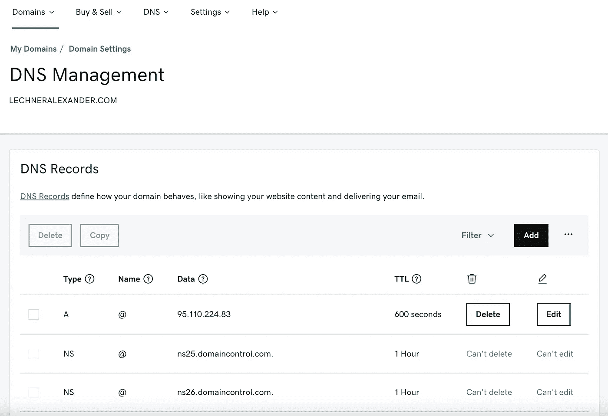
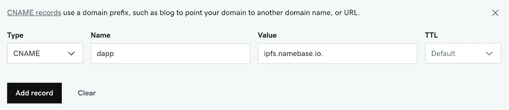
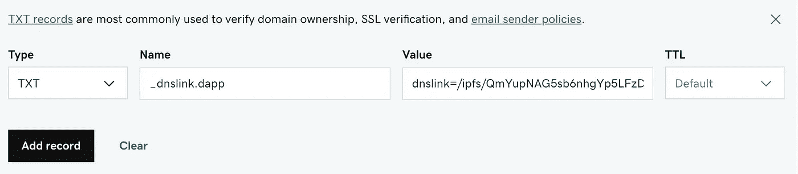

# 将一个域链接到 IPFS 托管的 dApp

> 原文：<https://medium.com/coinmonks/link-a-domain-to-a-dapp-hosted-on-ipfs-6cf155ef689f?source=collection_archive---------4----------------------->

*如何将域名链接到 IPFS 托管的 dApp 的快速分步指南*

本文是关于如何在 Avalanche 上构建和托管 dApp 的系列文章的第 4 部分。点击此处查看其他部分:

*   [第 1 部分:使用 Hardhat 创建并部署一个 Solidity 契约来雪崩](/@a.a.lechner/create-and-deploy-a-solidity-contract-to-avalanche-with-hardhat-2c5cd5e4fa93)
*   [第二部分:用乙醚、超屏蔽和反应制造雪崩 dApp](/@a.a.lechner/create-an-avalanche-dapp-with-ethers-metamask-and-react-342d8d22cb30)
*   [第 3 部分:用 IPFS 和 AWS 托管一个去中心化的应用](/@a.a.lechner/host-a-decentralised-application-with-ipfs-and-aws-1c8e147284ce)

## 第一步:

在本教程中，我们将链接一个传统的域名到 IPFS 托管的 dApp。如果你还没有一个托管在 IPFS 的 dApp，请查看之前的教程。

在本教程中，我们将使用这个 [CID](https://docs.ipfs.io/concepts/content-addressing/) 下托管在 IPFS 的 dApp:

```
https://ipfs.io/ipfs/QmYupNAG5sb6nhgYp5LFzDAW9Tn9kHRQwbLrbKBbbDneAp
```

要将一个域链接到 IPFS 文档，我们需要更新该域的 DNS 设置。所以去你的域名注册商那里打开 DNS 设置。对于 GoDaddy，设置如下:



## 第二步:

要将一个域链接到 IPFS 文档，我们需要创建 2 个 DNS 条目:

*   一个`CNAME`条目:将域链接到 IPFS 网关
*   一个`TXT`条目:将域链接到一个特定的 IPFS 文档(CID)

在本教程中，我们只将一个子域`dapp.lechneralexander.com`指向 dApp，所以让我们首先添加一个`CNAME`条目，将主机设置为`dapp`，将值设置为`gateway.ipfs.io.`:



现在我们将添加一个带有主机`_dnslink.dapp`和值`dnslink=/ipfs/YOUR_DAPP_CID`的`TXT`条目:



如果您想使用不同的子域，您可以简单地在`CNAME`和`TXT`设置中将`dapp`替换为您想要的子域。如果您想将域本身(而不是子域)指向一个 IPFS 文档，您需要将`CNAME`主机设置为`@`，将`TXT`主机设置为`_dnslink`。

保存您的 DNS 更新并等待一会儿。根据您的注册商，对 DNS 的更改可能需要几分钟/几小时才能生效。

**替代**:不使用`gateway.ipfs.io`作为网关，也可以使用[cloud flare](https://developers.cloudflare.com/distributed-web/ipfs-gateway/connecting-website#connecting-to-cloudflares-gateway)T1 提供的网关。Cloudflare 在 IPFS 之前添加了一个缓存层，因此使用 Cloudflare 网关通常会导致更快的页面加载。

## 第三步:

已经完成了，现在你可以通过在浏览器中调用子域:[http://dapp.lechneralexander.com](http://dapp.lechneralexander.com/)来访问 IPFS 托管的 dApp。

## 第四步:更新你的 dApp

每当你发布一个新版本的 dApp，你也需要更新 DNS 设置中的`TXT`记录。 [Cloudflare IPFS 文档](https://developers.cloudflare.com/distributed-web/ipfs-gateway/automated-deployment)链接到几个项目，您可以使用它们来自动化这个过程。

## 接下来:

在本教程中，我们将一个传统域链接到一个 IPFS 文档(雪崩网络上的一个 dApp)。在接下来的教程中，我们将使用一个分散的域(比如 ENS 或 Handshake)进行研究。

## 资源和链接:

*   IPFS 官方文档:[https://docs . ipfs . io/how-to/websites-on-ipfs/link-a-domain/# link-a-domain](https://docs.ipfs.io/how-to/websites-on-ipfs/link-a-domain/#link-a-domain)
*   Cloudflare IPFS 网关文档:[https://developers . cloud flare . com/distributed-web/ipfs-gateway/connecting-website](https://developers.cloudflare.com/distributed-web/ipfs-gateway/connecting-website)

> 加入 Coinmonks [电报频道](https://t.me/coincodecap)和 [Youtube 频道](https://www.youtube.com/c/coinmonks/videos)了解加密交易和投资

## 也阅读

[](/coinmonks/leveraged-token-3f5257808b22) [## 杠杆代币[多头代币]终极指南

### 杠杆化令牌是具有杠杆化风险敞口的 ERC20 令牌，不考虑保证金、要求、管理…

medium.com](/coinmonks/leveraged-token-3f5257808b22) [](https://blog.coincodecap.com/crypto-exchange) [## 最佳加密交易所| 2021 年十大加密货币交易所

### 编辑描述

blog.coincodecap.com](https://blog.coincodecap.com/crypto-exchange) [](https://blog.coincodecap.com/best-swap-platforms) [## 2022 年最佳加密交换平台| CoinCodeCap

### 编辑描述

blog.coincodecap.com](https://blog.coincodecap.com/best-swap-platforms) [](https://blog.coincodecap.com/best-online-casinos) [## 10 大最佳在线赌场|赢得并赢取免费 BTC 2022 | CoinCodeCap

### 编辑描述

blog.coincodecap.com](https://blog.coincodecap.com/best-online-casinos) [](/coinmonks/top-5-crypto-lending-platforms-in-2020-that-you-need-to-know-a1b675cec3fa) [## 2021 年最佳加密借贷平台| 6 大比特币借贷平台

### 获得比特币和其他加密货币的最佳贷款利率

medium.com](/coinmonks/top-5-crypto-lending-platforms-in-2020-that-you-need-to-know-a1b675cec3fa) [](/coinmonks/the-best-cryptocurrency-hardware-wallets-of-2020-e28b1c124069) [## 2021 年 6 大最佳硬件钱包|顶级加密硬件钱包[更新]

### 最好的加密货币硬件钱包是绝对必要的。我们将在 NGRAVE、Ledger Nano X 和…

medium.com](/coinmonks/the-best-cryptocurrency-hardware-wallets-of-2020-e28b1c124069) [](/coinmonks/crypto-trading-bot-c2ffce8acb2a) [## 2021 年最佳免费加密交易机器人

### 2021 年币安、比特币基地、库币和其他密码交易所的最佳密码交易机器人。四进制，位间隙…

medium.com](/coinmonks/crypto-trading-bot-c2ffce8acb2a) [](/coinmonks/best-crypto-signals-telegram-5785cdbc4b2b) [## 最佳 4 个加密交易信号电报通道

### 这是乏味的找到正确的加密交易信号提供商。因此，在本文中，我们将讨论最好的…

medium.com](/coinmonks/best-crypto-signals-telegram-5785cdbc4b2b)