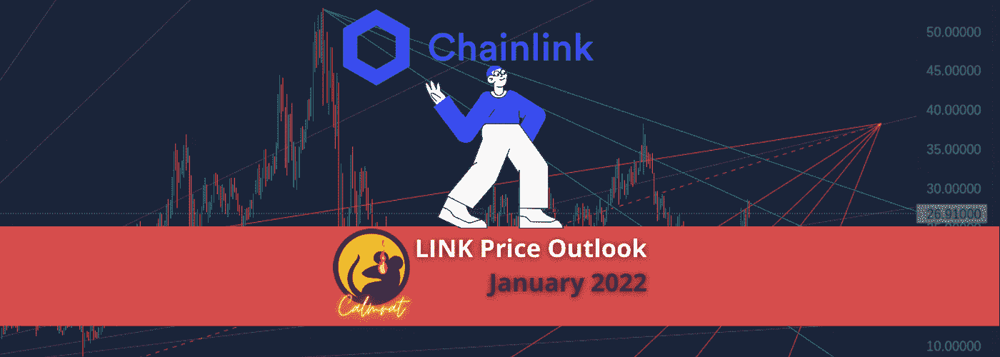
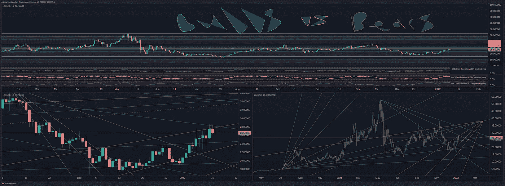
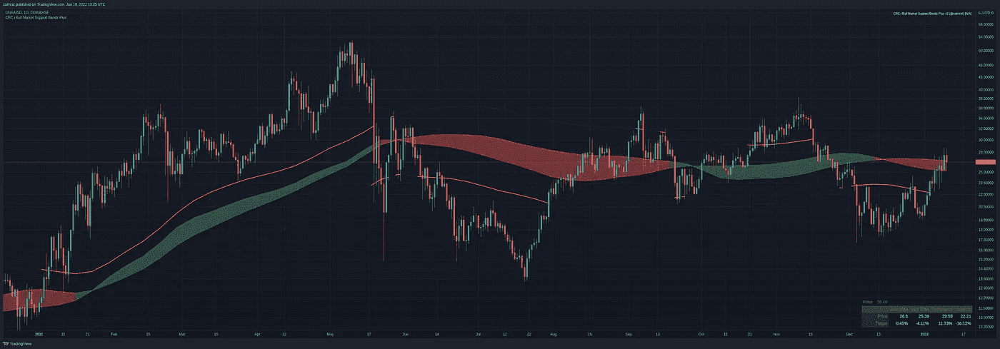
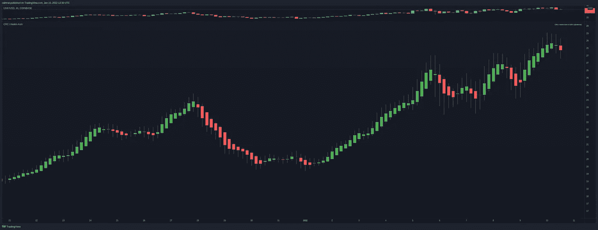
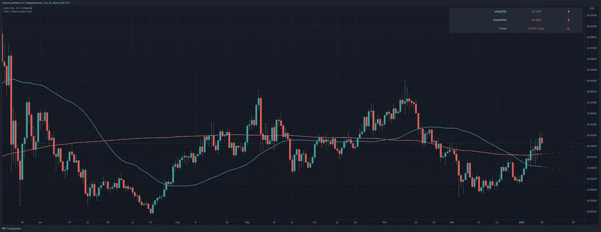

# 2022 年 1 月的链接价格目标

> 原文：<https://medium.com/coinmonks/link-price-targets-for-january-2022-aa91726fd4c?source=collection_archive---------14----------------------->

从目前的情况来看，似乎 [LINKUSD](https://www.tradingview.com/symbols/LINKUSD/) 将暂时被困在 28 美元阻力和 23 美元左右支撑位之间正在形成的[钻石形态](https://www.investopedia.com/terms/d/diamondtop.asp)内。如果我们避开上行，我认为 35 美元是流动性、支撑和阻力方面的下一个重要关注点。下行，回到 20-23 美元，取决于清算。

从 2021 年 5 月的高点和几周后市场在夏季前崩溃后的局部底部低点衡量 Fib 水平，黄金口袋位于 28-29 美元之间，与这些预测相符。

VRPR 水平也在排队，显示出强劲的[交易量](https://www.tradingview.com/ideas/volume/)和 27 美元和 24 美元的利息。

似乎我们在过去的一周已经达到了这个区间的顶部，达到了 28.5 左右，但两次未能守住 28 美元作为支撑。本周我们的方法只留下了一个漏洞。

经过上周的快速上涨，我们克服了 20w SMA / 21w EMA 牛市支持带！进步。

Heikin-Ashi 蜡烛线表明向下的势头正在形成。不过，我们需要等着看今天的交易会如何引导我们。

总之，我们必须在 28 美元上方有一个清晰的突破，并在日线时间框架上有一个测试作为支撑。否则，在接下来的几个星期里，死牛尸体的恶臭会淹没我们的感官。

在这种情况下，呆在里面会更好吗？不。确保你的限价单在你认为最有意义的地方。大多数人在牛市交易中赔钱。做多获利的唯一方法是在价格低的时候买入。

冷静点，伙计们。为更多鼓掌！

*   每月新增免费指标:[https://www.tradingview.com/u/calmrat/](https://www.tradingview.com/u/calmrat/)
*   分析，预测，交易:[https://medium.com/@calmrat](/%40calmrat)
*   俏皮话和笑声:[https://twitter.com/calmrat](https://twitter.com/calmrat)

交易奖金和更多…

*   *Crypto.com—*[*https://crypto.com/exch/v4n3pauckj*](https://crypto.com/exch/v4n3pauckj)
*   *https://accounts.binance.com/en/register?ref=346510770—*
*   **Bybit—*[*https://www.bybit.com/en-US/invite?ref=EKJRL*](https://www.bybit.com/en-US/invite?ref=EKJRL)*
*   **https://ftx.com/profile#a=60256726—*[*FTX*](https://ftx.com/profile#a=60256726)*
*   *交易视图—[https://www.tradingview.com/gopro/?share_your_love=calmrat](https://www.tradingview.com/gopro/?share_your_love=calmrat)*

*我的想法和意见仅此而已。我的。交易是有风险的，大多数交易者亏损或者更糟，破产。交易风险自担。可以假设我拥有这篇文章中提到的任何硬币的空头或多头头寸。仅用于教育目的。*

> *加入 Coinmonks [电报频道](https://t.me/coincodecap)和 [Youtube 频道](https://www.youtube.com/c/coinmonks/videos)了解加密交易和投资*

## *另外，阅读*

*   *[3 商业评论](/coinmonks/3commas-review-an-excellent-crypto-trading-bot-2020-1313a58bec92) | [Pionex 评论](https://blog.coincodecap.com/pionex-review-exchange-with-crypto-trading-bot) | [Coinrule 评论](/coinmonks/coinrule-review-2021-a-beginner-friendly-crypto-trading-bot-daf0504848ba)*
*   *[莱杰 vs n rave](/coinmonks/ledger-vs-ngrave-zero-7e40f0c1d694)|[莱杰 nano s vs x](/coinmonks/ledger-nano-s-vs-x-battery-hardware-price-storage-59a6663fe3b0) | [币安评论](/coinmonks/binance-review-ee10d3bf3b6e)*
*   *[密码本交易平台](/coinmonks/top-10-crypto-copy-trading-platforms-for-beginners-d0c37c7d698c) | [Coinmama 审核](/coinmonks/coinmama-review-ace5641bde6e)*
*   *[印度的加密交易所](/coinmonks/bitcoin-exchange-in-india-7f1fe79715c9) | [比特币储蓄账户](/coinmonks/bitcoin-savings-account-e65b13f92451)*
*   *[OKEx vs KuCoin](https://blog.coincodecap.com/okex-kucoin) | [摄氏替代品](https://blog.coincodecap.com/celsius-alternatives) | [如何购买 VeChain](https://blog.coincodecap.com/buy-vechain)*
*   *[币安期货交易](https://blog.coincodecap.com/binance-futures-trading)|[3 commas vs Mudrex vs eToro](https://blog.coincodecap.com/mudrex-3commas-etoro)*
*   *[本地比特币审核](/coinmonks/localbitcoins-review-6cc001c6ed56) | [加密货币储蓄账户](https://blog.coincodecap.com/cryptocurrency-savings-accounts)*
*   *[什么是融资融券交易](https://blog.coincodecap.com/margin-trading) | [成本平均法](https://blog.coincodecap.com/dca)*
*   *[支持卡审核](https://blog.coincodecap.com/uphold-card-review) | [信任钱包 vs 元掩码](https://blog.coincodecap.com/trust-wallet-vs-metamask)*