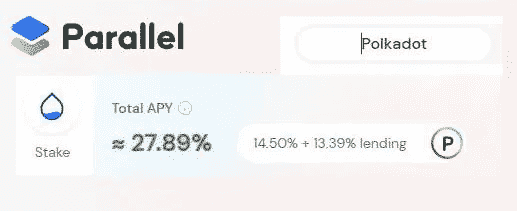

# 流动赌注 sDOT 可累积赌注奖励，可在 Parallel Finance 的 DEFI 生态系统中使用，以获得更多收益

> 原文：<https://medium.com/coinmonks/liquid-staked-sdot-accrues-staking-rewards-which-can-be-used-in-parallel-finances-defi-ecosystem-f823b14967cb?source=collection_archive---------12----------------------->

# 现在，较小的点持有者可以通过平行融资获得点赌注奖励

As of now DOT Liquid staking awards — 14.50% staking rewards in sDOT which can be lent to earn a further 13.39% Para APY yields

赌注是加密持有者想要做的第一件事，当赌注在区块链的赌注证明中被启动时。我记得当我带来我的点，我想赌注，但不能，因为最低点赌注的要求是 20 点，然后增加到 50 点。

因此，当我没有持有这么多 DOT 时，我总是被迫成为 DOT 的被动持有者，所以我不能通过下注的过程赚取 DOT 下注收益。

然而，有了 Parallel Finance，事情发生了变化，因为我只需在 Parallel Finance 的下注模块下注 5 点就可以获得下注奖励。

# 并行融资中的流动赌注 sDOT 赚取赌注回报，此外还可以用于在 DEFI 中赚取更多收益

我想所有的读者都知道在区块链投注。这允许密码持有者将他们的股份委托给网络的验证者，验证者反过来保护网络。

然而，对于像我这样没有设法通过通常已知的方式在 Polkadot 网络上下注的 DOT 持有人来说，他们可以通过平行融资来下注。如前所述，通过平行融资下注最少需要 5 点。标桩点将分发给并行金融团队研究的表现良好的验证器。

与此同时，赌注者得到 sDOT，因为这是流动的赌注点，这意味着赌注点可以在平行金融的 DEFI 中使用，以赚取更多的收益。

## **让我们探索一下流动点赌注者在平行金融中能获得多少收益**

**液体赌注奖励-**

***下注 DOT - >*** 领取 sDOT，sDOT 将继续累积 14.50%的 DOT 下注奖励

**这种 sDOT 可以在 Parallel Finance 的货币市场**中借出，现在可以获得 13%的 Para 奖励和 0.15%的 DOT 奖励。

这是一种非常安全的规避风险的方式，可以通过 sDOT 获得更多收益。

***通过向 DOT-sDOT 对*** 提供流动性赚取 LP 奖励

Liquidity providers have the DOT-sDOT pair to provide liquidity for…

这一对非常重要，因为在平行融资中，通过 sDOT 到 DOT 的互换，可以将一个人的 sDOT 转换为 DOT，因此显然这些资产需要流动性，sDOT - DOT 持有者可以为这些对提供流动性。

流动性提供者将获得 LP 奖励，他们可以在 [Parallel Finance 的货币市场](https://app.parallel.fi/#/lendAndBorrow)发放贷款，赚取更多收益。

目前，LP-DOT/sDOT 资产在货币市场借贷时可以获得 12%的 Para 回报。

**通过平行融资进行点流动赌注有其优势，让我们来看看这些优势— :**

1.  点持有者利用他们的赌注点，即平行金融的 DEFI 平台中的 sDOT，赚取更多收益。这在本文前面的章节中已经讨论过了。
2.  sDOT 可以在需要时通过交换立即转换成 DOT。否则，将需要 29 天的时间来拆除一个人的桩点，以恢复原来的点。
3.  在平行金融中，流动赌注只需要 5 点，而在 Polakdot 的网络中至少需要 50 点或更多的点来赢得赌注奖励。
4.  如果使用 Parallel Finance 的 liquid staking 模块，点 staging 是没有任何麻烦的。在这里，流动的 staked DOT 被分配给一个执行组的验证者，他们是由 Parallel Finance 的团队研究后选择的。

这使得点标桩对利益相关者来说很方便，否则就必须对执行验证器进行研究，并密切关注它们的批量生产性能，因为在不执行或表现不佳的验证器的股份被削减的地方，削减风险就在那里。

5.此外，由于存在削减风险，因此在削减验证人导致 sDOT 持有人的股份削减的情况下，平行融资将弥补损失。这一点在常见问题部分有所提及，您可以在平行金融的“赌注”模块下阅读—[https://app.parallel.fi/#/staking](https://app.parallel.fi/#/staking)

6.sDOT 非常灵活，因为人们可以通过 Parallel 的交换模块快速将 sDOT 交换到任何其他资产。否则，要出售标桩点，必须拆桩点，等待 29 天获得未标桩点，然后在市场上出售该点。

***因此，通过并行金融中的流动赌注赚取点赌注奖励是点持有者利用其闲置点并获得收益的绝佳机会。***

Parallel Finance 的目标之一是为用户提供一个易于使用的平台，为他们存放在 Parallel Finance DEFI 中的资产提供尽可能高的收益率。该协议从 Parallel Finance 的流动赌注模块的点赌注回报收益率开始。

**此处进入平行金融 App**—[https://app.parallel.fi/](https://app.parallel.fi/)

**了解平行金融-**

网站—[https://parallel.fi/index.html](https://parallel.fi/index.html)

推特—[https://twitter.com/ParallelFi](https://twitter.com/ParallelFi)

https://discord.gg/DeyEntFT

**这位作者的文章也可以在这些平台上阅读—**

[https://peakd.com/@mintymile/posts](https://peakd.com/@mintymile/posts)

[https://steemit.com/@mintymile/posts](https://steemit.com/@mintymile/posts)

https://www.publish0x.com/@greenchic

> 加入 Coinmonks [电报频道](https://t.me/coincodecap)和 [Youtube 频道](https://www.youtube.com/c/coinmonks/videos)了解加密交易和投资

# 另外，阅读

*   [TraderWagon 回顾](https://coincodecap.com/traderwagon-review) | [北海巨妖 vs 双子星 vs BitYard](https://coincodecap.com/kraken-vs-gemini-vs-bityard)
*   [如何在 FTX 交易所交易期货](https://coincodecap.com/ftx-futures-trading) | [OKEx vs 币安](https://coincodecap.com/okex-vs-binance)
*   [OKEx vs KuCoin](https://coincodecap.com/okex-kucoin) | [摄氏替代品](https://coincodecap.com/celsius-alternatives) | [如何购买 VeChain](https://coincodecap.com/buy-vechain)
*   [ProfitFarmers 回顾](https://coincodecap.com/profitfarmers-review) | [如何使用 Cornix Trading Bot](https://coincodecap.com/cornix-trading-bot)
*   [如何匿名购买比特币](https://coincodecap.com/buy-bitcoin-anonymously) | [比特币现金钱包](https://coincodecap.com/bitcoin-cash-wallets)
*   [瓦济里克斯 NFT 评论](https://coincodecap.com/wazirx-nft-review)|[Bitsgap vs Pionex](https://coincodecap.com/bitsgap-vs-pionex)|[坦吉姆评论](https://coincodecap.com/tangem-wallet-review)