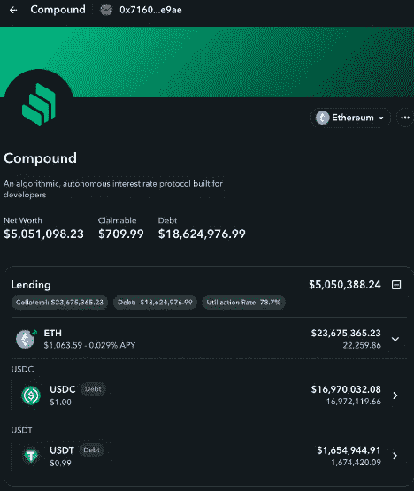

# 清算、三明治、破产:击落 3AC 的三支箭？

> 原文：<https://medium.com/coinmonks/liquidations-sandwiches-insolvency-three-arrows-shooting-down-3ac-b7176bb6f261?source=collection_archive---------16----------------------->

Photo by [Artem Kniaz](https://unsplash.com/es/@artem_kniaz) on [Unsplash](https://unsplash.com/)

市场崩溃的连锁冻结效应已经延伸到最活跃的投资公司之一:三箭资本，即 3AC。周三，20 家公司被迫清算，由于出售资产以避免未来清算和潜在的破产，导致成为三明治套利的受害者，使该公司的未来成为问题。

# 6100 万美元清算

根据 EigenPhi 的清算借款人排行榜，在过去的几天里，这个属于 3AC 的地址遭遇了 20 次清算，总金额超过 6100 万美元。

EigenPhi 的数据显示，同一时期的总清算金额约为 2 . 51 亿美元，这意味着 3AC 的资产出售占总额的 24%。

谁从拍卖中受益？查看 [№1 清算人的详细页面，](https://eigenphi.io/ethereum/liquidation/liquidator/0xd911560979b78821d7b045c79e36e9cbfc2f6c6f)，你可以在底部找到它与 3AC 地址的联系:总共 7 次清算，价值近 2300 万美元。

这个清算人[最大的利润也是出自 3AC 的口袋。](https://eigenphi.io/ethereum/liquidation/liquidator/0xd911560979b78821d7b045c79e36e9cbfc2f6c6f)

点击上面的行，您可以查看下面的详细信息。

你会在其他顶级清算中发现同样的模式，并期待更多的到来。为什么？看看 Zapper 上的地址组合。

截至美国东部时间 6 月 15 日上午 14:19，这个地址的净资产为 505 万美元，负债 1900 万美元。另一个地址的净资产为 688 万美元，负债 1900 万美元。

# 4 个不太好吃的三明治

面对如此紧迫的形势，所有的投资公司都会做和 3AC 一样的事情:加强自己的地位，即使是以折扣价。例如，它通过此交易将 30，000 个以太网交换为 28，340 个以太网[。](https://etherscan.io/tx/0xe115178f496b3d016a1cc37917ebaf3642efa30512cc67137520c3a9bbf29ce7)

但是，在开阔的区块链，当你匆忙的时候，更容易忘记谁在附近。

在过去的两天里，上面的地址已经成为[三明治攻击](https://eigenphi-1.gitbook.io/classroom/arbitrage-types/sandwich-arbitrage)的受害者。具体如下。

打开 https://eigenphi.io/并将地址粘贴到搜索框中。您将被引导至[受害者页面](https://eigenphi.io/ethereum/sandwich/victim/0x716034c25d9fb4b38c837afe417b7f2b9af3e9ae)。我们可以说它遭受了 4 次攻击，损失了 13K 美元。

下面列出了这四种攻击。

袭击是如何发生的？点击套利地址，然后[到了](https://eigenphi.io/ethereum/tx/0xa37c2ea698725180312a59fcb66019a972444d25b8d0c47ce06c1af71512dfba)。

受害者试图向 USDT 出售 1999 份 wet，并成为一个三明治的配方，动用了价值约 37.7 万美元的资产。

在类似的攻击下，该地址最终总共损失了 1.3 万美元。

当然，与 3AC 可能面临的破产相比，这一损失不算什么。

# 真的破产了吗？

化合物中含有 22K $WETH 可以暂时保证 3AC 的安全。

然而，根据 DeFi 分析师@ DeFi sty 的说法，如果 ETH 的价格继续下降，达到大约 1018 美元，3AC 的一切都将崩溃。考虑到系统性风险加上摄氏的地位，那绝对不是我们希望看到的结果。

更多[实时清算](https://eigenphi.io/ethereum/liquidation)和[三明治前置](https://eigenphi.io/ethereum/sandwich)数据，请访问[https://eigenphi.io/.](https://eigenphi.io/.)

跟随我们通过这些来挖掘更多隐藏的 DeFi 的智慧:

*   [EigenPhi 官方推特](https://twitter.com/eigenphi)
*   [EigenPhi MEV 提醒推特](https://twitter.com/eigenphi_alert)
*   [子堆栈](https://eigenphi.substack.com/)
*   [中等](/@eigenphi)
*   [Mirror.xyz](https://mirror.xyz/0xc19565163aFdEe3783FC970E4Bd0275B11848d34)
*   [电报](https://t.me/WisdomOfDeFi)
*   [不和](https://discord.com/invite/JXD8cyzR2a)
*   [时事杂志](https://www.getrevue.co/profile/EigenPhi)