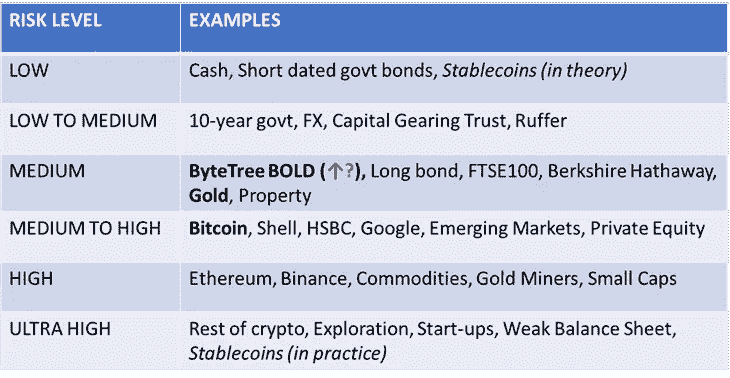
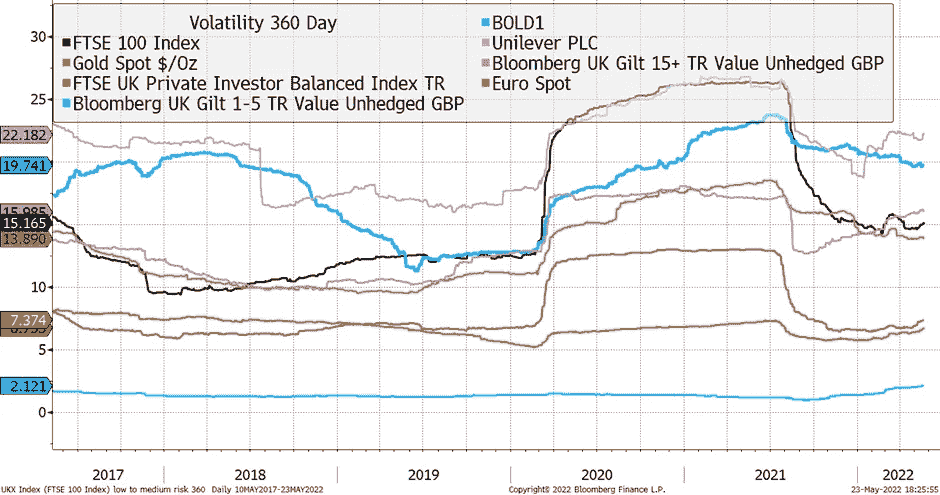
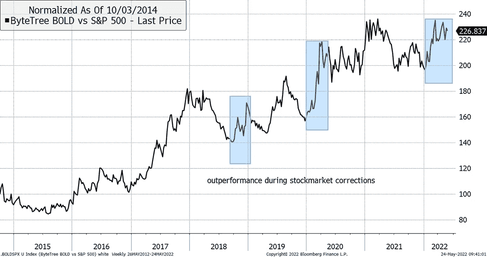
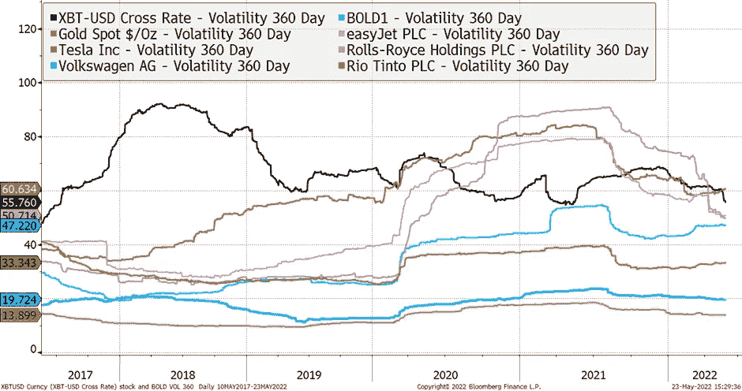

# 流动性和风险——黄金和比特币的认知与现实

> 原文：<https://medium.com/coinmonks/liquidity-and-risk-perception-vs-reality-for-gold-and-bitcoin-b1124f217040?source=collection_archive---------53----------------------->

我们不止一次被问到，为什么我们不把白银投入到大胆的(比特币和黄金)组合中。这是一种与黄金有相似之处的商品——主要是因为它被用作货币——所以它难道不是这种混合的很好的补充吗？

不包括白银的主要原因是它的风险更高。这将降低 BOLD 组合的质量，BOLD 被设计为基于风险/回报的最佳价值储存手段。一般来说，分散投资可以降低风险。但在这种情况下，将黄金与更具投机性的贵金属混合会增加风险，因为黄金无疑是最原始的替代保值手段。这同样适用于加密。虽然你打开了增加回报的潜力，但在比特币中加入其他加密货币实质上增加了你的风险。直到上周还被视为主要硬币之一的 Terra LUNA 最近的崩溃就说明了这一点。

例如，看看流动性。我怀疑大多数投资者认为白银比比特币更具流动性。事实并非如此。黄金交易量约为每天 1450 亿美元，白银交易量约为 145 亿美元，比特币交易量为 403 亿美元。当机构在寻找安全的资金存放方式时，流动性是一个关键考虑因素。比特币和黄金是这方面的佼佼者。

## **黄金流动性——1455 亿美元/天**

*   每天 20 万份合同，每份 100 盎司= 400 亿美元[ [来源](https://www.cmegroup.com/markets/metals/precious/gold.volume.html)
*   LBMA 数据 578 亿美元/天[ [来源](https://www.lbma.org.uk/prices-and-data/lbma-trade-data)
*   世界黄金协会估计，加上所有其他期货和实物金属交易，总价值为 1455 亿美元

## **白银流动性——145 亿美元/天**

*   每天 80，000 份合约，每份 5000 盎司 XAG = 92 亿美元[ [来源](https://www.cmegroup.com/markets/metals/precious/silver.volume.html)
*   SLV 交易所交易基金每天交易 6 亿美元，占所有 XAG 交易所交易基金的 66%,所以大约。总计 10 亿美元/天——不包括重复计算，因为 ETF 将与 CME 或 LBMA 或两者都参与。[ [来源](https://terminal.bytetree.com/silver/flows)
*   LBMA 数据 54 亿美元/天[ [来源](https://www.lbma.org.uk/prices-and-data/lbma-trade-data)

## **比特币流动性——403 亿美元/天**

*   11，000 份合同/天，每份 5 BTC = 16.5 亿美元/天[ [来源](https://www.cmegroup.com/markets/cryptocurrencies/bitcoin/bitcoin.volume.html)
*   每周链上 400 亿美元，因此每天 57 亿美元[[来源](https://terminal.bytetree.com/bitcoin/charts)
*   交易所交易基金包含在 BITO 的连锁数据或期货中
*   那么加密期货大约是 330 亿美元/天(有些重复计算了链上数据)[ [来源【T3]](https://www.theblockcrypto.com/data/crypto-markets/futures)

这给我们带来了一个更广泛的讨论，即与其他资产类别相比，如何从风险的角度考虑黄金和比特币。

下表可能会引起一些人的惊讶。把它当作一个思想实验。这是我们根据风险对不同资产类别进行分类的方式，使用标准的风险衡量标准，如流动性和波动性。想法是尽可能客观。有讨论的空间，我们欢迎任何反馈。

Source: ByteTree

黄金是一种中等风险资产，类似于美国长期债券或伯克希尔哈撒韦公司。下图显示，在 360 天的历史波动性方面，它处于中游水平。考虑到黄金数千年的历史记录，也许我们对它有点苛刻，但它也有一些相当严峻的下降，所以我们暂时不去管它。

Source: Bloomberg

BOLD 目前被归类为中等风险资产，就像黄金一样。但当我们仔细观察时，它似乎越来越像一种中低风险资产，类似于 10 年期国债或高质量的平衡投资信托，如 Ruffer Investment Company。尽管其波动性比黄金略高，但 BOLD 的历史性提款在其短暂的历史中一直较低。黄金在 2020 年 8 月见顶后，截至 2021 年 3 月下跌了约 19%。BOLD 最近的最大跌幅是从 2021 年 11 月的峰值到本月中旬的 14%左右。此外，请注意上图中只有粗体和金色看起来有走低的趋势。

BOLD 的另一个特点，也是我们为什么这样看待它的原因，是它在调整期间一直跑赢股市，这正是分散投资者应该做的，如下图所示。它还展示了适当调整投资组合中的资产规模，并努力将它们重新平衡至目标权重的美妙之处。通过这种方式，我们能够将中高风险资产(比特币)与中等风险资产(黄金)结合起来，并产生一种对两者都有所改善的东西(粗体)。这呼应了 60/40 平衡投资组合的意图，这种投资组合主导了一代人的投资配置思维。

Source: Bloomberg

与此同时，比特币一直表现得像一只周期性蓝筹股，因此我们将其归类为中高风险。从统计学角度来看，这不是高风险或超高风险资产。这当然是在其存在的早期阶段，但我们看到的每个数据点都讲述了一个不同的故事。它具有高度的流动性，并且其挥发性正在降低。所有其他加密技术都属于高级或超高级类别，但比特币已经开始以更高质量的方式运行。如下所示，其波动性似乎也在结构性下降。这是一种成熟资产的样子，这种行为将支持那些认为比特币是目前唯一具有持久使用案例的加密资产的人。这应该被认为是与投机性技术的崩溃截然不同的。

Source: Bloomberg

# 结论

感知和现实可以以非常不同的速度前进。尽管人们普遍认为比特币是一种超高风险资产，但事实并非如此。因此，将 BOLD 视为高风险资产组合的观点同样也是错误的。我们认为这是中低风险，类似于 10 年期国债。BOLD 的历史还表明，在风险状况不同的资产之间，进行有序的再平衡是一件神奇的事情。

未来五到十年很可能是经济和政治波动加剧的时期。企业收益将变得不稳定，更难折现，顽固通胀的威胁是真实的。股票和债券可能会不时反弹，但从目前来看，很难证明这两者会出现长期牛市。黄金和比特币这两种替代价值储存手段的谨慎组合，为这种新范式提供了强有力的投资理由。

本文由 ByteTree 资产管理公司首席执行官 **Charlie Erith** 撰写。这篇文章是从我们的网站上交叉发布的，最初发表于 2022 年 5 月 25 日[。](https://bytetree.com/research/2022/05/liquidity-and-risk-perception-vs-reality-for-gold-and-bitcoin/)

访问 [**ByteTree 终端**](https://terminal.bytetree.com/) 获取实时跟踪的**比特币**链上数据。我们还跟踪**以太坊**、**黄金**和**白银**的资金流。

[**订阅**](https://bytetree.com/mailing) 我们的邮件列表，免费每周更新。

> 加入 Coinmonks [电报频道](https://t.me/coincodecap)和 [Youtube 频道](https://www.youtube.com/c/coinmonks/videos)了解加密交易和投资