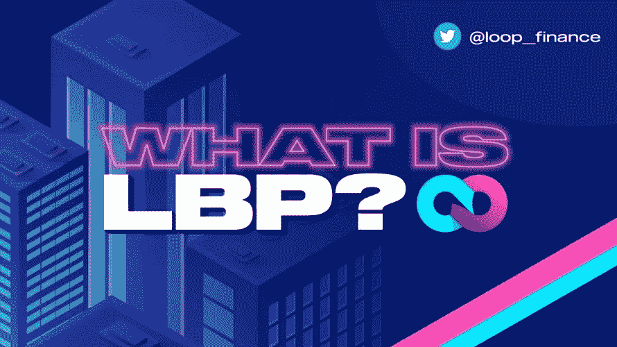
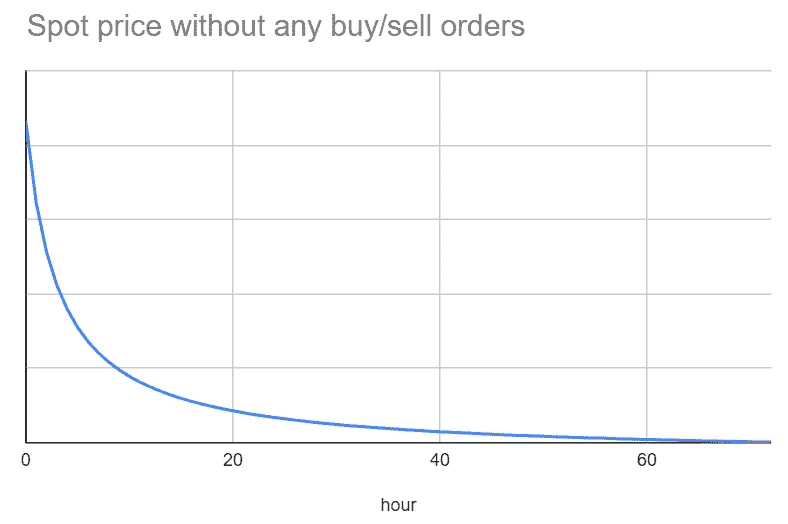

# 流动性引导池(LBPs 解释

> 原文：<https://medium.com/coinmonks/liquidity-bootstrapping-pools-lbps-explained-ec3f7041ac85?source=collection_archive---------5----------------------->

2017 年的 ICO 热潮给了我们一些重要的教训，众筹就是其中之一。集中交易所上市非常昂贵，而且较小的交易所大多缺乏 T2 安全性。在这一过程中，密码世界从 ETH 跨越到 stablecoins，从集中式交换跨越到分散式交换学习。然而，它并没有解决大量前期资本和机器人操纵价格的根本问题。鲸鱼会模仿使用机器人，价格暴涨，然后卖给散户投资者。这些问题没有完美的解决方案，但一个被证明非常有效的方案是 LBP 或流动性自举池。这些池是以太坊上的平衡器引入的。

# 流动性自举池

理解 LBP 需要理解大多数 AMM 所基于的交换池架构。

作为 DeFi 生态系统的重要组成部分，AMMs 使用流动性池来允许以无许可和自动的方式进行数字资产交易。AMMs 消除了传统的买卖匹配方式，确保了 24/7 的流动性。

用户用他们的资产提供流动性池，其价格由一个数学公式决定。一个这样的公式是 Uniswap 和 Bancor 推广的常数乘积公式，

**K= x * y**

该公式要求池**保持由常数 k 表示的恒定平衡。**由 x 和 y 表示的两种代币的储备需要保持相等的总值(以 50:50 的比率)。由于代币的相对价值是固定的，因此公式会根据两种代币的供应量自动确定价格。如果你想详细了解 AMMs 和流动性池，请观看白板加密的视频[。](https://www.youtube.com/watch?v=1PbZMudPP5E)

恒定产品库由于其简单和通用的结构而被广泛使用。此外，这些资源池易于创建和激励。研究表明，尽管这些池本质上过于简单，但是它们在令牌生成事件中的使用存在一个主要问题。让我给你描述一下-

当涉及到为新代币创建市场时，恒定产品池将用户置于一个相当独特的位置，其中他们必须选择他们希望提供初始流动性的定价水平。有两种情况-

*   当价格过高时，需要向资金池提供大量资本，同时伴随着买家减少以及代币浮动较低的风险。
*   当价格太低时——不公平的市场操纵和网络拥塞很常见，因为早期交易者、机器人和加密鲸鱼往往占上风。

机器人因其渗透而臭名昭著。他们的运作速度远远高于真正的投资者，他们能够以最低的价格购买，然后向真正的支持者倾销。持续的监控使这些人能够以牺牲你真正瞄准的社区为代价来赚取大量的金钱。

这就是**流动性自举池**发挥作用的地方，消除了对机器人不公平令牌分配的担忧。

解决一个反复出现的问题——流动性自举池

## LBPs 是如何工作的？

LBP 通过消除 bot 操纵，为每个人创造公平的发行机会，而不管他们的投资组合大小，从而增加对代币发行的信任。它们旨在保护新项目的声誉，获得相对于机器人的竞争优势，并防止鲸鱼通过拉地毯或其他操纵技术获利。LBPs 的操作机制需要调整池中两个令牌的权重。在其他流动性池中，代币需要保持 50:50 的固定比例。加权池被证明是有利的，因为它允许以最少的前期资本**获得较高的初始价格。LBP 控制器需要提供新的代币和一小部分第二资产(主要是稳定的代币)来启动池并开始分配。随着时间的推移，计划性地调整权重有助于缓慢降低价格，从而**延长价格发现期**，使参与者能够等待他们认为公平的购买价格。**

**让我们来分解一下— — —**

上述流动性引导池通过改变池权重来运行，以保持对市场的下行压力，从而成功克服不公平和不平等的代币分配问题。第二种资产的流入抵消了资产池权重向下逐渐转移所产生的自然向下抛售压力。重量和价格的这种变化阻止了早期投机导致的价格飙升。此外，在这种设置中，参与者被激励等待，直到价格下降到他们可接受的水平，因为市场通过从逐渐下降的高初始价格开始来确定所发行代币的最终价格。

创建资本高效型资金池是 LBPs 的核心，通过建立由发行的代币和抵押代币组成的双代币池来实现。起初，池的权重有利于项目的令牌。最终，随着时间的推移，平衡发生变化，到代币销售结束时，附属代币成为首选。

比方说，一个利用 LBPs 的项目开始运营时，权重分布更有利于它的令牌(比方说 80%)，从而最大限度地减少了前期所需的资本。现在，附属令牌被分配了 20%的较小权重。权重最终重新平衡，以实现项目令牌的销售，并有助于有效确定其相对于抵押品令牌的价格。

LBPs 的一个独特特性是控制器能够暂停交换。这种选择权的行使有几个原因，包括但不限于在意外需求提高象征性价格的情况下保持相对恒定的价格，或者在个人选择卖回资金池以获利的情况下。随着从拉地毯中获利的动机消失，逐渐释放池中不同权重的项目代币**迫使鲸鱼分解他们的交易**。此外，这种机制使价格发现相对更加灵活，并使个人能够以公平的方式参与销售。

我们试着通过一个例子来理解这一点。项目 X 通过 LBP 向 DAI 发起它的 X 令牌。举例来说，初始加权比率是 95:5，这意味着 X 的 95%对 DAI 的 5%。这意味着该项目的前期资本要求较低，为 DAI。最终的重量比为 5:95，这意味着 X token 的价格在 70 小时结束时继续以给定的比例下降。

从图表中可以看出，

-在 70 小时的过程中，价格不断降低，开始时价格大幅降低。

-在这条曲线上的任何一点，如果买入压力大于向下的重量压力，曲线就会上移。

-如果买入压力平衡了向下的权重压力，那么曲线将是平坦的，价格将围绕市场价格振荡。

-如果购买压力在接近结束时很大，将导致图形在结束时变大。

## 为什么是 LBPs？

首先也是最重要的是，LBP 旨在以相对**低资本要求**推出新代币。除此之外，如上所述，它们提供了**广泛令牌分发**以及**公平价格发现**的能力。

购买者需要注意，代币以最高拍卖价格列出，并且该价格在规定的时间段内逐渐下降，直到两个代币的池余额具有相等的价值。这种机制有助于避免机器人/鲸鱼的恶意行为，这些行为试图迫使其他所有人最终放弃他们的令牌以获取巨额收益。

LBP 是一个救世主，为整个社区提供了一个公平的机会。一个项目的成功取决于机构投资者和散户投资者。LBP 有助于所有用户以公平的价格获得 token launch，并消除价格波动和其他相关问题。

## 结论

对于希望以公平和资本高效的方式将代币分发给广泛用户群，而不受快速增长的价格曲线约束的项目来说，LBP 是一个很好的选择。

LBP 允许定制的令牌分发机制，该机制为项目提供了对其令牌发布的控制和灵活性。毫无疑问，围绕这一特定机制进行实验是关键，也是绝对必要的，以便在未来实现更好的结果和效率最大化。因此，LBPs 可以被视为筹资的未来，尤其是当涉及到寻求最低资本投资的新项目时。

**一切区块链—** 追求简化元宇宙链的不同区块。

捐赠地址—0x e 9 f 581 e 005 cbb 94752 a 96198052088 f 206 AC 73 b 1
terra 156 dez wfl 55 zzck l5 ud 5 TL 69 x8 p 4 sh 5 ZG 3 vt 54 x

**下线**

[智囊团](https://app.usebraintrust.com/r/everything1/)，[循环](https://www.loop.markets?ref=39055)，[预研](https://www.presearch.org/signup?rid=2491437)，[奥德赛](https://odysee.com/$/invite/@Cyekmyster:3)，[币安](https://accounts.binance.com/en/register?ref=12626399)

**社交**

[Substack](https://everythingblockchain.substack.com/account?utm_source=menu-dropdown) ， [Twitter](https://twitter.com/cyekmyster) ， [Youtube](https://www.youtube.com/channel/UCkcc6EceEAu1sMoi2dKczCQ) ， [Medium](/@everythingblockchain) ， [Reddit](https://www.reddit.com/user/cyekmyster)

本文提供的任何或所有信息仅用于教育目的，不得视为投资建议。在正确呈现任何信息方面的任何失误都是我们的责任。我们否认与使用此内容相关的任何责任。

> 加入 Coinmonks [电报频道](https://t.me/coincodecap)和 [Youtube 频道](https://www.youtube.com/c/coinmonks/videos)了解加密交易和投资

# 另外，阅读

*   [最佳加密分析或链上数据](https://coincodecap.com/blockchain-analytics) | [Bexplus 评论](https://coincodecap.com/bexplus-review)
*   [NFT 十大市场造币集锦](https://coincodecap.com/nft-marketplaces)
*   [AscendEx Staking](https://coincodecap.com/ascendex-staking)|[Bot Ocean Review](https://coincodecap.com/bot-ocean-review)|[最佳比特币钱包](https://coincodecap.com/bitcoin-wallets-india)
*   [Bitget 回顾](https://coincodecap.com/bitget-review)|[Gemini vs block fi](https://coincodecap.com/gemini-vs-blockfi)|[OKEx 期货交易](https://coincodecap.com/okex-futures-trading)
*   [美国最佳加密交易机器人](https://coincodecap.com/crypto-trading-bots-in-the-us) | [变化回顾](https://coincodecap.com/changelly-review)
*   [在印度利用加密套利赚取被动收入](https://coincodecap.com/crypto-arbitrage-in-india)