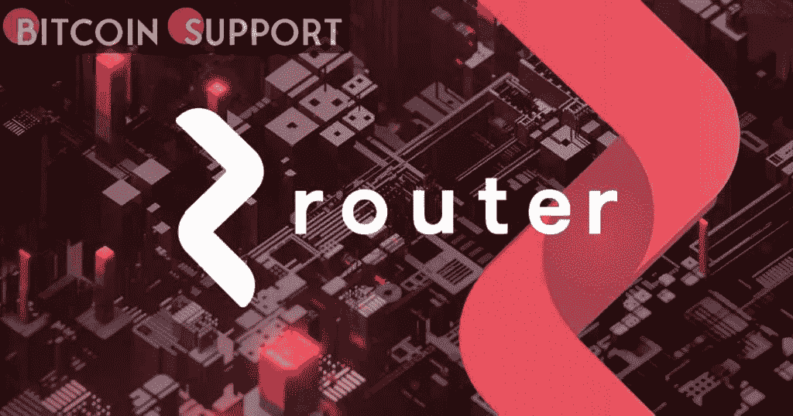

# 流动性池 app 路由器协议包括以太坊和 Fantom

> 原文：<https://medium.com/coinmonks/liquidity-pooling-app-router-protocol-includes-ethereum-and-fantom-712d0cb9a7cb?source=collection_archive---------38----------------------->

**Visit our website:-** [**https://bitcoinsupports.com/**](https://bitcoinsupports.com/)

路由器协议是实现区块链连接的基础设施层，今天宣布将以太坊和 Fantom 加入其平台。

该社区现在可以发送和接收资金，交换资产，并且随着路由器软件开发工具包(SDK)的即将发布，可以开发跨链的分散式应用程序(dApps ),这些应用程序可以跨越 Fantom、以太坊和之前集成的网络，如 Polygon、币安智能链和 Avalanche C-chain。

此外，这些集成还为用户提供了专有的探路者算法，该算法可聚合 dex 以确定跨链互换的最佳利率、1:1 的低费用资产转让，以及不到一分钟即可完成的 L2 结算。

继一月份成功推出 alpha mainnet 和本月早些时候整合 Avalanche C 链之后，Router Protocol 现在正继续其扩展跨链基础设施以支持更多网络的计划。

**“Fantom 和以太坊的结合极大地增加了我们生态系统的用户基础——我们现在比以往任何时候都更容易帮助更多的个人在链之间轻松交易。我们期待在这一势头的基础上，通过扩展到在 EVM 和非 EVM 平台上运行的其他主要 1 层和 2 层链来加强 DeFi 社区。”**

—路由器协议的联合创始人兼首席执行官 Ramani Ramachandran

路由器协议最近发布了一个跨链浏览器，消除了为了跟踪跨链事务而监控几个块浏览器的需要。

值得一提的是，路由器协议正在开发众多新功能，并将于近期发布:

**1 .增加了 L1 和 L2 锁链的整合:**

引入了与 EVM 兼容的锁链，包括阿比特鲁姆、乐观、和谐、极光、月光和克罗诺斯。

整合与 EMP 不相容的链，如 Terra 和 Solana。

**2。一个路由器协议跨链 SDK，用于简化跨链应用程序的构建。**

**3。流动性挖掘工作，具有奖励路由器流动性提供者的激励结构。**

**访问我们的网站:-**[**https://bitcoinsupports.com/**](https://bitcoinsupports.com/)

**免责声明:以上为作者观点，不应视为投资建议。读者应该自己做研究。**

> 加入 Coinmonks [电报频道](https://t.me/coincodecap)和 [Youtube 频道](https://www.youtube.com/c/coinmonks/videos)了解加密交易和投资

# 另外，阅读

*   [加密货币储蓄账户](/coinmonks/cryptocurrency-savings-accounts-be3bc0feffbf) | [YoBit 审核](/coinmonks/yobit-review-175464162c62)
*   [Botsfolio vs nap bots vs Mudrex](/coinmonks/botsfolio-vs-napbots-vs-mudrex-c81344970c02)|[gate . io 交流回顾](/coinmonks/gate-io-exchange-review-61bf87b7078f)
*   [CoinFLEX 评论](https://coincodecap.com/coinflex-review) | [AEX 交易所评论](https://coincodecap.com/aex-exchange-review) | [UPbit 评论](https://coincodecap.com/upbit-review)
*   [AscendEx 保证金交易](https://coincodecap.com/ascendex-margin-trading) | [Bitfinex 赌注](https://coincodecap.com/bitfinex-staking) | [bitFlyer 点评](https://coincodecap.com/bitflyer-review)
*   [Bitget 回顾](https://coincodecap.com/bitget-review)|[Gemini vs block fi](https://coincodecap.com/gemini-vs-blockfi)cmd |[OKEx 期货交易](https://coincodecap.com/okex-futures-trading)