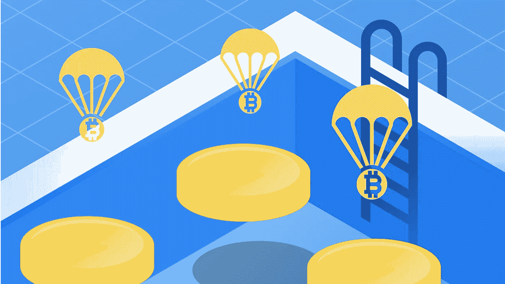
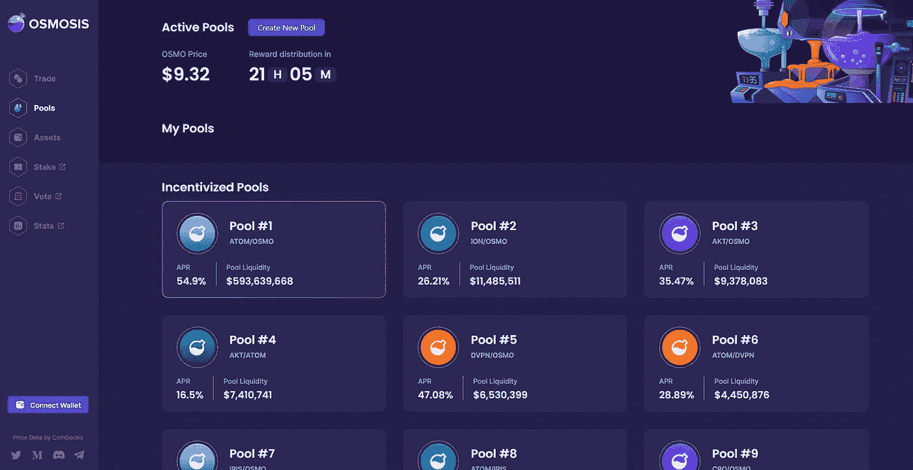
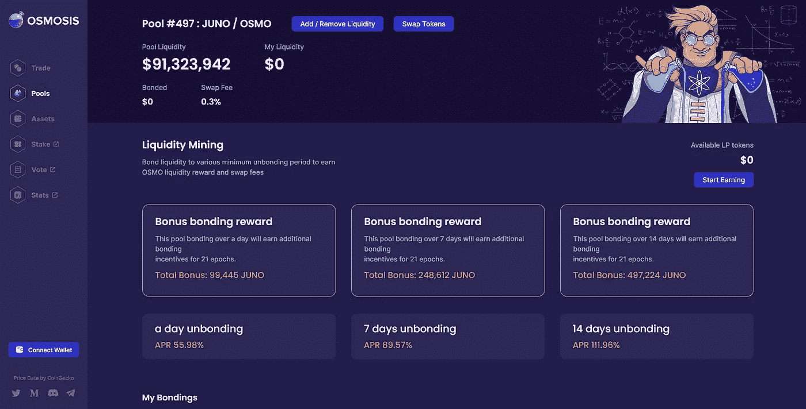
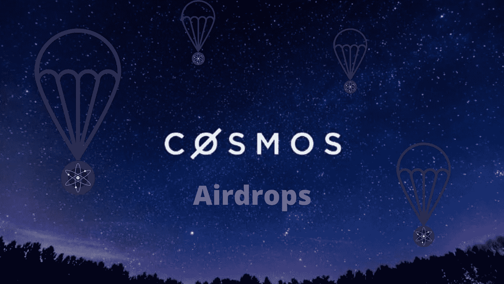
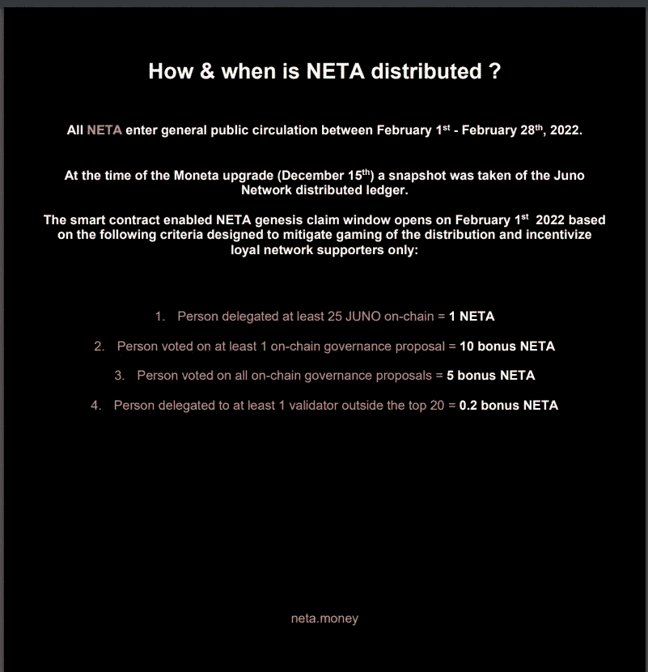
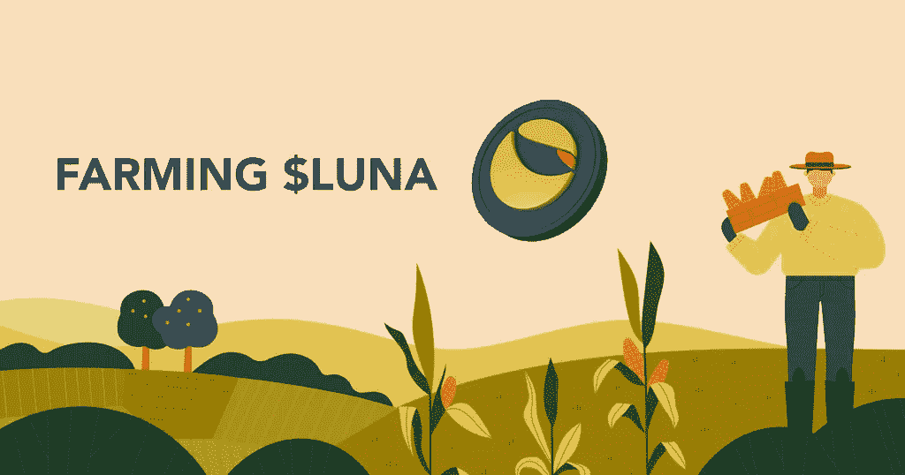

# 流动性池、产量农业和空投

> 原文：<https://medium.com/coinmonks/liquidity-pools-yield-farming-airdrops-5976897ce28b?source=collection_archive---------14----------------------->

## 在宇宙和地球生态系统中

Image Source: [Binance Academy](https://academy.binance.com/en), [What Are Liquidity Pools in DeFi and How Do They Work?](https://academy.binance.com/en/articles/what-are-liquidity-pools-in-defi), edited in [Canva](https://www.canva.com/).

流动性池、产量农业和空投是加密领域的机制或策略，可以为参与者提供回报或额外收入。在这个简短的指南中，我们将简要介绍它们是什么，以及如何通过参与目前发展最快的两个加密生态系统来从中受益。

## 流动性池

加密的一个重要方面是分散化，直到最近几年，加密主要在集中的交易所交易。为了创造一种分散的加密交易或交换方式，市场需要流动性，即由一对加密令牌组成的资金池。这通常在[自动做市商(AMM)](https://academy.binance.com/en/articles/what-is-an-automated-market-maker-amm) 上完成，这基本上是一种帮助确定池中两种资产价格的算法。流动性提供者(LP)实质上成为分散的做市商，赚取交易费，在某些情况下还能获得额外的回报。在向其中一个资金池提供流动性之前，用户应确保他们了解[非永久性损失](https://academy.binance.com/en/articles/impermanent-loss-explained)的潜在风险。

## 高产农业

从最基本的意义上来说，收益农业或流动性开采是用户向流动性池提供流动性，目的是从交易费用和可能提供的任何额外奖励中赚取利息或收益。产量农业也可以简单到用赌注来赚取利息，然而，高级用户倾向于寻找和种植他们能获得的最佳产量，策略可能会变得相当复杂。要了解更多关于高产农业的信息，请[访问本指南](https://academy.binance.com/en/articles/what-is-yield-farming-in-decentralized-finance-defi)。

## 空投

空投是一种新的加密项目向现有社区分发令牌、产生意识和提高流动性的方式。这些空投可以被认为是免费的，因为一旦投放到公开市场，它们往往会有价值，然而，并不是所有的项目都会成功，也不是所有的项目都是合法的，所以在做研究和准备时要小心。要了解更多关于空投的信息，请[访问这篇博文](https://taxbit.com/blog/what-are-crypto-airdrops-and-how-do-they-work)。

# 宇宙生态系统

[Cosmos 生态系统](https://blog.cosmos.network/ibc-update-the-internet-of-blockchains-is-growing-fast-dae883228ebf)由于其[【IBC(区块链间通信协议)】](https://blog.cosmos.network/deep-dive-how-will-ibc-create-value-for-the-cosmos-hub-eedefb83c7a0)，其低廉的交易费用，其开发者工具而快速增长。

早期参与一个充满活力和不断增长的社区有其好处，包括高收益和利润丰厚的空投。下面我们将探讨其中的一些好处，以及新参与者如何参与进来。

## 渗透

Image Source: Screenshot taken from [Osmosis](https://app.osmosis.zone/pools).

[渗透](https://app.osmosis.zone/)目前是宇宙生态系统中最顶尖的 DEX/AMM。用户可以向任何一对货币提供流动性，并赚取掉期费用(通常约为 0.3%)和债券流动性的流动性奖励(通常以原生代币$OSMO 的形式)。正如你在上面的图片中看到的，这些资金池比你当地银行的储蓄账户更有吸引力。

最大的渗透池是$ATOM/$OSMO 流动性池。在上面的图片中，你可以看到用户通过提供和绑定他们的流动性可以获得 54.9%的年利率(这随着市场的波动而变化)。一些池提供更高的回报，如下图所示，目前提供高达 111.96%的年利率。

Image Source: Screenshot take from [Osmosis](https://app.osmosis.zone/pool/497).

*开始时，用户需要在一个流行的交易所购买一些$ATOM，然后将它们发送到他们自己的*[*Keplr wallet*](https://www.keplr.app/)*地址。他们必须将$ATOM 与渗透联系起来，同时确保钱包里留有一些$ATOM 作为交易费。然后在渗透作用下,$ATOM 可以换成任何其他的 IBC 代币。*

## 宇宙空投

Image Source: [BitcoinAirdrop.net](https://bitcoinairdrop.net/wp-content/uploads/2020/01/Cosmos-ATOM-Nedir-Nas%C4%B1l-Sat%C4%B1n-Al%C4%B1n%C4%B1r-696x391-1.jpg), edited in [Canva](https://www.canva.com/).

在宇宙生态系统中有许多令人兴奋的空投机会，对于那些足够早利用这些机会的人，祝贺你们！🎉

对于那些刚刚接触宇宙生态系统的人来说，欢迎并且不要担心，我敢肯定还有很多有趣的机会。

每个项目都有自己的资格要求，必须满足这些要求才能参与空投。最好是通过用户的官方渠道了解具体细节，从而了解用户感兴趣的每个项目的最新情况。大多数项目都有中型博客和 twitter 账户，他们会定期在上面发帖。

根据以前的空投事件，任何人都可以遵循一些基本要求，以增加他们未来空投资格的机会；

*   您将需要一个 [Keplr 钱包](https://www.keplr.app/)来下注您的代币。
*   3 最重要的筹码是$ATOM、$JUNO 和$OSMO。
*   $SCRT 现在排名第四。
*   **不要**给 0%佣金验证者股份。
*   为了安全起见，远离前 10–25%的验证器(项目宁愿空投他们的令牌给不太集中的验证器)。
*   参与治理并对提案进行投票。这可以从你的 Keplr 钱包里完成。
*   为[渗透](https://app.osmosis.zone/)或 [JunoSwap](https://junoswap.com/) 提供流动性。
*   提供流动性的最佳组合最有可能是渗透型的$OSMO/$ATOM，$OSMO/$UST，以及 JunoSwap 型的$JUNO/$ATOM 或$JUNO/$UST。
*   尽早使用产品并参与测试网络。
*   为特定的空投任务提供最新的验证器。

*此信息来源于* [*雷神密码*](https://youtu.be/C02Ji3h0geg?t=66) *和* [*密码密码*](https://www.youtube.com/watch?v=7ITkCKb9mzc) *。*

*你不需要下注、投票和提供流动资金来获得资格，但做到这三点只会增加你的机会和你可能有资格获得的金额。同样，每个项目都有不同的要求和资格，因为大多数项目都是由社区驱动的，所以你最好的选择是参与到相应的社区中，学习如何最大化你能获得的金额。此外，根据项目的不同，通常有一系列申请空投的步骤。

**让我们来看看最近的一个例子，它恰好是宇宙生态系统中最有利可图的空投之一，**

Image Source: Screenshot taken from Neta.Money, [BlackPaper](https://neta.money/NETA_Money.pdf)

$JUNO 在$NETA 快照发布时不到 10 美元，而$NETA 在发布时刚刚超过 2000 美元。因此，最初价值 250 美元的$JUNO 将奖励委托人价值略高于 2000 美元的$NETA。对所有链上治理提案进行投票的参与者将额外获得价值 3 万美元的 NETA。一个参与者可能只对一个链上治理提案进行了投票，而不拥有任何$JUNO，但仍然会被空投价值超过 2 万美元的$NETA。

不是所有的空投都会遵循这个例子，很多可能价值 0 美元，但你永远不知道在加密中，任何事情都有可能。

**现在让我们来看看一些即将到来的和正在进行的空投新人仍然可以参与；**

[**豺狼**](https://jackaldao.com/) —快照是美国东部时间 2022 年 4 月 9 日下午 1 点。准备快照需要两周多一点的时间(2022 年 3 月 21 日)。秘密(＄SCRT)、原子(＄原子)和朱诺(＄朱诺)赌注者有资格获得豺狼空投。将有一个 2x 空投奖金为那些赌注与豺狼道 SCRT 网络验证。如需了解更多关于 airdrop 的信息，请访问:[https://jackal-wiki . voice . site/Airdrops-31 a6 e22 a 454943d 19 b 54 BF 69565 d22e 5](https://jackal-wiki.notion.site/Airdrops-31a6e22a454943d19b54bf69565d22e5)

也跟着他们的推特[@豺狼 _ 道](https://twitter.com/JACKAL_DAO)。

[**传奇**](https://legendao.io/) — NFT 项目。SCRT，奥斯莫，露娜 stakers。快照日期尚未公布。点击查看他们的 twitter 更新[。](https://twitter.com/LegendaoNFT)

**$RAW** — Junoswap 治理令牌。奖金快照日期尚未公布，将是随机的，并在实际快照后公布。可能还有时间参与。在快照发布前等待他们的安全审计。根据他们的[黑皮书](https://gateway.pinata.cloud/ipfs/QmYbdpphwvtrdmRjotRX1f8isikPCqxivZoYNnsyoe5iwf?preview=1)，fairdrop 最有可能的接收者是$ATOM、$JUNO 和$OSMO 持有者/赌注者/有限合伙人。更多细节可以在 twitter [这里](https://twitter.com/junoswapdex/status/1487022328127098886)找到。

酷猫——$ ATOM，$JUNO，$HUAHUA stakers。3 月 13 日&4 月 1 日之间的快照。详情在此[处](https://coolcat.blog/2022/03/12/coolcat-takes-a-stand-with-juno/)。

**资产地幔**——$ p stake&$ LUNA stakers 的 Stakedrop 仍在进行中。Comedex，$JUNO 和 Stargaze 的赌注即将到来。查看他们的博客页面,了解更多关于他们赌注的信息。

[**基因组**](https://nomic.io/) —比特币/宇宙桥。第一张快照拍摄于 2022 年 1 月 21 日，对象是$ATOM 股东和持有者。还有两个快照待定。更多信息请访问他们的[博客页面](https://blog.nomic.io/nomic-stakenet-launch)。

**克洛诺斯财经** —建立在 Evmos 之上的 AMM。$ATOM/$JUNO/$OSMO stakers。快照是随机的，还没有公布，所以应该还有时间参与。关于空投的更多细节可以在他们的[媒体帖子这里](/@cronusfinance/the-cronus-airdrop-e387aceca90c)找到。请访问他们的[推特](https://twitter.com/cronusfinance)获取最新信息和更新。

以下是一些仍可索赔的著名空投物资；

**—快照拍摄于世界协调时 2022–01–01 00:00。写这篇文章时，你仍然可以要求你的空投。请访问[https://airdrop . crescent . network/](https://airdrop.crescent.network/)查看您是否有资格以及您是否有资格获得任何奖金乘数。**

****—渗透 LPs 快照拍摄于 2022 年 2 月 15 日。$ATOM 赌注者的赌注已经结束。查看他们的[博客页面](https://blog.assetmantle.one/2022/03/15/mantledrop-explained/)了解更多信息。查看他们的[空投页面](https://airdrop.assetmantle.one/)，看看你是否有资格。****

****[**Nomic**](https://nomic.io/) —比特币/宇宙桥。第一张快照拍摄于 2022 年 1 月 21 日，对象是$ATOM 股东和持有者。还有两个快照待定。要申领空投物资，请访问[经济网络应用](https://app.nomic.io/)并连接您的 Keplr 钱包。****

****[**Evmos**](https://rektdrop.com/mission-control) —宇宙 EVM 链。详情参见[这篇博文](https://evmos.blog/the-evmos-rektdrop-abbe931ba823)并前往 [evmos 应用](https://rektdrop.com/mission-control)查看你是否有资格申请空投。****

******查找过去和未来空投的资源；******

****[https://cosmosairdrops.io/](https://cosmosairdrops.io/)****

****在[这段 Cryptocito youtube 视频](https://www.youtube.com/watch?v=7ITkCKb9mzc)中提到了以下两个资源:****

*   ****[https://docs . Google . com/spreadsheets/d/1 cjrglycj 8 dwj 4-ze 5 puwsf H3 wggekfc _ u52-YlripGw/edit # GID = 1777801625](https://docs.google.com/spreadsheets/d/1CjRglycJ8DwJ4-ZE5PUwSFh3wGgEkfc_u52-YlripGw/edit#gid=1777801625)****
*   ****https://cosmosuplink.web.app/airdrops****

****@cryptolikemo 非常关注宇宙生态系统，并在宇宙生态系统上有多个线程——[https://twitter.com/cryptolikemo/status/1497780470318354440](https://twitter.com/cryptolikemo/status/1497780470318354440)****

****在推特上关注 [@Cosmos_Airdrops](https://twitter.com/Cosmos_Airdrops)****

****在 Youtube 上关注 [Cryptocito](https://www.youtube.com/channel/UCE1JHFSfUWcXVyzV3KGA9Fw) 。****

****在 Youtube 上关注毫无悔意的反叛者。****

****在 Youtube 上关注 Hawes Capital。****

# ******地球生态系统******

****Terra 是另一个在加密领域快速成长的生态系统，它为新来者和现有社区成员提供了大量机会。随着最近[为 Terra reserves 购买比特币的计划](https://cointelegraph.com/news/we-re-already-buying-terra-founder-plans-to-obtain-10b-btc-for-reserves)出台，这个生态系统必定会蓬勃发展。****

## ******$露娜产量农业******

********

****Image Source: Daryl Loh, [Growing Your Bag Of LUNA: Here’s A Guide To Yield Farming In The Terra Ecosystem](https://chaindebrief.com/yield-farming-terra-ecosystem-luna/)****

******地面站&锚协议******

****Terra Station 就像是$LUNA 和其他 CW20 代币的通用钱包。这就是$LUNA 每年大约 7-9%的赌注。为了取消$LUNA，用户必须等待 21 天的取消绑定期。****

****用户可以在 UST——一种与美元挂钩的稳定货币——上获得接近 20%的年收益。目前有超过 11B 的 UST 存入该协议。用户也可以利用他们的$LUNA 并借用 UST 来对抗它。****

****[*【这里听雷神 Crypto 说说主播 v . 2】*](https://youtu.be/w5gfkd0gayE)****

******PRISM 协议******

****PRISM 允许你把你的 LUNA 分成两部分，pLUNA(主令牌)和 yLUNA(让步令牌)。****

****风险较低的玩法是把你的 yLUNA 押上大约。目前年利率为 9.6%，其中包括转换为 pLUNA & yLUNA 的空投。****

****然后是 PRISM Farm，它目前的年利率为 41.41%，是 PRISM tokens 的基本收益。你可以下注 PRISM 来获得 xPRISM，当你承诺时，它允许你获得 AMPS。安培可以提高你的棱镜农场四月。****

****您可以通过将 pLUNA 添加到 PRISM 的流动性池中来使用 pLUNA 进行养殖。目前收益 9.19%左右。****

****[棱镜上的全导](https://www.youtube.com/watch?v=fso1EWwXZmg&t=59s)****

******潜移默化******

****用户可以将$LUNA 与$OSMO、$UST 或$ATOM 配对。目前在[渗透](https://app.osmosis.zone/pools)上最高收益的$LUNA 池是$LUNA/$OSMO 池，当结合 14 天时，APR 为 96.17%。每天以$OSMO 代币支付，可以重新存入池中，或者如果您愿意，可以将其转换为$LUNA 或您喜欢的任何其他货币。****

******火星协议(出借&借用)******

****用户可以借入或借出卢娜或 UST，并在$卢娜/$UST 流动性池和[火星协议](https://marsprotocol.io/)中赚取超过 200%的 APY 汽车复利。目前有一些限制，但可能值得关注，因为随着时间的推移，上限很可能会提高。****

****火星上超过 200% APY 协议详情:[https://twitter.com/ThorHoejer/status/1502324728148766727](https://twitter.com/ThorHoejer/status/1502324728148766727)****

*****来源:* [*雷神 Crypto 的$ 100+/天$露娜产量养殖指南*](https://www.youtube.com/watch?v=-iS-Xwgxd_8)****

## ****$LUNA Airdrops****

****像大多数项目一样，最好使用他们的早期测试网，并成为早期产品用户，以获得空投的最高机会。单单押$LUNA 就能让用户获得大部分空投的资格。一些项目会有一个验证器，他们要求用户把他们的$LUNA 作为赌注来验证。请在 twitter 上关注您最喜欢的项目，并关注他们的中型博客以了解最新动态。****

****以下是一些帮助寻找空投物资的工具；****

*   ****https://lunaairdrops.com/——当前和未来空投的清单。这份名单并不总是最新的，所以要与其他官方渠道交叉核对。****
*   ****https://terra.smartstake.io/airdrops—另一个空投清单，显示了那些可能有多个快照日期的空投。因此，可能有多个机会接收来自具有多个快照日期的项目的空投。例如，看起来锚协议仍在进行空投，一个名为瓦尔基里协议的项目也是如此。****
*   ****https://airdrops.io/luna-holders/[——另一份名单，但不是完整的名单。](https://airdrops.io/luna-holders/)****
*   ****https://learnterra.io/airdrops/[——一份空投清单和一个网站，你可以在那里认领你所有的空投物资，但众所周知，从官方项目网站认领会更便宜。](https://learnterra.io/airdrops/)****
*   ****[https://www.terradrops.io/](https://www.terradrops.io/)——类似于上一个链接。你可以连接你的钱包，查看你可以索赔，甚至直接在这里索赔，但是，从官方网站索赔可能会更便宜。****

*****来源:*[*https://youtu.be/PKZ71AkTcXw*](https://youtu.be/PKZ71AkTcXw)****

******值得注意的空投******

*   ****[动能货币](https://kinetic.money/)——虽然[空投](/@kinetic_money/chapter-1-the-kinetic-token-kntc-airdrop-7f6c067cf07b)拍摄的快照早已过去，但投资者可以参与他们将于 2022 年 3 月 30 日开始的空投。参与者需要在特定的时间内存入并锁定$UST。关于 lockdrop 的更多信息，请访问他们的媒体文章[这里](/@kinetic_money/chapter-3-nucleus-the-kinetic-lockdrop-f16da6164a16)。****
*   ****[海王星金融](https://nept.finance/)——空投日期尚未公布，新参与者仍被允许加入。参与者需要获得$LUNA，并用 Neptune Finance 验证器进行委托。说明可以在这里找到[。](https://neptunefinance.medium.com/how-to-delegate-to-the-neptune-validator-dc4580e64841)****
*   ****[天使协议](https://www.angelprotocol.io/) —有几种方法可以参与接收$HALO 令牌。其中之一就是在一段时间内将$LUNA 投入到一个天使验证程序中。赌注下得越久，每隔一段时间就会有越多的$光环被空投到钱包里。如需了解如何接收$HALO airdrops 的更多信息，请访问[该网页](https://leslug.com/angel/score)。****
*   ****[Talis 协议](https://talis.art/)——根据[https://airdrops.io/talis-protocol/](https://airdrops.io/talis-protocol/)的规定，如果你在 2022 年 3 月 7 日的快照之前向 Talis 验证器下注$LUNA，你将有资格申领$TALIS。****

*****来源:*[*https://youtu.be/hGja-34065w*](https://youtu.be/hGja-34065w)****

******其他项目******

*   ****[https://www.edgeprotocol.io/](https://www.edgeprotocol.io/)—类似于 Mars 协议的货币市场协议，但有一些额外的选项。目前处于测试阶段，可能会提供空投服务，但还没有正式的细节。也许值得关注。****

*****【*[*这里听听 Hawes Capital 说说 Edge Protocol。*](https://youtu.be/L3F59I_engk)****

*   *****[尖塔。money](https://gateway.pylon.money/)—Terra 的项目众筹和早期代币农业平台。参与者可以挖掘令牌的机会列表。列出的每个项目都有一套说明。*****

*****[*【点击此处了解霍伊斯资本更多关于塔门的信息。】*](https://youtu.be/NKz1h-s699E?t=966)*****

*******顶级资源*******

*   *****[*关注 YouTube 上的雷神 Crypto*](https://www.youtube.com/c/ThorCrypto)。*****
*   *****[关注 YouTube 上的 Haws Capital。](https://www.youtube.com/channel/UCrjK31ijhdb5OKjkeFXI3tQ)*****

*   ********本帖不应作为理财建议。我不是财务顾问。我是一个密码爱好者。********

> ******加入 Coinmonks* [*电报频道*](https://t.me/coincodecap) *和* [*Youtube 频道*](https://www.youtube.com/c/coinmonks/videos) *了解加密交易和投资******

# *****另外，阅读*****

*   *****[Bookmap 评论](https://coincodecap.com/bookmap-review-2021-best-trading-software) | [美国 5 大最佳加密交易所](https://coincodecap.com/crypto-exchange-usa)*****
*   *****最佳加密[硬件钱包](/coinmonks/hardware-wallets-dfa1211730c6) | [Bitbns 评论](/coinmonks/bitbns-review-38256a07e161)*****
*   *****[新加坡十大最佳加密交易所](https://coincodecap.com/crypto-exchange-in-singapore) | [购买 AXS](https://coincodecap.com/buy-axs-token)*****
*   *****[红狗赌场评论](https://coincodecap.com/red-dog-casino-review) | [Swyftx 评论](https://coincodecap.com/swyftx-review) | [CoinGate 评论](https://coincodecap.com/coingate-review)*****