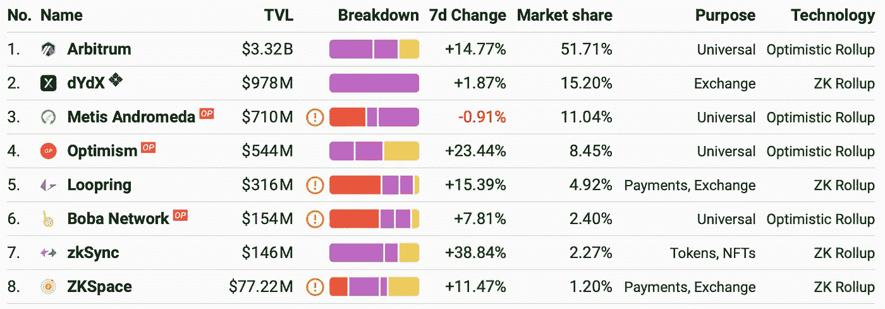
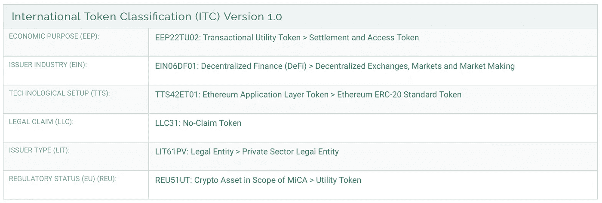
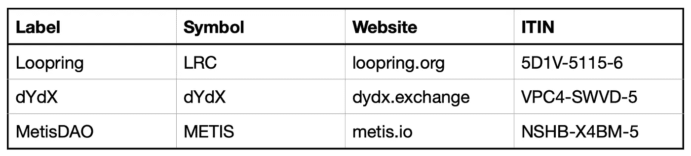
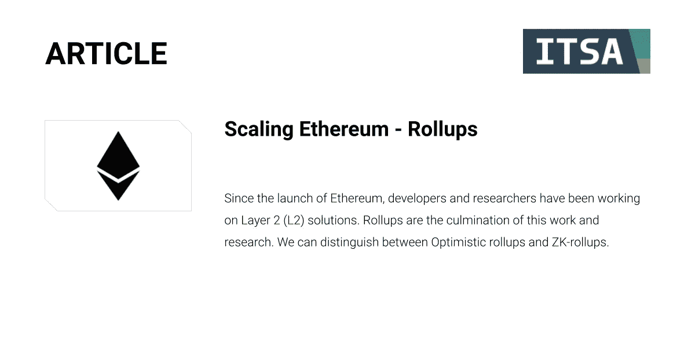

# 正在令牌库中列出以太坊汇总

> 原文：<https://medium.com/coinmonks/listing-ethereum-rollups-in-tokenbase-5d43f9e2ec29?source=collection_archive---------27----------------------->

自从以太坊推出以来，开发人员和研究人员一直致力于第二层(L2)解决方案。总结是这项工作和研究的高潮。历史上 L2s 是从比特币上的照明网络开始的。L2s 的总体思想是，用户在依赖主链安全性的同时，在链外执行大部分活动，而不是将所有活动放在区块链上。我们可以区分乐观汇总和 ZK 汇总。

作者:瓦伦丁·卡利诺夫，克里斯蒂安·维霍夫

# 历史

区块链空间的第一个 L2 解决方案是比特币闪电网络(LN)，于 2018 年首次推出。它允许用户以几乎零成本进行交易。由于技术和以太坊虚拟机(EVM)的复杂性，扩展以太坊更具挑战性，以太坊虚拟机允许执行被称为智能合约的代码。我们已经看到无数关于如何扩展以太坊的提议，以便它能够容纳运行在其上的应用程序的涌入。L2s 最初的想法可以追溯到[等离子](https://docs.ethhub.io/ethereum-roadmap/layer-2-scaling/plasma/)，后来的 Rollups 被采用为缩放以太坊的解决方案。Plasma 与 Joseph Poon 和 Vitalik Buterin 合著，开启了以太坊终极扩展解决方案之旅。在 2018 年，ZK 证明和欺诈证明作为 L2 解决方案的概念被引入。2020 年，这种设计演变成了卷装。

# 什么是第二层？

当我们谈论以太坊和比特币时，我们称这些为第一层(L1)区块链。这些 L1 受共识协议的保护，如工作证明(PoW)和利益证明(PoS)。L2 是垂直扩展的区块链，在 L1 区块链之上，允许较低的费用，与 L1 区块链的信托模式相同。L2 的设计完全不可信。它们允许显著的规模，而无需开发新的信任解决方案。侧链是实体需要开发附加信任机制的例子。L2 的总体想法是，用户可以像信任以太坊或任何 L1 区块链一样信任它。

# 什么是汇总？

我们可以区分乐观汇总和 ZK 汇总。通过将计算转移到 L2，rollup 需要一种方法来向以太坊证明在 L2 发生了什么。在某种意义上，以太坊保证了 L2，即使计算不是由以太坊网络完成的。乐观汇总通过假设数据是正确的，将数据发布到以太坊。不需要额外的步骤，这也保持了低费用。每次汇总需要向以太坊发送交易时，它都需要支付以太坊网络费用。在无效交易的情况下，乐观的 rollups 引入了一种争议机制，恶意方因向以太坊提交错误的交易而受到惩罚。挑战的工具叫做**欺诈证据**。如果有人想提交欺诈证据，他们还需要提交一份保证书，以确保他们不会在网络上发送垃圾邮件或提交垃圾邮件交易。如果欺诈证据被证明是错误的，债券将被大幅削减。

ZK 汇总，不像乐观汇总，不需要欺诈证据。相反，发送到第 1 层的每批数据都包含一个名为 ZK-斯纳克的加密证明:

> *“ZK-SNARK 允许你生成一个证明，证明某个计算有某个特定的输出，以这种方式，即使底层计算需要很长时间才能运行，这个证明也可以非常快地被验证。”维塔利克·布特林*

与乐观汇总不同，ZK 汇总为以太坊提供了即时证据，证明 L2 上的计算是正确的。任何人都可以向你保证，他们的经营是诚信的，你不需要信任他们，或者重新执行或检查他们做了什么。由于每次交易都需要提交加密证明，ZK 汇总的网络费用自然比乐观汇总高。

哪种汇总技术将确立自己的领先地位还有待观察。两者各有利弊，在不久的将来会帮助 L1s 扩大规模。转向股权证明也有助于以太坊降低网络费用。分片的概念也有望帮助以太坊规模化。

# 汇总概览

随着我们迈向 L1 多链的未来，我们也希望拥有多链 L2。Arbitrum 和乐观主义是目前市场上最受欢迎的乐观主义总结。两个项目都有不同的方法来处理智能合约代码。无需深入细节，Arbitrum 使用自己的 Arbitrum 虚拟机(AVM ),而乐观使用类似以太坊的 EVM。截至今天，我们可以看到市场已经为 Arbitrum 说话。由于汇总依赖于 L1，他们不需要令牌来保持安全和激励矿工。然而，一些项目已经决定在它们的汇总中引入一个令牌。这种乐观汇总的例子是 Metis。梅蒂斯生态系统的本土标志是梅蒂斯。

Figure 1: Rollups Total Value Locked (TVL) (Source: [l2beat.com](https://l2beat.com/))

从上面的图表中我们可以看到，就锁定的总价值而言，乐观汇总目前正在战胜 ZK 汇总(TVL)。排名靠前的 ZK 上卷是 zkSync、Loopring 和 dYdX。ZKSync 是一个没有令牌的通用汇总。dYdX 是一个 ZK 汇总，专门设计为一个分散式交换机，拥有自己的令牌 DYdx。Loopring 还致力于成为一家拥有自己的代号“LRC”的交易所。卷起空间继续发展，我们预计在不久的将来会看到许多事情发生变化。

# 根据 ITC 对 Loopring (LRC)的分类:

Figure 2: The UST Tokenbase entry (Source: [https://itin.itsa.global/YMJX3H8H5](https://itin.itsa.global/5D1V51156))

**经济目的(EEP):** LRC 被列为**结算和接入令牌** (EEP22TU02)。

**行业类型(EIN):**LRC 发行人活跃于**分散交易所、市场、做市领域** (EIN06DF01)。

**技术设置(TTS):** LRC 是以太坊 **ERC-20 标准令牌** ( [TTS42ET01](https://api.itsa.global/list-tokens?itc_tts=TTS42ET01) )。“以太坊 ERC-20 标准令牌”类捕获了通过 ERC-20 标准实现的每个令牌。

**Legal Clam(LLC):**LRC 令牌并不赋予其持有者针对发行机构的任何法律索赔或权利，因此它被列为**无索赔令牌** (LLC31)。

**发行者类型(LIT):** 维度“发行者类型”提供了关于令牌发行者的性质的信息。Loopring 基础设施由 Loopring 技术有限公司建造，loop ring 技术有限公司是一家**私营法律实体** (LIT61PV)。

**监管框架(欧盟)(REU):** “欧盟监管状态”维度根据欧盟委员会的加密资产市场监管提案(MiCA，监管提案 COM/2020/593 final)提供了有关令牌潜在分类的信息。LRC 令牌有资格作为**实用**令牌；**MiCA**([reu 51 ut](https://api.itsa.global/list-tokens?itc_reu=REU51UT))范围内的加密资产，根据法规提案 COM/2020/593 final 第 3 (5)条的定义。

# 汇总令牌列表:

Figure 3: List of rollups tokens

# 国际令牌标准化协会(ITSA)

国际令牌标准化协会(ITSA)是德国法的一个非营利协会，旨在促进 DLT 和区块链加密令牌的识别、分类和分析的全面市场标准的开发和实施。作为一个独立的行业成员组织，ITSA 联合了 100 多个来自不同利益集团的国际联合创始成员。为了提高全球令牌市场的透明度和安全性，ITSA 目前正在开发和实施国际令牌识别号( **ITIN** )作为加密令牌识别的市场标准，国际令牌分类(ITC)作为根据加密令牌的固有特征对其进行分类的标准框架。然后，ITSA 将经过识别和分类的令牌添加到我们的**令牌库**中世界上最大的令牌注册中心。

*   **国际代币识别号码(ITIN)** 是一个 9 位字母数字技术标识符，用于可替换和不可替换的 DLT 代币。由于其底层的统一令牌定位器(UTL)，ITIN 提供了一个独特的和叉弹性的令牌标识。ITIN 还允许将其他媒体和数据(如法律合同或价格数据)连接和匹配到令牌，并提高处理这些令牌时的安全性和操作透明度。
*   国际令牌分类(ITC) 是一个多维度、可扩展的令牌分类框架。当前维度包括技术、经济、法律和监管维度以及多个子维度。到 2021 年年中，至少会增加两个新维度，包括一个税务维度。到目前为止，根据分类令牌的市值，我们的分类框架已应用于 99%的令牌市场。
*   ITSA 的**令牌库**目前拥有超过 4000 个令牌的数据。Tokenbase 是一个用于分析令牌的整体数据库，将我们的识别和分类数据与外部提供商的市场和区块链数据相结合。几个合作伙伴的第三方数据已经集成，API 访问也在开发中。

# 评论

*本文由卡利诺夫原创(来源:*[blog.kalinoff.com](https://blog.kalinoff.com/scaling-ethereum-rollups/)*)。*

如果你喜欢这篇文章，我们会很乐意转发给你的同事或在社交网络上分享。更多关于国际令牌标准化协会的信息可以在 [*互联网*](https://my.itsa.global/) *，在* [*推特*](https://twitter.com/itsa_global) *，或者在*[*LinkedIn*](https://www.linkedin.com/company/itsa-global/)*上找到。*

***Valentin kali nov****是国际令牌标准化协会(ITSA)的执行董事，致力于创建世界上最大的令牌数据库，包括分类框架和唯一令牌标识符和定位器。他在柏林 BlockchainHub 从事内容创建和令牌分析工作已有五年多的经验，曾任维也纳经济大学密码经济学研究所的项目经理和 Token Kitchen 的令牌分析师。如果您想进一步讨论 ITSA e.V .或有任何其他未决问题，您可以通过* [*联系 Valentin，Valentin . kali nov @ itsa . global*](http://valentin.kalinov@itsa.global/)*并连接*[*Linkedin*](http://in.com/in/valentin-kalinov/)*。*

***Christian vie Hof****是国际令牌标准化协会(ITSA)的执行董事，致力于创建世界上最大的令牌数据库，包括分类框架和唯一令牌标识符和定位器。他在波恩大学、香港大学和伦敦政治经济学院获得了经济学学士学位，主修行为经济学和金融学。目前在法兰克福金融与管理学院攻读金融硕士，如果您想进一步讨论 ITSA e.V .或有任何未决问题，您可以通过* [*联系他。*](http://christian.viehof@itsa.global/)

> 加入 Coinmonks [电报频道](https://t.me/coincodecap)和 [Youtube 频道](https://www.youtube.com/c/coinmonks/videos)了解加密交易和投资

# 另外，阅读

*   [Bookmap 点评](https://coincodecap.com/bookmap-review-2021-best-trading-software) | [美国 5 大最佳加密交易所](https://coincodecap.com/crypto-exchange-usa)
*   最佳加密[硬件钱包](/coinmonks/hardware-wallets-dfa1211730c6) | [Bitbns 评论](/coinmonks/bitbns-review-38256a07e161)
*   [新加坡十大最佳加密交易所](https://coincodecap.com/crypto-exchange-in-singapore) | [购买 AXS](https://coincodecap.com/buy-axs-token)
*   [红狗赌场评论](https://coincodecap.com/red-dog-casino-review) | [Swyftx 评论](https://coincodecap.com/swyftx-review) | [CoinGate 评论](https://coincodecap.com/coingate-review)
*   [投资印度的最佳密码](https://coincodecap.com/best-crypto-to-invest-in-india-in-2021)|[WazirX P2P](https://coincodecap.com/wazirx-p2p)|[Hi Dollar Review](https://coincodecap.com/hi-dollar-review)