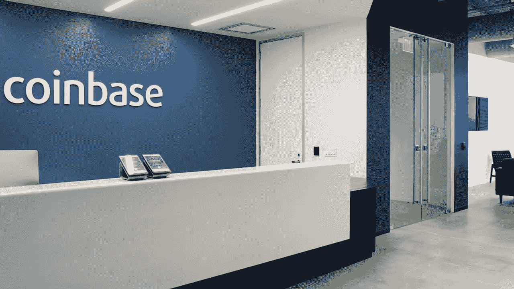

# 随着交易所从历史高点下跌 80%,在比特币基地上市的股票似乎已经死亡

> 原文：<https://medium.com/coinmonks/listings-on-coinbase-appear-dead-as-exchange-falls-80-from-all-time-highs-5bdbb5254538?source=collection_archive---------49----------------------->

面对加密货币和纳斯达克的低迷，比特币基地继续挣扎，从每股近 430 美元的历史高点下跌了 80%以上。

上周标志着 2021 年 4 月直接上市的美国密码交易所首次发现其股票价格达到两位数。截至周一盘后收盘，该公司的交易价格为每股 84.30 美元。

所有这些都发生在纳斯达克集体大幅跳水的时候——在同一时间段内，综合指数下跌了 17%。

其他隔离宠儿，如 Zoom 和 Shopify，分别下跌了 72%和 69%，而加密领先者比特币下跌了约 36%。

但是，尽管这些数字发人深省，但很少有公司能与比特币基地经历的持续而戏剧性的失宠相提并论，它从未与其直接上市的宣传相提并论。

虽然直接上市的复杂性意味着内部人士天生被迫出售，但公众眼中的垃圾场并不好看，股票也从未恢复。

比特币基地的表现尤其糟糕，尽管 2021 年第四季度的收入和每股收益超出了预期。

> 加入 Coinmonks [电报频道](https://t.me/coincodecap)和 [Youtube 频道](https://www.youtube.com/c/coinmonks/videos)了解加密交易和投资

# 另外，阅读

*   [WazirX vs coin dcx vs bit bns](/coinmonks/wazirx-vs-coindcx-vs-bitbns-149f4f19a2f1)|[block fi vs coin loan vs Nexo](/coinmonks/blockfi-vs-coinloan-vs-nexo-cb624635230d)
*   [本地比特币评论](/coinmonks/localbitcoins-review-6cc001c6ed56) | [加密货币储蓄账户](https://coincodecap.com/cryptocurrency-savings-accounts)
*   [什么是融资融券交易](https://coincodecap.com/margin-trading) | [成本平均法](https://coincodecap.com/dca)
*   [支持卡审核](https://coincodecap.com/uphold-card-review) | [信任钱包 vs 元掩码](https://coincodecap.com/trust-wallet-vs-metamask)
*   [Exness 点评](https://coincodecap.com/exness-review)|[moon xbt Vs bit get Vs Bingbon](https://coincodecap.com/bingbon-vs-bitget-vs-moonxbt)
*   [如何开始通过加密贷款赚取被动收入](https://coincodecap.com/passive-income-crypto-lending)