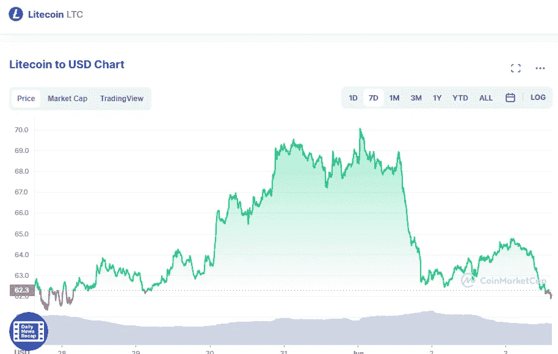

# 6 月 3 日莱特币价格分析

> 原文：<https://medium.com/coinmonks/litecoin-price-analyse-3rd-of-june-2e4333df4cf6?source=collection_archive---------48----------------------->

Source photo [Litecoin price today, LTC to USD live, marketcap and chart | CoinMarketCap](https://coinmarketcap.com/currencies/litecoin/)

在 Litecoin 价格分析中，我们可以在 4 小时的时间范围内检测到一个熊市下降三角形形态。如果价格今天突破该模式的底部边界，价格有可能跌至 62.28 美元。

4 小时价格图上多头试图突破 62.42 美元水平的尝试失败，导致了负面趋势。