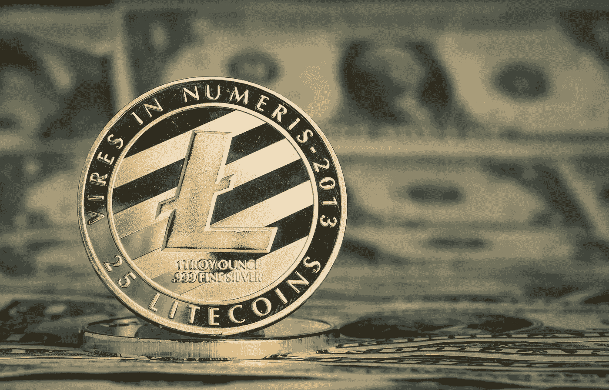

# 莱特币价格分析:LTC 飙升至 115.12 美元，并准备继续其上升轨迹

> 原文：<https://medium.com/coinmonks/litecoin-price-analysis-ltc-surges-to-115-12-and-is-poised-to-continue-its-upward-trajectory-fc27b5d9728b?source=collection_archive---------54----------------------->

Source photo [litecoin — Bing images](https://www.bing.com/images/search?view=detailV2&ccid=748C4VUJ&id=4455ADCD1ABCFBC7411C3386F8985B99D562BF13&thid=OIP.748C4VUJU9MmWmVs_yxNqwHaEv&mediaurl=https%3a%2f%2fcryptochronicle.com%2fwp-content%2fuploads%2f2019%2f03%2f93935920_m.jpg&cdnurl=https%3a%2f%2fth.bing.com%2fth%2fid%2fR.ef8f02e1550953d3265a656cff2c4dab%3frik%3dE79i1ZlbmPiGMw%26pid%3dImgRaw%26r%3d0&exph=1639&expw=2559&q=litecoin&simid=608001965891854414&FORM=IRPRST&ck=1BE908DE17BDFBADC2351A27679F1F4A&selectedIndex=0&ajaxhist=0&ajaxserp=0)

今天的莱特币价格分析表明一个积极的趋势。LTC 价格现在面临 117.6 美元的强大阻力。莱特币价格在 114.1 美元附近找到了支撑。

莱特币的价格进入今天的每日市场，反应不一，交易价格为 115.39 美元，最初从 115.12 美元开始。从那以后…