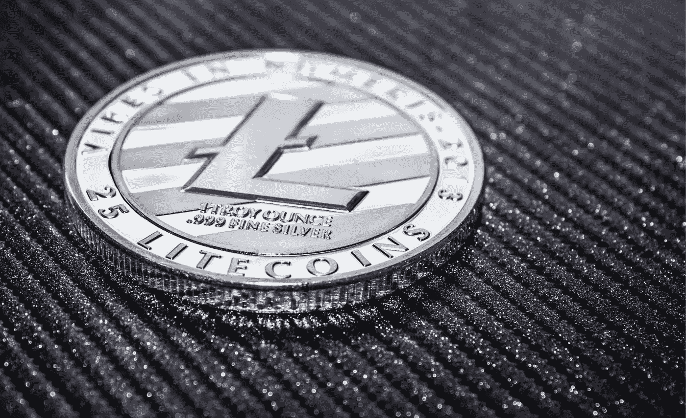

# 莱特币价格预测 2022–2026

> 原文：<https://medium.com/coinmonks/litecoin-price-prediction-2022-2026-e2f077b36cf5?source=collection_archive---------31----------------------->

Source photo [litecoin — Bing images](https://www.bing.com/images/search?view=detailV2&ccid=6h9un%2bFw&id=5F128CD8FC7739044B5DA8C28B37FC1B6D38F414&thid=OIP.6h9un-Fw3UZkQ5yxUrUa8AHaEh&mediaurl=https%3a%2f%2fwww.forexnewsnow.com%2fwp-content%2fuploads%2f2018%2f12%2fLitecoin.jpg&cdnurl=https%3a%2f%2fth.bing.com%2fth%2fid%2fR.ea1f6e9fe170dd4664439cb152b51af0%3frik%3dFPQ4bRv8N4vCqA%26pid%3dImgRaw%26r%3d0&exph=916&expw=1500&q=litecoin&simid=607990150443334353&FORM=IRPRST&ck=2F3DD456BFE2D6B1A7ECAB6AC8C1778F&selectedIndex=1&ajaxhist=0&ajaxserp=0)

莱特币(LTC)是一种加密货币，由查理·李于 2011 年 10 月开发。由于交易成本低，它被全球 2000 多家商店接受作为支付方式。由于莱特币的成本效益，在成本是一个因素的不发达国家，它是一种可行的替代支付方法。由于其闪电般的执行速度，Litecoin 还拥有短短几分钟的交易确认时间。