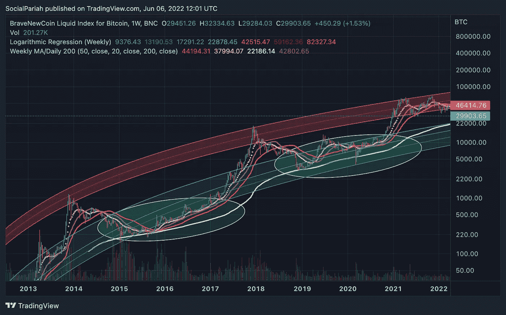

# 对数回归:-技术分析 I

> 原文：<https://medium.com/coinmonks/logarithmic-regression-technical-analysis-i-514c405d9b6c?source=collection_archive---------14----------------------->

弄清楚我们在加密货币市场的大计划中所处的位置似乎是一项艰巨的任务，特别是当面临与熊市相关的恐惧、不确定性、怀疑(FUD)时。

然而，使用一点数学，并通过接受价格有许多可能的导演的想法，我们可以利用一些技术指标来了解加密货币市场目前的交易情况，并确定潜在的轨迹。

一组经常依赖的长期宏观指标是*对数回归带*，它一直充当加密资产价格的支撑点和阻力点。在接下来的分析中，我们将特别评估**BTC**的价格变动。

**寿师爷:**

在我开始之前，我想快速地向 Benjamin Cowen 表示感谢，他的 Youtube 频道为我提供了理解和开始研究高级技术分析指标/模式的基础知识。我强烈建议任何有兴趣学习更多技术分析的人去看看他的频道，链接[这里](https://www.youtube.com/channel/UCRvqjQPSeaWn-uEx-w0XOIg)。

我也想对 TradingView 上的 *memotyka9009* 喊一声。我非常依赖他的脚本来模拟对数回归带。尽管我对他的代码理解有限，但我还是决定运行结果，因为获得的结果展示了与预期标准一致的回归波段，尽管相对于其他几个模型，波段定位本身略有不同。

在此链接到脚本[。](https://www.tradingview.com/script/8AFRXsor-Logarithmic-Regression-Weekly/)

**什么是对数回归？**

对数回归是一种回归类型，它模拟最初快速增长，然后随着时间的推移而放缓的情况。对于我们这些经历了 2017 年加密泵和随后的崩溃以及 2021 年泵的人来说，理解为什么这个指标被用来模拟加密价格运动。

两种泵的速度和大小之间的差异在早期就很明显，并为加密货币市场的“延长周期理论”和“收益递减”的支持者提供了重要的支持。我们将进一步评估这两个概念。

如何在我自己的图表上观察它？

在 TradingView 的图表中加入对数回归指标的方式，起初可能看起来很复杂，但只要有一点点指导，这项任务就能相对快速地完成。首先，你需要在 TradingView 上打开"*brave new coin LIQUID INDEX***"***或" BLX"* 图表(我从 *memotyka9009* 获得的模型只对这个特定的图表有效)。然后，您需要点击图表底部的“ *Pine Editor* ”，它将打开一个编码脚本，供您输入从 *memotyka9009* **获得的脚本。**简单地将脚本直接复制并粘贴到您的 Pine 编辑器中，删除所有现有的代码。完成后，根据您想要的名称保存脚本，之后您可以通过单击 save 按钮旁边的按钮直接添加到 chart。

请注意，如果代码成功执行，但您的回归没有显示在图表上，很可能您使用的是 TradingView 的免费版本，并且已经超过了 3 个指标的限制。只需删除图表上显示的一个指标，再次将脚本添加到图表中，就可以开始了。

太好了，我们已经能够在 BTC 图表上设置它，但是我们如何读取提供的数据呢？嗯，像所有技术分析一样，我们寻找一致的模式以及随时间的变化，对 BTC 价格在一个周期内以及不同周期间的表现做出自己的评估。

要指出的一个关键指标是中间的蓝线，它是在价值单调增长的非常重要的假设下作为 BTC 的公允价值。或者，我们可以观察中间的绿色带和 *200 周移动平均线* ( *仅仅是过去 200 周的周价格平均值——白线*)来获得在最近的牛市中一直保持的支撑线。(见白色圆圈部分。)

从这些信息中我们可以推断出什么？我们已经看到，最近，价格倾向于保持在中间绿色(较低)带之上，并在 *200 周移动平均线指标* **(不包括灯芯波动)**之上保持一致性。我们可以相对有信心，这条支撑线将保持，价格不会大幅下降到两个指标指定的价格点以下。值得注意的是，在最近几年里， *200 周 MA* 与中间的绿色(较低)带会聚。随着市场走向成熟，这种转换可能会继续朝着公允价值支撑线(蓝色中线)进行，但是，这可能需要多年时间，在此期间会出现价格波动周期。

看看上面的波段，我们看到，从历史上看，在随后大幅下跌(进入熊市)之前，价格相对稳定地达到上对数回归的上波段。着眼于未来价格的阻力区可能会带来一定程度的不确定性，特别是如果 BTC 此前尚未达到该区域的价格。然而，根据历史结果，我们注意到在每个牛熊周期中，价格在绿色回归带以下积累价值的时间是一致的。突破绿色回归带后，价格往往保持在 20 周均线(黄色虚线)上方，当我们进入并经历牛市时，这是一个强有力的支撑区。一旦价格突破红色(上方)回归线，我们将面临更大的价格反转风险和熊市的开始迹象。

值得注意的是，特别是在较高的回归带的情况下，不同的模型在定义上限时会经历不同的结果，最近的一些模型表明，在崩溃之前的 2021 年牛市周期中，我们几乎没有触及红色(较高)回归带的表面。这并不是说模型是不正确的，而是考虑到了不同的计算风格和假设，它们在从你获得的结果中得出结论时起着关键作用。基本上，仅仅因为它看起来像它并不意味着它会再次发生，仅仅因为某人以前是对的，即使它是一贯的，也不意味着那个人下次不会错。记住这一点。

**收益递减理论:**

简而言之，该理论认为，随着时间的推移，从投资特定资产(特别是像加密这样的新兴资产)中获得的回报的*数量*会随着时间的推移而减少。除了 BTC 本身，我们找不到更多的例子，我们从对数图中注意到，随着时间的推移，红色和绿色回归带(有时被称为“无人区”)之间的距离缩小了。我们还注意到波动性降低，价格不太可能上涨，在图表两边的主要回归区域花费的时间很少。例如，我们注意到，在 2018 年的熊市中，价格一直保持在中间绿色回归线之上，而在 2015 年，价格下降到中间绿色回归线以下，并保持在回归所描绘的最低区域内，直到下一个周期开始。对于红色(上方)回归带中的价格波动，可以设置类似的东西。我们在这种情况下注意到，在最近的牛市(2021 年)中，价格在较高波段盘整的时间明显长于之前的周期，这使我们很好地过渡到“延长周期理论”。

**延长周期理论:**

加密货币社区中有一个常见的误解，即每 4 年发生一次周期，以配合 BTC 减半(BTC 产出减少的过程)。然而，基于历史数据，显然不是这样。我们观察到的周期从不到三年到四年多不等。我们还注意到，价格波动性较小，因此与前期相比，在后期周期中，价格在某些区域的盘整时间较长。这种整体波动性的降低反过来导致价格需要更长的时间来将价值从较低(绿色)回归带巩固到代表整个周期的较高(红色)回归带。

总之，是的，这看起来是一个令人畏惧的指标，是的，设置和理解它有点复杂，但是，我坚信从理解和阅读这个指标中获得的知识对市场中任何一个稳定的交易者来说都是至关重要的，对计划进入市场的人来说也是非常有用的。查看我在 Twitter 上关于 DCAing 的帖子，了解这是否是你投资组合的正确之举。

再次向*本杰明·考恩*和 *memotyka9009* **，**大声呼喊，我非常感谢你们在网上发布的免费内容。

社会弃儿

> 加入 Coinmonks [Telegram group](https://t.me/joinchat/Trz8jaxd6xEsBI4p) 学习加密交易和投资