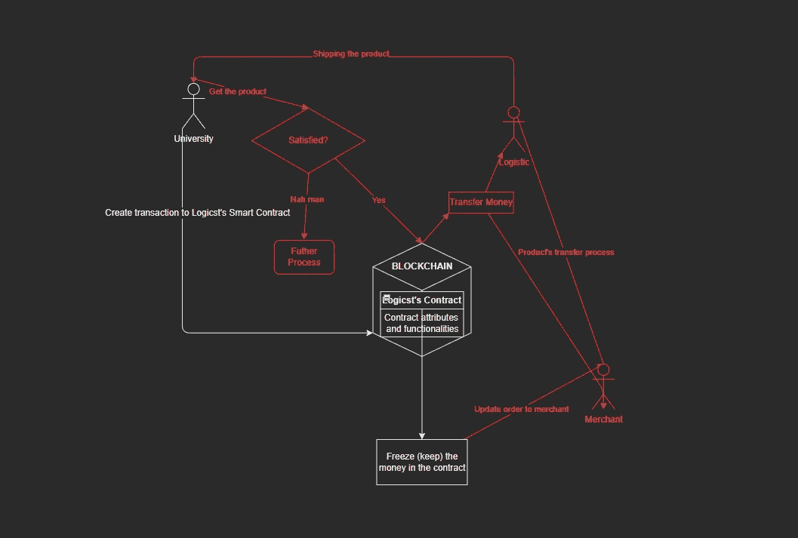
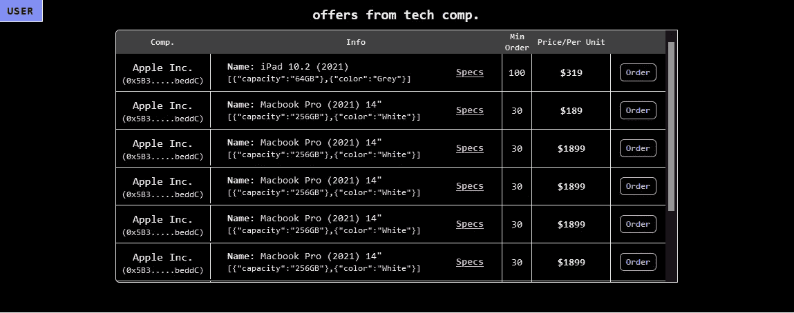
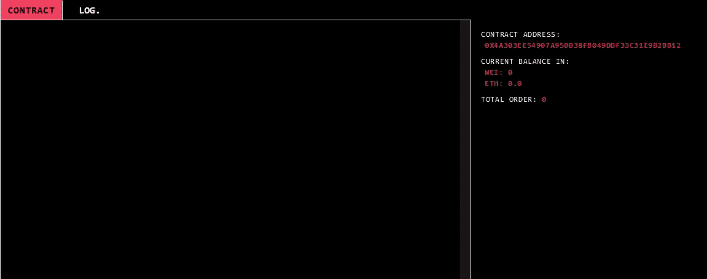
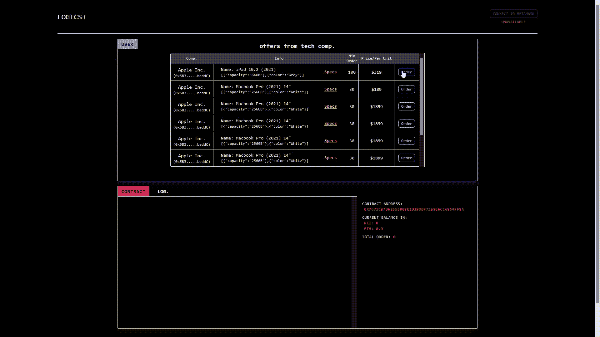
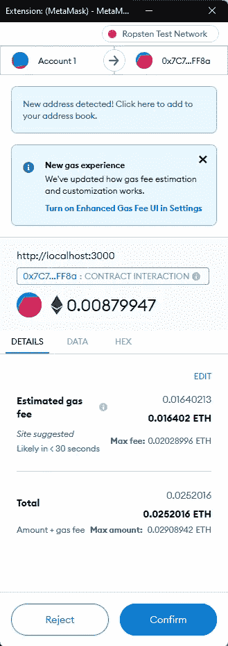
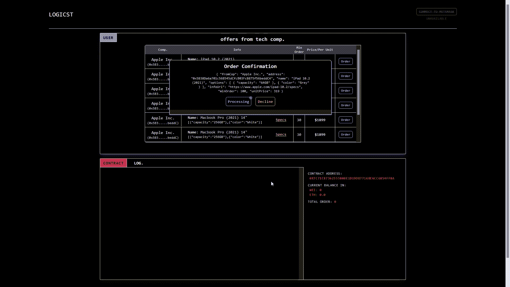
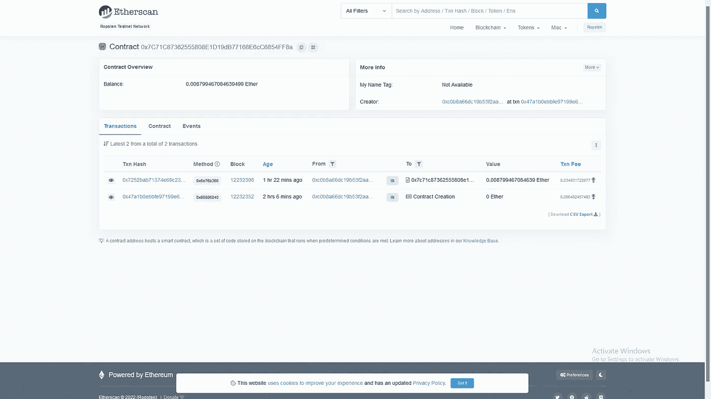
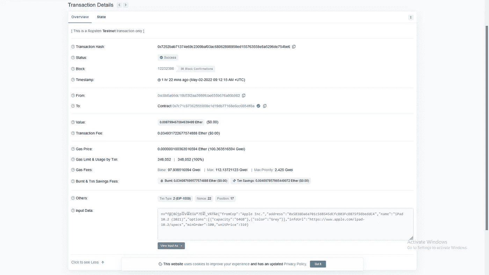

# LOGICST: Block 迷你项目

> 原文：<https://medium.com/coinmonks/logicst-block-mini-project-b3bbe013a675?source=collection_archive---------48----------------------->

> **免责声明:**如果我的语言中有什么错误而导致误解，我必须用我的语言向你道歉，如果我不知道我错在哪里，请告诉我纠正我做错的地方。
> 
> 这个迷你项目旨在深入研究区块链如何作为一个高层次的视角工作，以及我如何使用这项技术来集成和创建一个可以与智能合同通信的 web 应用程序，更重要的是，主要是提高我在这一领域的技能。
> 
> 因此，如果有任何/部分上下文是错误的，需要修正，或者需要调整每个特定上下文的视角或理解，请告诉我。

# 项目概述

该程序的目的是创建一个分散的应用程序，主要有几个角色与以下对象进行交互:

*   Logicst 的合同(作为供应商)
*   客户(如大学或任何需要从数据到内部和外部视图的透明性、可追溯性和完整性的组织)
*   m̶e̶r̶c̶h̶a̶n̶t̶s̶̶(̶o̶r̶̶t̶h̶e̶̶c̶o̶m̶p̶a̶n̶y̶̶t̶h̶a̶t̶̶s̶e̶l̶l̶̶b̶u̶l̶k̶̶o̶r̶d̶e̶r̶̶t̶o̶̶a̶n̶y̶̶o̶t̶h̶e̶r̶̶o̶r̶g̶a̶n̶i̶z̶a̶t̶i̶o̶n̶)̶
*   l̶o̶g̶i̶s̶t̶i̶c̶s̶̶(̶w̶h̶o̶̶r̶e̶s̶p̶o̶n̶s̶i̶b̶l̶e̶̶f̶o̶r̶̶s̶h̶i̶p̶p̶i̶n̶g̶̶p̶r̶o̶c̶e̶s̶s̶)̶

> 我划掉的最后两项目前还没有实现，因为时间限制或者是我没有很好地管理自己来完成它。
> 我必须向你道歉，我的顾问(T_T)。如果可以的话，请原谅我。

**陈述主要观点:**

这个应用程序的主要思想是充当中间人来持有|冻结资金(我应该称之为资金管道吗？LOL)客户需要与商家交易，然后在完成商品在商家和物流之间的转移过程后等待商家批准订单。满足所有要求的条件后，合同将解冻客户的资金，然后将资金直接发送到商家和物流的钱包地址。

**图片主旨:**

The color red indicates the UN-implemented parts at this moment.

说够了…让我们看看它是如何工作的！

# 让我们深入应用程序

**App 概述**

这个博客将只解释程序的整体，例如它的功能和它的行为，但是，我将在下面附上源代码的链接，以防有人想更详细地查看它，或者给出关于源代码的任何建议。

代号:[https://github.com/jabosinyahouse/block-mini](https://github.com/jabosinyahouse/block-mini)

这个应用程序是用 React 的堆栈创建的。JS、Tailwind CSS 和 Solidity 在页面第一次呈现时就已经连接到 Logicst 契约的提供者，并在应用程序级别向下传递它们。这是在 JavaScript 的 ethers 模块|库的帮助下完成的。

Overview of The Application at First Entry | Index

该应用程序有两个主要组件:

1.  **用户组件**

This component shows the list of offered items from the merchants. The customer can click *the order button* to initiate their transaction at any items that the customer desire.

2.**合同组件**

This component displays the current status of our contract. By that, we can see the transaction event that occurs in our contract. But we didn’t create any transaction yet so the log’s box is empty for now.

**工作原理**

当用户单击 order 按钮时，订单确认将弹出，其中包含特定选定商品的订单详细信息，并让用户决定是否启动交易。

Order Process

用户点击确认按钮后，系统将执行从 JavaScript 到 Logicst 的契约的命令来调用函数 **orderItem** 。然后，浏览器弹出元掩码模式，让用户签名|确认我们将在 Ropsten 网络中执行的交易，它在我录制 GIF 图像视频时没有出现，因此我将附上下面的图。

Metamask popup modal when the customer selected confirms button.

在客户确认 Metamask 中的交易后，我们必须等待交易在链中得到批准。需要几秒到一分钟。完成后，契约组件将根据我们直接从区块链获取的数据更新状态变量。如果事件日志出现，这意味着我们获得的数据来自区块链，它已经存储在那里！

Everything works, and we got the data!!!

所以我们可以通过在 Ropsten 测试网络的 Etherscan 中检查它来确保它能够工作。

Baam! The first one on the list is the transaction that we recently made!

This is the transaction info located inside the Blockchain, so everyone can see it!!! Transparent enough? In-transparent comp. may hate it! 😝

# 结论

由此，我们可以看到智能合约为我们提供的高级能力视图，以及它在网络中的透明性，这需要数据的透明性和完整性(不可变属性)，因此值得尝试一下，并确定该技术的适当用例(已经有了，但对我来说，我认为这只是开始，对我来说，我可以考虑自己，因为我对该技术几乎一无所知。就像冰山一样，我只是站在它自己的顶端。

有一件事我知道，我对此知之甚少，无论是区块链方面(可靠性)还是网站方面(JavaScript、CSS)

我所做的只是触及了坚固性工作原理的表面，还有许多我需要学习的东西。这个项目教会了我很多东西，它可以告诉我此刻我还缺少什么，很多东西…

我上面说的是，如果我能从现在开始最大限度地发挥我的技能，我就能在将来最大限度地利用它的能力和好处。

> 加入 Coinmonks [电报频道](https://t.me/coincodecap)和 [Youtube 频道](https://www.youtube.com/c/coinmonks/videos)了解加密交易和投资

# 另外，阅读

*   [Bookmap 点评](https://coincodecap.com/bookmap-review-2021-best-trading-software) | [美国 5 大最佳加密交易所](https://coincodecap.com/crypto-exchange-usa)
*   最佳加密[硬件钱包](/coinmonks/hardware-wallets-dfa1211730c6) | [Bitbns 评论](/coinmonks/bitbns-review-38256a07e161)
*   [新加坡十大最佳加密交易所](https://coincodecap.com/crypto-exchange-in-singapore) | [购买 AXS](https://coincodecap.com/buy-axs-token)
*   [红狗赌场评论](https://coincodecap.com/red-dog-casino-review) | [Swyftx 评论](https://coincodecap.com/swyftx-review) | [CoinGate 评论](https://coincodecap.com/coingate-review)
*   [投资印度的最佳密码](https://coincodecap.com/best-crypto-to-invest-in-india-in-2021)|[WazirX P2P](https://coincodecap.com/wazirx-p2p)|[Hi Dollar Review](https://coincodecap.com/hi-dollar-review)