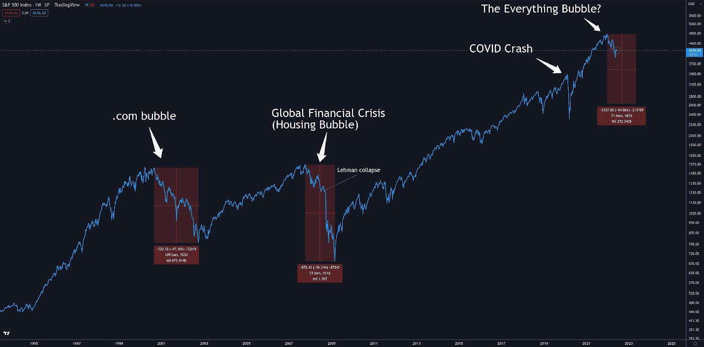
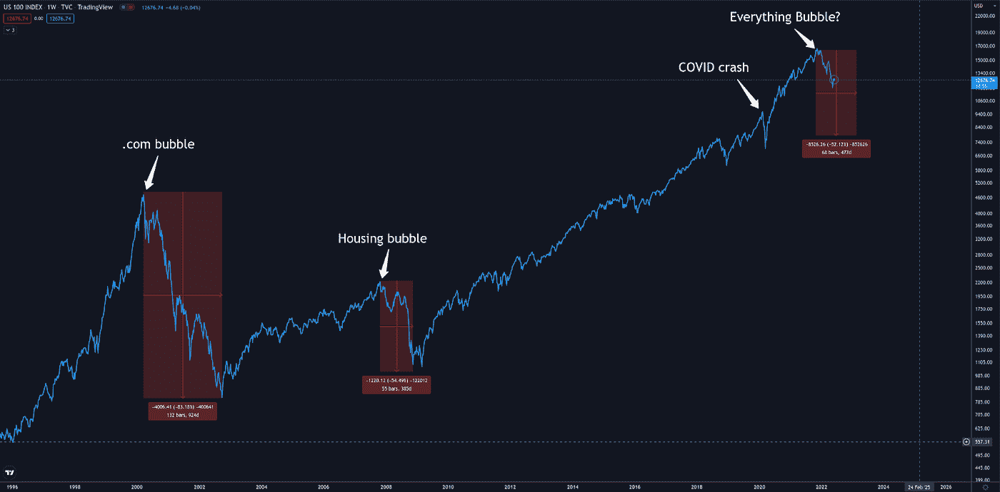
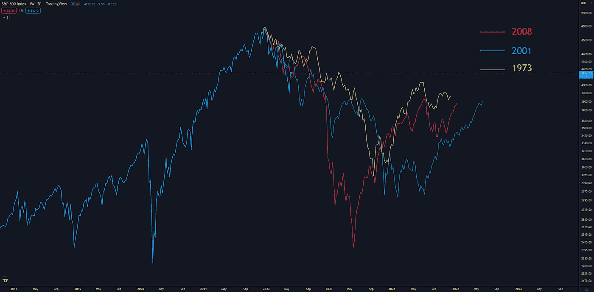
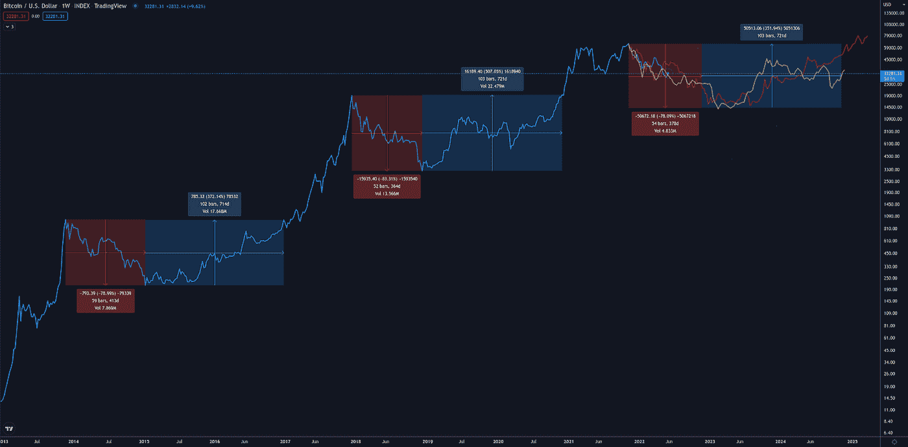

# 长期加密展望

> 原文：<https://medium.com/coinmonks/long-term-crypto-outlook-276aaf02cc1f?source=collection_archive---------14----------------------->

# 不要和美联储作对

这个“咒语”在上涨过程中变得流行起来，因为股票估值过高，许多人试图预测永远不会到来的修正。这当然是因为美联储基本上通过免费印钞来刺激经济。

所以顺理成章的是，同样的道理也适用于下降的过程。如果美联储正在收紧，也不要反对。虽然在大幅下跌后，东西可能看起来很便宜，但这种同样的“价值投资”心态让人们在逆自由现金潮流而动时陷入困境。

# “财政大臣濒临第二次银行救助”

这对 crypto 来说意味着什么？crypto 不是诞生于金融危机吗？如果我们看得更深一点，比特币抗议的不是崩盘，而是对崩盘的反应。嵌在第一块比特币上的著名标题说明了一切，这是我们反对的救助。因此，我在这里的观点是，比特币旨在防范刺激央行，而不是收紧。刺激导致通货膨胀= >通货膨胀过高= >需要紧缩来对抗通货膨胀。我们现在正处于紧缩状态，Crypto 显然对此反应不佳。随着这种动态现在被很好地理解和接受，多头开始寻找“支点”何时到来。现在你可以制作先进的经济、政治和心理模型来尝试预测这种情况何时发生。或者你可以等待支点被宣布。美联储不会悄悄地改变利率，几个月后利率就会泄露给市场。他们的一举一动都被拍成电报。那么为什么不简单地等待呢？科技股的相似性告诉我们，与适应支点相比，预测支点几乎没有什么价值。

# 全球信贷周期

经济通过信贷周期自然扩张和收缩。在上升的过程中，我们有资金去尝试一些事情来提高我们的生产力。在下降的过程中，我们清除那些不起作用的东西，为下一个周期的新事物留出空间。然而，在过去的二十年里，央行作为一个安全网介入，迅速将我们从任何下跌中反弹出来。其结果是，我们现在在金融体系中存在大量效率低下的公司，如“僵尸公司”，这些公司只能支付利息，永远无法偿还债务或产生任何利润。这让我担心，我们可能会宿醉，因为金融形势变得足够严峻，足以扼杀所有这些被压抑的低效率。对于各国央行(主要是美联储)将如何应对市场下跌，仍有一些疑问。最近的历史让市场参与者习惯于期待救助。然而，你只能选择一个，抗击通胀或救市。大多数经济学家认为，我们将需要一场衰退，才能让通胀完全回到合理水平。就连杰罗姆·鲍威尔自己也说了很多话:“软着陆”

谢尔比问鲍威尔，他是否愿意像沃尔克一样“严厉”地“控制通货膨胀，保护物价稳定”

*鲍威尔回答说，沃克尔是“这个时代最伟大的经济公仆”，并补充说，“我希望历史会记录下，你这个问题的答案是肯定的。”*

# terra 爆炸对 crypto 的伤害

从短期来看，这给不断下跌的市场火上浇油，一方面是因为抵押品的清算，另一方面是因为 UST 和露娜的价值缩水。但我认为更持久的损害是引擎盖下发生的事情。稳定币爆炸是一种特殊的邪恶，它打击那些相信自己选择了风险较低的选项的人。现在你可以认为人们应该明白他们所冒的风险。然而，这种观点并不重要，重要的是人们炸了自己的账户，基金遭受重创，DeFi 和 CeFi 项目中投资于锚定国债的人遭受重创。

随着对自由落体式估值的信任度不断下降，当这些东西崩溃时，就类似于中央交易所破产。它以一种方式烧伤参与者，他们完全离开加密，并相信这是一个纸牌屋，或者更糟的故意骗局。

这也招致监管审查。如果 crypto 以前在雷达上，现在他们在十字准线上。

这是加密周期中丑陋的一部分，在我看来，这也是为什么会有如此可预测的周期的真正原因。虽然比特币减半可能增加了时间，但它奏效的原因是繁荣和萧条周期的性质。在熊市中，行不通的东西会被清洗掉，参与者有时间忘记过去的罪恶，被新的机会所吸引。

# 游戏计划

好吧，那是一堆狗屎。尽管有光和隧道的尽头。我仍然坚定地看好熊市的另一面会卷土重来。那我们什么时候按下购买键？

首先，在我看来，我们必须承认，我们正涉足一些未经考验的领域。我们深陷熊市下跌之中，而世界经济似乎正面临衰退。前三次加密周期都发生在股市有史以来最大的牛市中。随着本轮周期对机构投资者的收购，出现了与标准普尔的相关性。

# 我们的兄弟 S&P 和纳斯达克 100 指数的前景。

我相信两种可能的情况之一会发生。

场景 1:某件事突然刹车，比如 08 年雷曼倒闭。这个场景让我们匆忙到达目的地。虽然深度可能相同，但这种情况会缩短时间。

情景 2:随着时间的推移，我们的“软着陆”慢慢缩小了这个泡沫。我认为这将类似于。网络泡沫。

标准普尔 500 指数

纳斯达克 100 指数

最后是 S&P 的放大图，覆盖了-01 年和-08 年的崩盘以及-73 年的崩盘，许多经济学家将当前的通胀逆风与此进行比较。

基于这些先前的例子，一个有根据的猜测让我相信，底部可能会在明年夏天的某个时候找到。我猜测标普 500 指数的底部深度大约是 3k。

从加密的角度来看，这是怎样的呢？在我看来，唯一足以进行这类比较的数据集是比特币。与之前的图表类似，我将之前的两次熊市叠加在我们当前的轨迹上，并在明年夏天的某个时候在 14k 到 20k 之间触底。

# 比特币和另类硬币

宏观环境在很大程度上勾勒出了比特币的故事。价值宏观资产储存是比特币的巅峰。随着时间的推移，随着波动性的消退和信任的增长，它只会慢慢变好，并朝着这个目标发展。

但幸运的是，在密码创新和推动行业潜力方面，还有其他令人兴奋的项目。之前的熊市对这些“另类”项目并不友好。在早期，比特币的竞争对手变得默默无闻。后来，在 ICO 热潮中，大多数受资助的项目在接下来的熊市中要么死亡，要么默默无闻。

傲视群雄的成功当然是以太坊。智能合同的诞生为分散计算创造了一个全新的机会和需求世界，例如执行这些合同的块空间。以太坊主导了智能合约领域，并在整个周期中幸存下来。随着时间的推移，以太坊和比特币之间的相关性随着这两大“巨头”与市场其他部分的明显分离而增长。

# 融资前景

促成 2020 年牛市的大多数项目都是在以太坊的 ICO 热潮期间获得资金，并在 2018 年的熊市期间建造的。随着美国证券交易委员会的介入，并宣布公众“首次发行硬币”为非法，crypto 的融资环境发生了巨大变化。虽然项目不允许向“不老练”的投资者提供硬币，但它们仍被允许从根据这些法律被视为“老练”的风险资本家那里筹集资金。虽然已经有相当多的风险投资对这个领域感兴趣，但这些规则创造了一个监管套利机会，对他们来说太好了，不能错过，于是繁荣被点燃。一切都得到了资助，因为一旦硬币上市并卖给“不老练”的投资者，风险投资基本上肯定会大赚一笔。

因此，与后 ICO 熊市类似，现在有一大堆毫无价值的狗屎，没有任何用户会崩溃和死亡。这很好。这就是周期应该如何运作，清除坏项目，为新项目留出空间。这也为投机者创造了巨大的机会。因为如果你能找出哪些项目会持续到下一个周期，在熊市最严重的时候买入它们会带来巨大的收益。

# 全新闪亮 vs 久经考验

尽管在下一轮熊市中挑选久经考验的项目非常有利可图，但这也非常非常困难。胜算很大，除非你有特定优势，否则这可能不是一个好策略。

另一方面，从历史来看，这个崭新而闪亮的类别是一个绝妙的赌注。不幸的是，你很可能无法接触到它。种子阶段实际上是熊市期间最容易获得的，这将被庞大的新 a16z 基金吞噬。现在，如果你有机会和风投一起下注，那看起来是个不错的选择。

# 赌以太坊

鉴于熊市的历史以及挑选幸存者的难度，押注于大联盟的风险收益比要高得多。尽管明星们正在走向以太坊，但进入这一特殊的熊市。首先，另一个周期巩固了其仅次于比特币的地位，成为凌驾于市场其他部分之上的东西。理应如此。尽管其吞吐量有限，而且来自提供近乎免费交易的新型智能合约平台的竞争激烈，但它们仍保持着主导地位。

现在，随着对区块空间需求的消退，事情变得不拥挤，扰乱国王的机会也随之消失。以太坊现在迎来了全面熊市，推出了期待已久的向股权证明的过渡，并最终提高了吞吐量。

转向 PoS 也带来了能源效率的巨大提高。这不仅会对公众的看法产生巨大的影响，更重要的是会对允许投资的可用资本产生巨大的影响。世界资本的很大一部分被指定为“ESG”资格，这意味着它不被允许投资于被认为“坏”的东西。坏主要归结为能源“浪费”,这种说法已经引起了关注，引发了围绕能源消耗的激烈辩论。在这场辩论中，立法者已经利用以太坊的举动作为论据，认为权力是不必要的，甚至比特币也可能改变。结论不准确无关紧要。该声明表明，PoS 以太坊很有可能获得 ESG 的批准，而 PoW 比特币则没有

除了能量和吞吐量，赌注变得更好。因为随着技术的进步，ETH 的记号组学也得到重大的革新。这次大修被称为“三重减半”。这是指比特币对通胀的周期性抑制。虽然这个数字不像比特币那样固定，因为它的一部分是随着网络利用率而动态变化的，但这比著名的比特币减半更能降低通胀。

# 我们什么时候买？

因为我认为市场的驱动因素是宏观动态，所以买入应该基于风向何时变得有利。正如我提到的 14k-20k 美元是我对比特币底部的猜测，以太坊的相应水平将在 1000 美元左右。由于不确定性如此之高，我认为 DCA 方法从低于 1500 美元开始，预期 1000 美元，并接受低至 600 美元的风险，如果你想确保自己不被边缘化，这是一个合理的策略。虽然我认为底部可能会在明年夏天出现，但我也预计会有一个漫长的平坦底部。这意味着可能还需要一年时间，情况才会真正开始好转。

> 加入 Coinmonks [电报频道](https://t.me/coincodecap)和 [Youtube 频道](https://www.youtube.com/c/coinmonks/videos)了解加密交易和投资

# 另外，阅读

*   [TraderWagon 回顾](https://coincodecap.com/traderwagon-review) | [北海巨妖 vs 双子星 vs BitYard](https://coincodecap.com/kraken-vs-gemini-vs-bityard)
*   [Exness 评测](https://coincodecap.com/exness-review)|[moon xbt Vs bit get Vs Bingbon](https://coincodecap.com/bingbon-vs-bitget-vs-moonxbt)
*   [如何开始通过加密贷款赚取被动收入](https://coincodecap.com/passive-income-crypto-lending)
*   [加密货币储蓄账户](/coinmonks/cryptocurrency-savings-accounts-be3bc0feffbf) | [加密交易机器人](https://coincodecap.com/best-crypto-trading-bots)
*   [BigONE 交易所评论](/coinmonks/bigone-exchange-review-64705d85a1d4) | [CEX。IO 审查](https://coincodecap.com/cex-io-review) | [Swapzone 审查](/coinmonks/swapzone-review-crypto-exchange-data-aggregator-e0ad78e55ed7)
*   [最佳比特币保证金交易](/coinmonks/bitcoin-margin-trading-exchange-bcbfcbf7b8e3) | [比特币保证金交易](https://coincodecap.com/bityard-margin-trading)