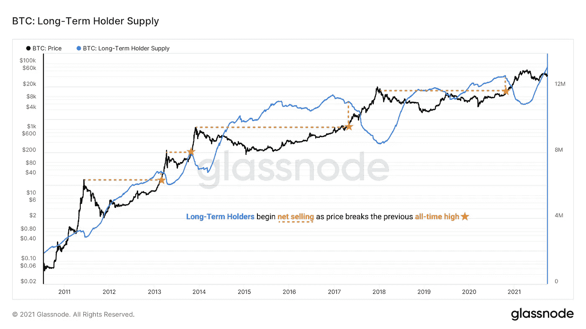
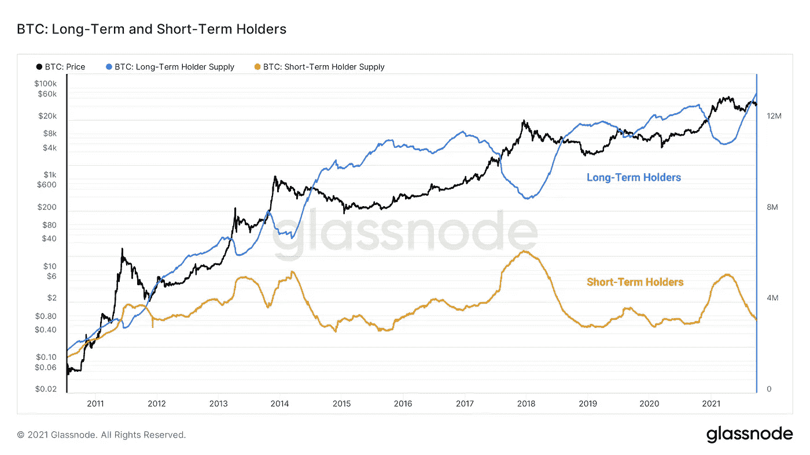

# 长期与短期持有者:谁赢了？

> 原文：<https://medium.com/coinmonks/long-term-vs-short-term-holders-who-wins-a703cd71c19f?source=collection_archive---------73----------------------->

市场是由人组成的，他们的决定形成了市场动力，创造了重复的模式。这个概念代表了行为经济学的概念。

你不必是个天才也知道赚钱的方法是低价买入高价卖出——这一点很明显。棘手的部分是弄清楚什么时候价格便宜，什么时候价格高。

货币的时间价值决定了资产的价格会随着时间的推移而升值。从本质上讲，你持有一项资产的时间越长，你未来预期的出售价格就越高。理解这一概念的人旨在通过更长时间地持有资产来增加利润。

为了实现这样的利润，长期持有人依赖于对他们持有的资产的足够需求。反思行为经济学的概念，我们可以更深入地挖掘加密资产市场中的两个亚群体:长期持有者和短期持有者。

这张图表显示了长期(155 天)比特币持有者的抛售行为。请注意，一旦之前的 ATHs 被突破，长期持有人就会退出他们的头寸。

source: glassnode

在这张图表中，我们可以看出长期持有人和短期持有人之间的反比关系。具体来说，随着更多短期持有人进入，长期持有人的数量减少，这代表着当比特币的价格达到新高时，长期持有人将他们的持有物出售给新进入者。

source: glassnode

简而言之，长期持有者购买比特币并持有。随着时间的推移，比特币的价格上涨，新的投资者被吸引并进入市场。当比特币达到新的价格时，需求达到峰值。长期持有者出售给新投资者获利。

比特币价格下跌，短期持有者退出市场，亏本出售他们的比特币。与此同时，长期持有人的数量增加，因为他们积累比特币，导致下一个 ATH，希望将其出售给被甜蜜牛市的绿色烛光吸引到市场的新投资者。

WAGMI

感谢阅读。

关于这个主题的更深入的分析，你可以前往 [glassnode](https://insights.glassnode.com/follow-the-smart-money/) 。

如果你喜欢这篇文章，请在这里和[推特](https://twitter.com/twenty_dex)上给我一个关注。

更多即将推出。

> *加入 Coinmonks* [*电报频道*](https://t.me/coincodecap) *和* [*Youtube 频道*](https://www.youtube.com/c/coinmonks/videos) *了解加密交易和投资*

# 另外，阅读

*   [Bookmap 点评](https://coincodecap.com/bookmap-review-2021-best-trading-software) | [美国 5 大最佳加密交易所](https://coincodecap.com/crypto-exchange-usa)
*   最佳加密[硬件钱包](/coinmonks/hardware-wallets-dfa1211730c6) | [Bitbns 评论](/coinmonks/bitbns-review-38256a07e161)
*   [新加坡十大最佳加密交易所](https://coincodecap.com/crypto-exchange-in-singapore) | [购买 AXS](https://coincodecap.com/buy-axs-token)
*   [红狗赌场评论](https://coincodecap.com/red-dog-casino-review) | [Swyftx 评论](https://coincodecap.com/swyftx-review) | [CoinGate 评论](https://coincodecap.com/coingate-review)
*   [投资印度的最佳密码](https://coincodecap.com/best-crypto-to-invest-in-india-in-2021)|[WazirX P2P](https://coincodecap.com/wazirx-p2p)|[Hi Dollar Review](https://coincodecap.com/hi-dollar-review)