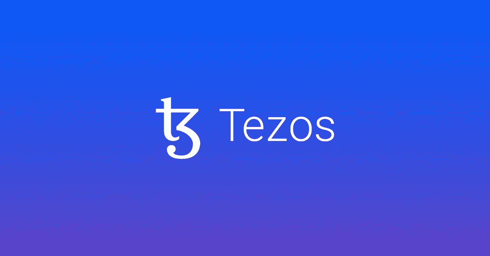

# 寻找 Web3 的入口？给泰佐斯(XTZ)一个机会。

> 原文：<https://medium.com/coinmonks/looking-for-an-on-ramp-to-web3-give-tezos-xtz-a-go-5b550b2c5492?source=collection_archive---------41----------------------->

如果你还没有涉足 Web3，并且正在寻找一个好的切入点，我建议试试 XTZ 的区块链。

这是我在 2021 年 12 月定居的地方，我看到许多其他人也在做同样的事情。随着时间的推移，我开始欣赏 Tezos 社区的酷劲。我将在文章后面分享我对此的看法，但首先我想讨论一下它的一些好处和特性。

泰佐斯速度很快。它有一些很棒的市场。交易费用很低。随着新的 dApps 和平台定期上线，生态系统已经相当成熟。它允许低成本、低风险的进入。

虽然以太坊 NFT 市场无疑是最活跃的，也有许多最引人注目的项目——但你要支付高昂的煤气费(交易成本)，这使得实验和潜在的错误代价更高。

我不是唯一一个觉得 Tezos 是一个好的起点的人。最近，我在读一篇著名的 Web3 时事通讯， [Metaversal](https://metaversal.banklesshq.com/p/a-quick-guide-to-tezos-nfts?s=r) 也建议将 Tezos 作为一个很好的起点。

不管什么原因，Tezos 上的 cryptoart 很便宜。我见过一些在以太坊上拥有高价艺术品的艺术家选择在 Tezos 上出售，以此来提供低价艺术品。

这就是我之前提到的为什么 Tezos 看起来像一个前卫的独立联合企业。它不是由那些希望通过买卖艺术品快速致富的人经营的。Tezos 上的大多数收藏家并不是在寻找他们的金鹅。那些人很快就会发现他们走错了地方。

作为一个艺术家，这是一把双刃剑。你将从 Tezos 上价格较低的艺术品开始，它们将以较慢的速度增值。但是你可以和许多伟大的艺术家一起展示，而且不用冒几百美元的油费的风险。

我在 Tezos 上发现的另一个独特品质是，艺术家出售的是版本而不是 1/1，这意味着作为一名艺术家，你会为一件作品铸造多个版本，比如 25 个，而不是一个版本。这在一定程度上解释了较低的定价。好处是接触到更多的收藏者，从长远来看可能会有回报。

## 那么如何开始呢？

我会从在双子星网上购买 Tezos 开始(我相信这是目前唯一一家与 Tezos 有交易对的美国加密交易所)。一旦你做到了这一点，如果你真的想要一个更高层次的网络安全，就使用像 [Kukai](https://wallet.kukai.app/) 或 [Temple](https://templewallet.com/) 这样的浏览器钱包进行实验，或者像 [Ledger](https://www.ledger.com/) 或 [Trezor](https://trezor.io/) 这样的硬件钱包。

我之前链接的那篇 [Metaversal 文章](https://metaversal.banklesshq.com/p/a-quick-guide-to-tezos-nfts?s=r)给出了不同 NFT 市场的更多细节。我发现 Objkt 是一个很好的起点。

我不确定 Tezos 是否是你的公用事业支持的 pfp 项目的最佳目的地，该项目有一个 10 年的路线图，但 Arthur Breitman 在这篇 Twitter 帖子中提出了不同的建议:

作为一个提示，请注意他化身中的蜥蜴生物——那是一场[暴风雪](https://objkt.com/collection/tezzardz)，这是泰佐斯区块链上的一个大型 pfp(个人资料图片 NFT)项目。在这里，他不是一个公正的法官，而是直接与 Tezos 团队合作。

很难预测未来一切会如何发展。市场会意识到艺术品在 Tezos 上的定价过低，并随着时间的推移导致价格大幅飙升，还是会保持较低的价格，继续成为更容易获得的艺术品的市场？

我甚至不会假装对整个 Tezos 生态系统进行推测，但那里有许多开放的问题。

以下是 YouTube 上一些信息丰富的视频，可以让你了解更多关于特佐斯区块链的信息:

[什么是泰佐斯— XTZ 自我修正用动画解释](https://www.youtube.com/watch?v=Umy75ihttwo)

[Tezos 是什么？XTZ](https://www.youtube.com/watch?v=1GxDajT-DH8)

# **必须了解 Tezos 上的艺术家和项目**

既然你已经考虑过进入 Tezos，让我们来看看你能在这里找到的一些受欢迎的艺术家和项目。

 [## 橱窗静物 001 | objkt.com

### gif 由约翰·卡雷尔 jjjjjjjjjjohn 约翰

objkt.com](https://objkt.com/asset/hicetnunc/2371) 

约翰·卡雷尔，也被称为 jjjjjjohn——他因《T2》的《窗边静物》系列而声名鹊起。在这一点上，许多艺术家制作衍生版本，你会在 Tezos 的艺术中看到其他偶然的参考。他仍然铸造新的项目，几乎拉屎黄金。

[纸佛](https://twitter.com/paperbuddha)，和我列举的其他几个一样，在多个区块链都有作品。他们的作品被描述为许多不同佛像的“迷幻拼贴画”。

我一直在关注一群现实主义/超现实主义肖像画家，他们创造了一些不可思议的 NFT 艺术:

[Jeremy Lipking](https://twitter.com/lipking)

[大卫·谢菲兹](https://twitter.com/davidcheifetz)

弗朗辛·Krieg

[塔妮娅·里维斯](https://twitter.com/tania_rivilis)

[Loginovart](https://objkt.com/profile/tz1dVVnZCqo83YTqwj2JW5kfRNZtdyuzMUUK/created)

[XCOLLABZ](https://twitter.com/XCollabz) 是另一个值得关注的伟大账户/创造者。他们在 Tezos 上安排天才艺术家之间的合作。

Tim Maxwell 是一位杰出的艺术家，他在 Tezos 上制作精美细致的单色线条画。

你还会发现许多才华横溢的艺术家利用生成算法和人工智能来创作艺术。下面是一些值得一看的例子:

[甘布鲁克](https://twitter.com/ganbrood)

[罕见的](https://twitter.com/rare_force1)

珍妮·帕萨宁

胡敏

除了这些艺术家个人，还有一些收藏和系列也值得一看。

[心你](https://objkt.com/profile/heartyou/created)

[泰扎德兹](https://objkt.com/collection/tezzardz)

[Dogamí](https://objkt.com/collection/dogami)

[金字形神塔](https://objkt.com/collection/ziggurats)

[奥茨](https://objkt.com/collection/ottez)

Tezos 上有无数精彩的项目和艺术家，每天都有新人加入。这些只是其中的几个。正如我上面提到的故障艺术家一样，请在评论中回复一些你最喜欢的 Tezos 艺术家和收藏。我很乐意听到和发现更多！

原载于 2022 年 4 月 22 日[的航次简讯](https://web3voyage.substack.com/p/no-18-glitches-are-not-just-technical?s=w)。

随着我对 Web3 的深入研究，讨论将涉及加密货币，我希望确保包含此免责声明。我没有金融方面的背景或专业知识。法学，或者经济学。本文探讨了新技术，如 NFTs 和加密货币，以及艺术家和创作者的潜在用途。这仅供参考。它不提供也不打算用作法律、投资、财务或其他建议。

*在我的* [*类型共享社交博客*](https://typeshare.co/hassank/posts/looking-for-an-on-ramp-to-web3-give-tezos-xtz-a-go) 上阅读这篇文章和更多内容

> 加入 Coinmonks [电报频道](https://t.me/coincodecap)和 [Youtube 频道](https://www.youtube.com/c/coinmonks/videos)了解加密交易和投资

# 另外，阅读

*   [阿联酋 5 大最佳加密交易所](https://coincodecap.com/best-crypto-exchanges-in-uae) | [SimpleSwap 评论](https://coincodecap.com/simpleswap-review)
*   购买 Dogecoin 的 7 种最佳方式
*   [最佳期货交易信号](https://coincodecap.com/futures-trading-signals) | [流动性交易所评论](https://coincodecap.com/liquid-exchange-review)
*   [用于 Huobi 的加密交易信号](https://coincodecap.com/huobi-crypto-trading-signals) | [Swapzone 审查](/coinmonks/swapzone-review-crypto-exchange-data-aggregator-e0ad78e55ed7)
*   最佳[密码交易机器人](https://coincodecap.com/best-crypto-trading-bots) | [购买索拉纳](https://coincodecap.com/buy-solana) | [矩阵导出审查](https://coincodecap.com/matrixport-review)