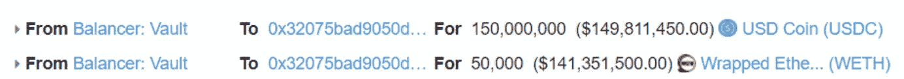
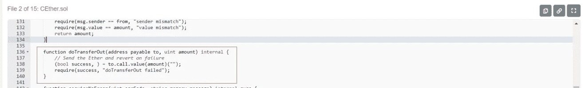
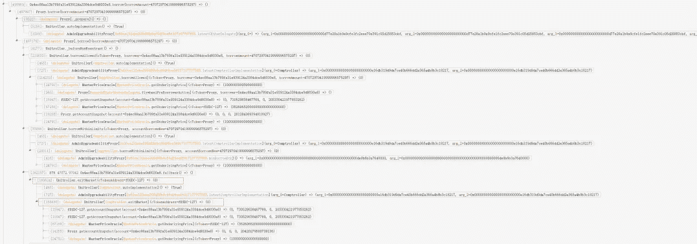
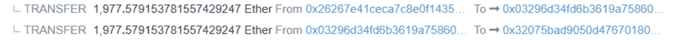
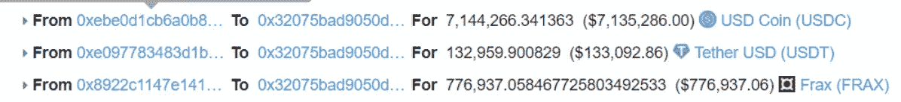
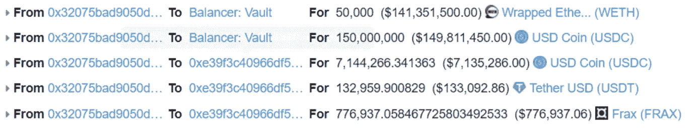
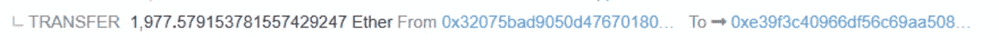

# 由于合同中的可重入漏洞，损失超过 8000 万美元:Beosin 对 FeiProtocol 漏洞的分析

> 原文：<https://medium.com/coinmonks/loss-exceeds-80m-due-to-reentrancy-vulnerability-in-contract-beosins-analysis-of-the-882742f5f248?source=collection_archive---------15----------------------->

2022 年 4 月 30 日**据 Beosin EagleEye 报道，FeiProtocol 的 Rari 熔丝池被开采了约 28380 美元 ETH。** Beosin 安全团队对事件进行了分析，结果如下所示。

# **费协议简介**

Rari Capital 通过创造新的机会、社区和金融产品，让个人能够挣脱束缚。官网:【https://rari.capital/】T4

# **相关信息**

由于利用了多个合同，这里只分析一个交易。

**交易哈希:**

0 xab 486012 f 21 be 741 c 9 e 674 ffda 227 e 30518 E8 a1 e 37 a5 f1 d 58d 0 b 0d 41 f 6e 76530

**黑客地址:**

0x 6162759 edad 730152 f0df 8115 c 698 a 42e 666157 f

**黑客契约:**

0x 32075 bad 9050d 4767018084 f 0 CB 87 b 3182d 36 c 45

**受害人合同:**

**0x 26267 e 41 ECA 7 c8 e0f 143554 af 707336 f 27 fa 051**

# **开采流程**

1.  黑客第一次 flashloans 从平衡器:金库。

2.由于在 Rari Capital 的其他实施合同中存在可重入性，使用 flashloan 中的资金在 Rari Capital 中进行抵押贷款。

攻击者通过回调契约中构造的攻击函数，收回池中受协议影响的所有令牌。

3.返回 flashlaon 并将获利资金发送到 0xe39f 合约。

# **漏洞分析**

这次攻击主要利用了 Rari Capital 的其他实现合同中的一个可重入漏洞**。**

# **资金追踪**

截至本文撰写之时，被盗资金估计超过**28，380 ETH(约 8034 万美元)**和**目前正存入 TornadoCash** ，其中大部分仍在黑客的地址。

# **总结**

针对这一事件，Beosin 安全团队建议:

1.**进行 ETH 传输时，请谨慎使用 call.value。确保不会发生重入。**

2.项目上线前，强烈建议选择专业的安全审计公司进行全面的安全审计，规避安全风险。

如果您需要任何区块链安全服务，请联系我们:

[**网站**](https://beosin.com/) [**邮箱**](http://contact@beosin.com/) [**官方推特**](https://twitter.com/Beosin_com) [**预警**](https://twitter.com/BeosinAlert) [**电报**](https://t.me/beosin)**[**LinkedIn**](https://www.linkedin.com/company/beosin)**

> **加入 Coinmonks [电报频道](https://t.me/coincodecap)和 [Youtube 频道](https://www.youtube.com/c/coinmonks/videos)了解加密交易和投资**

# **另外，阅读**

*   **[加拿大最佳加密交易机器人](https://coincodecap.com/5-best-crypto-trading-bots-in-canada) | [Bybit vs 币安](https://coincodecap.com/bybit-binance-moonxbt)**
*   **[阿联酋 5 大最佳加密交易所](https://coincodecap.com/best-crypto-exchanges-in-uae) | [SimpleSwap 评论](https://coincodecap.com/simpleswap-review)**
*   **[购买 Dogecoin 的 7 种最佳方式](https://coincodecap.com/ways-to-buy-dogecoin) | [ZebPay 评论](https://coincodecap.com/zebpay-review)**
*   **[最佳期货交易信号](https://coincodecap.com/futures-trading-signals) | [流动性交易所评论](https://coincodecap.com/liquid-exchange-review)**
*   **[用于 Huobi 的加密交易信号](https://coincodecap.com/huobi-crypto-trading-signals) | [Swapzone 审查](/coinmonks/swapzone-review-crypto-exchange-data-aggregator-e0ad78e55ed7)**