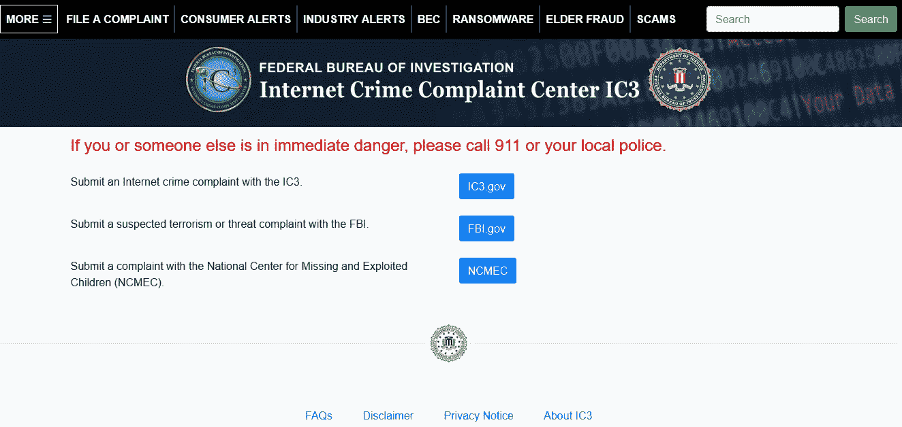

# 丢了你的比特币？抱歉，它不会回来了——揭露比特币恢复骗局

> 原文：<https://medium.com/coinmonks/lost-your-bitcoin-sorry-its-not-coming-back-uncovering-bitcoin-recovery-scams-e4111b7ea2a6?source=collection_archive---------0----------------------->

本文包含以下主题:-

```
1\. **INTRODUCTION**
2\. **SO-CALLED “BITCOIN RECOVERY” SITES**
3\. **CASE — 1: bitcoinrecovery.co**
4\. **CASE — 2: moneybackagency.com**
5\. **MODUS OPERANDI: BITCOIN RECOVERY SCAM**
6\. **BITCOIN RECOVERY OPTIONS**
7\. **WHAT HAPPENS TO LOCKED/LOST BITCOIN?** 
```

**简介**

“**比特币丢失**”是一个老生常谈的问题，至今没有找到任何有效的解决办法。结果，由于私钥丢失或钱包无法访问，数量庞大的**370 万个比特币**被永久锁定并退出流通。

不幸的是，这个领域已经被骗子征服，他们通过专门的网站冒充合法的加密恢复团队向受害者进行加密勒索。


Beware about Helping Hand! Source| Pinterest (Self-Edit)

不可否认&痛苦的事实是，丢失的比特币无法找回，除非你有万能钥匙或种子助记符来找回它们。


**Search Result: Google**

大多数密码持有者没有意识到这一事实，这为攻击者/骗子提供了一个完美的漏洞。骗子通过说服目标从受害者那里取回丢失/被盗的比特币来进行敲诈。

**所谓的“比特币回收”网站**

在谷歌或必应上进行普通搜索时，你可能会遇到大量的加密检索服务，它们向你保证能找回你丢失/锁定的比特币。现在，你可能知道不要上当，因为他们正在拉出一个纯粹的骗局。

让我们检查几个这样的网站…

**案例一:bitcoinrecovery.co**


**Landing Page**

给新来的网民留下深刻印象的网站会发现这种服务像干净的 UI 一样真实，首先吸引眼球，并在不知不觉中获得信任。


**Dialog Pop-Up to fill in the details**

让我们深入每个参数来证明它的真实性。

**检查点 1:弹出窗口**

初次接触时会弹出一个窗口，了解比特币丢失的性质。在输入详细信息后，不会有任何后续操作，因为这个对话框是吸引访问者的空子弹。

**检查点 2:联系电话**

该公司提供的联系电话[ **+1.800.821.0520** ]出现在另外两个类似的网站上，即:- **cybersecgroup.info** 和**desifad.com**


**Contact Number Exists for other Services**

**检查点 3:自吹自擂的媒体**

该网站的另一个黑幕是:它声称会出现在各种流行媒体上，如福布斯、彭博；但是他们都没有直接的联系来支持这个声明。


**Media Attention**

**关卡 4:幽灵评论**

归结到客户满意度评论，我们发现这些都是为了网站的真实性而做的虚假评论。


**Fake Reviews provided by Ghost Identities**

让我们把这个分解成**图片**和**引用**。

**图片**

经过调查，发现在网站上发现的人与该公司没有任何联系，甚至他们的名字只是一个幽灵身份。

让我们来挑选审稿人**戴维·约翰逊**。同一个头像也在其他不同的网站上使用，例如:-


**Image Search for selected Image**

从上面的图像中，可以假设真实的人是**布莱恩·金**。但是等等…

经过进一步调查，发现了以下图像；在一个叫 [Bryte](http://livedemo.zemez.io/bryte/default/home-app/) 的 UI 公司找到的。


**Reviews from Bryte: Fake Review**

由此发现，评论者乔治·史密斯在布莱特变成了约翰·博根狄。

哇哦…交换人格！

最后，让我们找出这些人的真正来源:-


**Real Image from Lead Balance**

这是图片的[真实来源，该图片已被裁剪为各种平台上的犯罪/虐待活动的头像，如**幽灵评论、骗局推广、**等。通过仔细观察，你会发现这三张脸在之前的图片中被非法用于虚假宣传。](http://leadbalance.com)

**行情**

> **你会相信我完全忘记了我的密码，无法进入我的以太坊。我真的很生自己的气，以为它永远消失了--但比特币恢复公司(Bitcoin Recovery Co .)来救了我。我给了他们一些关于我常用密码的想法，他们很快就发现了进入我的以太坊的必要密码。我真的很感激他们的努力，因为如果我的错误记忆让我永远失去了投资，我会很难过的！**

****这个评论可以在所有的诈骗服务中找到。****

********

******Exact Quote Match on Internet Search******

> ******注**:一些网站被关闭，因为它们被证明是假的。这同样适用于其他报价。****
> 
> ******如果您的业务门户中有任何团队图片，请仔细检查。在某个地方，有人可能会悄悄地利用你的善意形象来经营他们的邪恶生意。******

****5 号检查站:办公地址****

****该网站提供的地址正在被 5 个以上的网站使用，同样与加密恢复有关。****

******美国纽约州纽约市麦迪逊大道 741 号
邮编 10065******

********

******Same Address was given for other Crypto Recovery themed fraudulent services******

****有骗子设立的相同主题的网站，向已经被诈骗的客户/受害者勒索比特币。****

****案例二:moneybackagency.com****

********

******Cryptocurrency Retrieval Landing Page******

****登陆这个以中央政府为主题的网站会给访问者一种真实感。就像这样****

********

******Official Portal to Register any Cyber Complaint (directly linked to FBI)******

****大多数访问者会在第一眼就感到困惑，因为所有的主要关键词都出现了，如“**投诉中心**”、“ **IC3** ”等。****

> ******注意**:时刻记得检查网址，不要上当。****

****这家名为 **MoneyBackAgency** 的公司据说在以色列运作，据称受 **FCA** 监管，也就是英国的**金融监管局。**根据 FCA:-****

> ****对于我们来说，有效地识别冲击或防止源自国际公司在英国以外的活动的风险行为可能会更加困难但可能会对英国市场造成重大负面影响。如果公司的英国分支机构与其海外分支机构高度关联或依赖于海外分支机构，并且在监督和信息共享方面的监管合作不够充分，情况尤其如此。****

****你可以在这里阅读 FCA [的全部指导方针](https://www.fca.org.uk/publication/corporate/approach-to-international-firms.pdf)。****

******总之，FCA 和 MoneyBackAgency 没有任何关系；位于以色列。******

****这个网站有趣的一点是网站中使用的签名。****

****你能猜出这是谁的签名吗？****

****是美利坚合众国的国父——本杰明·富兰克林。****

********

******Original Signature of Benjamin Franklin******

****同样可以在加密欺诈网站 MoneyBackAgency 上找到“**欺诈资产追回主管**”。****

****在检查域名历史时，发现该网站相对较新，于 2022 年 1 月 4 日**以注册服务商 cheap name**的名义注册，并利用隐私保护服务**以永久冰岛地址掩盖真实身份。******

> ******注意**:大部分恶意域名之前在各种勒索软件/黑客系列中都利用了这种(隐私)服务。****

******追踪加密地址******

****让我们看看那些被 MoneyBackAgency 诈骗的受害者向各种骗局搜索渠道报告的比特币地址。一些地址是:-****

```
 ****17BSLhc597GybEuZ4DyFpdtceY3Moi3nWo** : Active since Jan 19, 2022 (0.06BTC)
**34fzTpqE6vfygjshamqyPpSfadMUqFHy78** : Active since Sept 19, 2021 (31BTC)
**16fCfA47XsEX5UK2mjpfjtKk29af9t3wCG** : Active since Nov 5, 2020 (9BTC)
**3D4J6hZEm8NhUSYTfFguxeipiXCcmgC8kG** : Active since March 24, 2021 (0.32BTC)
**1CKNWAUabjQZoi3ACPMkNJyw8KHDVN8g64** : Active since March 31, 2016 (8.4BTC)
1oW9eLXMqXgvaXS5mxXUZX3c6uSZtWhkM
bc1q2gu0cywvqwps43ym8zcjv5xy6lw3t859tumd5m
bc1q8cm0dg4a2w345xd7y44eut6d8zj9mpnk3a3pur
bc1qzjzjvxjtd88zcxmw8spg5se9mhvf0w32p53lv9 : Active since Nov 25, 2021 (0.024BTC)**
```

********

******Red-Flagged Bitcoin Address Report | Source: bitcoinabuse.com******

****所有这些地址都参与了各种其他黑暗行业，例如:-****

```
**>> Sextortion
>> Ransomware
>> Blackmail
>> Investment Fraud
>> Darknet Market Seller**
```

> ******注意**:一定要审查你收到的比特币地址，以检查任何恶意的历史指纹。骗子/罪犯也可能使用新的地址。当心！****

****从上述案例研究中可以清楚地看出，**骗子/罪犯利用合法的关键点来伪装成有关当局/部门。******

****以上两个案例只是加密领域的冰山一角。****

****以下是类似网站的入围名单****

```
**moneybacklimited.com
moneybackagency.com
Competentfund.com
fraudscan.org
cryptowalletsrecovery.com
bitcoinrecovery.co
hackerspro.com
hackethicsrecovery.com
cryptorecoverycenter.com
retrievelostfunds.com
myassetrecoverynetwork.comFor further extended list, I found a good resource here:-
[https://scamrecovery.net/recovery_category/blacklisted/](https://scamrecovery.net/recovery_category/blacklisted/)**
```

******作案手法:比特币回收骗局******

1.  ****承诺得到钱(加密)回来，并收取受害者(欧元 3K+增值税)的总恢复服务。****
2.  ****发一张钱包的图片(大概是 PS 过的/网上搜的)。****
3.  ****复制一个包裹递送站点，**分配假跟踪号**。****
4.  ****包裹递送收费(比特币硬钱包——大概)。****
5.  ****要求受害者**投资不太受欢迎的加密项目**，这些项目大多是假的 ico。****
6.  ****要求客户/受害者通过 Whatsapp **直接联系他们，以避免公开示警**。****
7.  ****在 Quora 这样的公共场合虚假吹嘘金钱回收。广播电子邮件 id 如**professionalexperthacks@aol.com**或
    cybertechrecoveryspot@gmail.com 和联系电话如 **+1.800.821.0520** 和**+1(530)628–3819**等。****
8.  ******身份盗窃**:从 LinkedIn 或其他媒体等各种来源窃取个人资料图片，并在 Quora 等公共领域创建一个虚假账户，以推广加密骗局。这是一个活生生的例子:—****

********

****Scammer’s Identity Theft****

********

******Real Identity of Kathy Crusco******

****9.骗子在社交媒体中跟踪骗子。****

****10.声称会在各种媒体上出现，但没有文章或链接可以证明广告中的说法。****

******比特币恢复选项******

1.  ****访问 **Wallet.dat** 文件。****
2.  ******BIP32 钥匙**:为此，您可能需要万能钥匙****
3.  ******BIP39** :它是助记形式的私钥(这就是为什么你写下 12-24 个随机生成的单词)。那个私钥让你可以花你的比特币。****
4.  ****对弱密码的暴力攻击。****

****任何上述说(前 3 点)应该与你在一起，以恢复您丢失/锁定的加密资金。****

> ******注**:如果你已经发送了一笔交易，或者有人已经访问过你的钱包，那么除非你能访问你的种子或私钥，否则恢复是极不可能的。****

****助记短语应该保密——不要提供给任何在线服务来恢复你的加密密码，因为这取决于熵。****

******锁定/丢失的比特币会怎么样？******

****锁定/丢失的比特币通常会从总供应量中退出流通。****

****有两类，即:-****

******烧录地址**:被有意发送以将其从总流通中移除的加密货币令牌被发送到不可用的比特币地址。这些都在网络之外，转移给他们的资金被认为是烧毁。****

******僵尸地址**:这些是休眠地址，最近没有任何事务。大多数犯罪资金被归类为僵尸地址，在那里资金长时间未被触及，因此处于休眠状态。****

********

******Use Case: Zombie Address******

****由于没有中央权力机构来控制比特币的流动，因此合乎逻辑的想法是，一旦你的资金丢失，就无法追回。如果有人声称要回你被黑的资金，我请求你对他们傻笑，然后继续做下一件事。****

## ******关注我的** [**推特**](https://twitter.com/RakeshKrish12/) **获取有趣的 DarkWeb/InfoSec 简短发现！；——)******

> ******注意:- *本文纯属个人研究，未经作者同意，不得在任何地方使用/发表。*******

****#比特币#被黑# infosec #网络安全# OSINT # dark web # deep web # tor # dark net # hack #教程#区块链#黑客#调查#研究#加密货币# crypto # FBI #网络命令# bitcoinlost #加密货币#bitcoinrecovery #bitcoinscam****

> *****加入 Coinmonks* [*电报频道*](https://t.me/coincodecap) *和* [*Youtube 频道*](https://www.youtube.com/c/coinmonks/videos) *了解加密交易和投资*****

# ****另外，阅读****

*   ****[Bookmap 评论](https://coincodecap.com/bookmap-review-2021-best-trading-software) | [美国 5 大最佳加密交易所](https://coincodecap.com/crypto-exchange-usa)****
*   ****最佳加密[硬件钱包](/coinmonks/hardware-wallets-dfa1211730c6) | [Bitbns 评论](/coinmonks/bitbns-review-38256a07e161)****
*   ****[新加坡十大最佳加密交易所](https://coincodecap.com/crypto-exchange-in-singapore) | [购买 AXS](https://coincodecap.com/buy-axs-token)****
*   ****[红狗赌场评论](https://coincodecap.com/red-dog-casino-review) | [Swyftx 评论](https://coincodecap.com/swyftx-review) | [CoinGate 评论](https://coincodecap.com/coingate-review)****
*   ****[投资印度的最佳密码](https://coincodecap.com/best-crypto-to-invest-in-india-in-2021)|[WazirX P2P](https://coincodecap.com/wazirx-p2p)|[Hi Dollar Review](https://coincodecap.com/hi-dollar-review)****
*   ****[加拿大最好的加密交易机器人](https://coincodecap.com/5-best-crypto-trading-bots-in-canada) | [库币评论](https://coincodecap.com/kucoin-review)****
*   ****[用于 Huobi 的加密交易信号](https://coincodecap.com/huobi-crypto-trading-signals) | [HitBTC 审核](/coinmonks/hitbtc-review-c5143c5d53c2)****
*   ****[如何在 FTX 交易所交易期货](https://coincodecap.com/ftx-futures-trading) | [OKEx vs 币安](https://coincodecap.com/okex-vs-binance)****