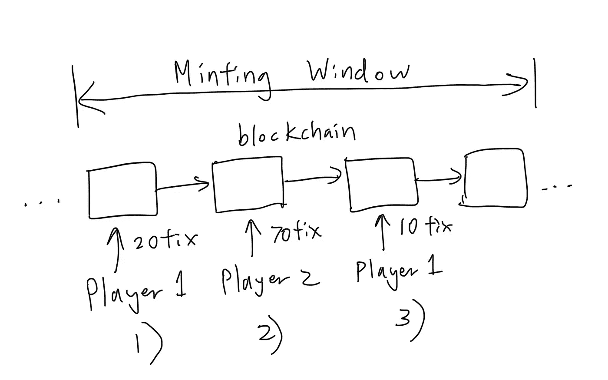

# 可靠性彩票 Dapp——动机和机制

> 原文：<https://medium.com/coinmonks/lottery-dapp-motivation-and-mechanics-36aba14f9034?source=collection_archive---------1----------------------->

Photo by [Alejandro Garay](https://unsplash.com/@chinitogaray?utm_source=unsplash&utm_medium=referral&utm_content=creditCopyText) on [Unsplash](https://unsplash.com/s/photos/lottery?utm_source=unsplash&utm_medium=referral&utm_content=creditCopyText)

这篇文章将探索一个基于 Solidity 的智能合约和基于 React 的 dapp，所有这些都可以在这里找到。

这是一个基于以太坊区块链的去中心化彩票的前端演示(为其目标受众恰当地称为“去中心化彩票”)。这篇文章将讨论这种分散式彩票如何运作的一些动机和机制。[这个帖子](/p/6f67e50739a3)给出了一个彻底的 smart 合同分解。

# 动机

区块链带给我们的好处是一个不可变的账本，数据可以存储在上面。这种分类账既是公开的，也是可核实的，也就是说，任何人都可以看到发生的交易，并因此对其进行审计。它是不可变的，因此也没有人能够篡改现有的数据。

然而，从本质上讲，区块链只不过是一个分布式数据库。

然而，这是强大的。数据和交易可以以不可信的方式存储——你不再需要仅仅*相信某个集中的实体已经管理了你的数据并正确记录了你的交易，你可以自己去核实。*

这就像是从经典的秘密教师成绩册到发布在谷歌文档上的公共成绩。学期结束时，我再也没有意识到史密斯夫人在周三晚上 11 点批改数学试卷时看错了自己的笔迹，当时她已经喝了三杯鸡尾酒了。

From [Reddit](https://www.reddit.com/r/nostalgia/comments/rkmfr9/teachers_grade_book/)

这就是为什么区块链特别适合于集中式信任是流程固有的应用程序——这是业务模型的重要支柱，而不仅仅是一个外围的、可任意使用的功能。事实上，在这些情况下，诚信是最重要的，同时也使他们最容易受到欺诈和滥用——因为机会主义者参与其中。

因此，基于赔率和概率的游戏服务很快成为(相对)容易实现，但[特别相关的用例](https://ethereum.org/en/whitepaper/)。在彩票或赌博等应用中，整个前提是建立在公平、非常随机的概率基础上，这些概率由大型中央实体管理，这些实体的声誉取决于诚信，它们承认需要“百分之百光明正大、诚实、透明”的流程。

一整套规章制度都经过精心制定和严密监控，以确保公平。大型第三方审计公司被保留来对此提供证明。错综复杂的制衡机制已经到位，这是可以理解的——赔率上的微小差异可能会带来巨额资金。

然而，归根结底，是人类在监控人类，运营商和第三方都需要大量的开销和基础设施。尽管如此，我们仍然无法真正洞察这一过程的“实际”完整性。我们如何审计审计人员？我们如何在抽奖中实际验证“[每个球在抽奖前后都称重，以确保每个球的重量都在非常小的方差公差](https://www.powerball.ca/news/lottery-draw-auditing)内”？

管理者*声称*“[【第三方】公司充当公众的耳目](https://www.powerball.ca/news/lottery-draw-auditing)”——那么，如果我们能够使用自己的耳目会怎么样呢？大型集中式第三方审计师*从来没有*被腐败过吗？开个玩笑— [只有 4%的人真正被抓住](https://fortune.com/2020/07/02/auditing-accounting-corporate-fraud/)。

[由于低劣的审计员，数十亿美元“丢失”](https://www.nytimes.com/2002/01/15/business/enron-s-collapse-the-auditors-who-s-keeping-the-accountants-accountable.html)。世界在不停地变化，审计公司也在不停地被聘用。

别忘了谁为这种虚假的诚信买单——它被包裹在行政费用中，不可避免地从潜在的彩票奖金中抽走，并传递给消费者。

似乎是“代码即法律”的完美应用。聪明的合同解决了我们的问题。

# 彩票机制

在分散型彩票的这种智能合同实现中，合同所有者(“所有者”)可以用可定制的参数初始化彩票，如最大参与者数量、可变的铸造时间段或最低票价。

一旦初始化，就建立一个铸造窗口。彩票只能在这个活动的造币窗口(“造币窗口”)期间购买。玩家(“玩家 1”、“玩家 2”等)购买彩票，并且他们赢得彩票的几率与他们为该彩票持有的总未兑现彩票的比例直接相关。

例如，如果(1) **玩家 1** 买了 20 张票，而(2) **玩家 2** 买了 70 张票，然后(3) **玩家 1** 又买了 10 张票，则总共有 100 张票。**玩家 1** 的票位范围是 1–30，**玩家 2** 的票位范围是 31–100。

A degenerate’s rendering

赢家的赔率将与他们购买彩票的比例直接相关。例如，在我们的例子中，**玩家 1** 将有 30%的机会获胜(他们持有总共售出的 100 张门票中的 30 张)，而**玩家 2** 将有 70%的机会获胜(他们持有总共 100 张门票中的 70 张)。

铸造期结束后，可以进行拉伸。在时间戳到达后，铸造周期自然结束，或者可以由**所有者**强制结束(出于演示目的和紧急情况)。

## 彩票抽奖

首先，确定票的分发，并按最初购买的升序进行标记，按购买地址分组。这意味着，在我们之前的例子中，所有的**玩家 1** 的门票被分组在一起，即使他们的购买分两批进行。分配给他们的票据索引从 1 到 30(从 1 开始，因为他们是第一个购买地址)。

这种门票分配方法不会影响他们的赔率——分组完全是出于方便。

接下来，通过生成随机票券索引并找到该票券索引持有者的地址来选择随机赢家。

确定赢家后，总彩池(“奖金”)将作为待决提款存入，只允许赢家取回他们的奖金。对于何时必须发生，没有时间限制。

也有一些适当的检查和平衡，以确保完整性得到维护。如果由于某种原因，某次抽奖出现问题，**所有者**也可以取消当前抽奖。资金将返还给持票人(截至 v0.1.6，该退款机制尚未实现)。

就是这样！一种完全分散的经营彩票的方式。未来的帖子将探讨智能合同的细节。

注意事项:

*   从 v0.1.6 开始，通过附加的智能契约库(`Random.sol`)引入了一种随机性算法，该算法基于块号的 blockhash，如在 [Bored Ape 游艇俱乐部契约](https://etherscan.io/address/0xbc4ca0eda7647a8ab7c2061c2e118a18a936f13d#code)等中所见。然而，这是一个幼稚的算法，没有经过严格的随机性测试，可能会被利用。来自[固体文件](https://docs.soliditylang.org/en/latest/units-and-global-variables.html):

> 不要依赖`*block.timestamp*`或`*blockhash*`作为随机的来源，除非你知道你在做什么。
> 
> 在某种程度上，时间戳和块哈希都会受到挖掘者的影响。

*   随机性的一个更好的实现可能来自类似 Chainlink 的 [VRF](https://docs.chain.link/docs/chainlink-vrf/) 这样的东西。这将在以后的版本中实现。

> 加入 Coinmonks [电报频道](https://t.me/coincodecap)和 [Youtube 频道](https://www.youtube.com/c/coinmonks/videos)了解加密交易和投资

# 另外，阅读

*   [霍比审核](https://coincodecap.com/huobi-review) | [OKEx 保证金交易](https://coincodecap.com/okex-margin-trading) | [期货交易](https://coincodecap.com/futures-trading)
*   [网格交易机器人](https://coincodecap.com/grid-trading) | [Cryptohopper 审查](/coinmonks/cryptohopper-review-a388ff5bae88) | [Bexplus 审查](https://coincodecap.com/bexplus-review)
*   [7 个最佳零费用加密交易平台](https://coincodecap.com/zero-fee-crypto-exchanges)
*   [氹欞侊贸易评论](https://coincodecap.com/anny-trade-review) | [霍比保证金交易](/coinmonks/huobi-margin-trading-b3b06cdc1519)
*   [分散交易所](https://coincodecap.com/what-are-decentralized-exchanges) | [比特 FIP](https://coincodecap.com/bitbns-fip) | [Pionex 评论](https://coincodecap.com/pionex-review-exchange-with-crypto-trading-bot)