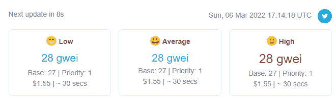
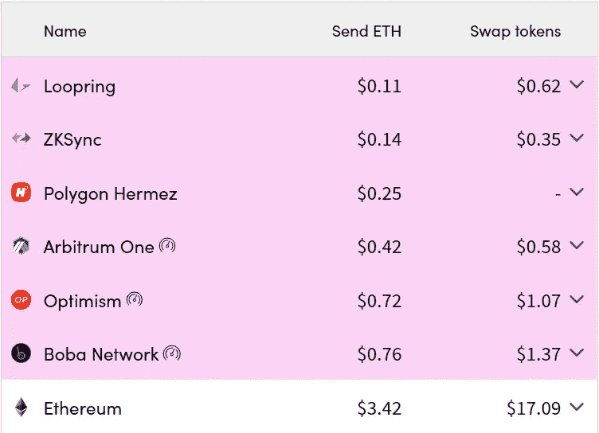
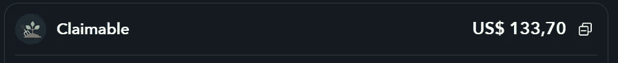
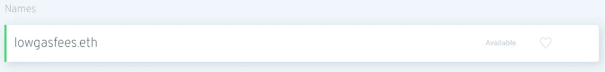
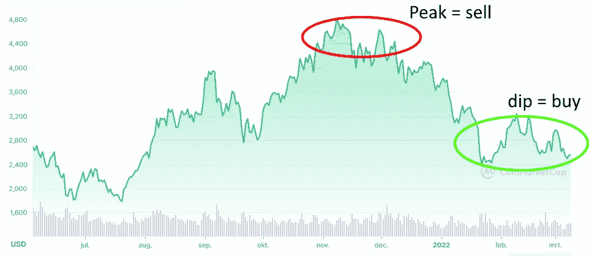

# 以太坊气费低！现在该怎么办？

> 原文：<https://medium.com/coinmonks/low-ethereum-gas-fees-what-to-do-now-16897664c0d7?source=collection_archive---------28----------------------->

Low Ethereum fees!

# 介绍

随着当前熊市的慢慢到来，任何区块链上的网络活动最近都大大降低了。如果你只对价格感兴趣，这可能是一件坏事，但如果你对使用 DApps 感兴趣，这显然是一件好事，因为更低的连锁活动意味着更低的天然气费用！在过去的几天里，以太坊的天然气费用一直低于 20 Gwei，这意味着(相对)低的交易成本和合同互动！

在这篇文章中，我将讨论几个选项和想法，花你的乙醚层 1，现在天然气价格触及更低的低点。这些通常是只对鲸鱼或更大的交易有益的交互，因为它们在更高的网络活动中消耗大量的气体。

# 要做的事情！

## 1.将您的资产连接到第 2 层！

Super low fees on Layer-2s!

**不，说真的，做吧……**现在是将你的以太坊或其他 ERC 代币过渡到第二层的最佳时机。合约互动在第一层是昂贵的，如果你是像我一样的低资本投资者，你没有理由想要留在第一层。当你试图交换或提取你的资产时，你在 L1 赚的每一分利润都会立即减少。像 [Hop.exchange](https://hop.exchange/) 或 [cbridge.celer.network](http://cbridge.celer.network) 这样的应用程序会照顾你在 L1 的资产，并以低廉的费用将其转移到 L2！

## 2.撤回/交换低市值头寸！

Low -cap claimables!

如果你像我一样，在探索以太坊生态系统和 DeFi 时不知道自己在做什么，你可能在 mainnet (L1)上有一些低市值的流动性头寸或代币。现在是一个很好的时机来要求或收回任何职位或奖励，你已经收集了一段时间，或交换低资本令牌，你曾经购买，现在终于可以摆脱。Zapper.fi 是一个寻找无人认领的奖励的好地方！

## 3.注册你的 ENS 域名！

Register your .eth address!

你的以太坊最好的消费方式之一就是在[以太坊域名服务](https://app.ens.domains/) (ENS)注册一个 ENS 域名。将 ENS 域名链接到您的元掩码或其他受支持的链可以让您拥有可读的。eth 地址，像以太坊-创始人的 [Vitalik.eth](https://twitter.com/vitalikbuterin) 。有这样一个地址，你就可以从你的。eth 地址而不是讨厌 0x234234 地址！目前注册一个 ENS 域名的费用约为 15-50 美元(5 美元/年)。

## 4.多买以太坊！

Do this, not the other way around

所以，你这几天一直在哭，因为价格降了，你的利润全亏了。如果你像我一样，通常高买低卖，但如果我告诉你，你应该做相反的事情来赚钱呢？！我们目前处于低谷，所以如果你还有剩余的钱，试着多买一些以太坊吧！现在享受美味的五折优惠！

## 5.做一些交易！

最后但同样重要的是，以太坊最初的使用方式；做一些以太坊交易！现在是给你的朋友、老板、同事、前任或妻子送些以太坊并付款的理想时机！交易成本低至 1 美元，现在是时候最终将一些资金转移到 [Oekraine DAO](https://www.ukrainedao.love/) 了。

# 结论

这是三种花费以太坊的方式，现在煤气费是几个月来最低的！我希望你从中学到了一些东西，如果你有任何关于低燃气费的建议或想法，请告诉我！看看第二层备忘单，了解所有第二层解决方案和应用，了解 L2 的情况！

第二层备忘单:[链接 ](https://mirror.xyz/ethmaxitard.eth/iyCAlOexgQKOvoSAAk4utYGEdnESOKb5HstM2_LaqL4)