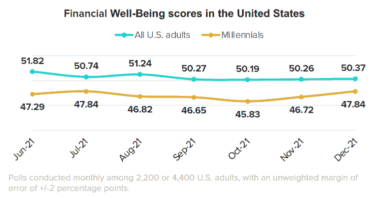

# 低千禧一代的财务状况将成为采用加密技术的驱动力

> 原文：<https://medium.com/coinmonks/low-millennial-financial-well-being-set-to-be-a-driving-force-for-crypto-adoption-207adf4153a1?source=collection_archive---------42----------------------->

# 千禧一代可能会转向另类金融服务和加密等资产。随着年轻一代加入加密货币的潮流，研究人员预计 2022 年加密货币将被更多人采用。

千禧一代不仅对在抖音这样的社交媒体平台上制作视频感兴趣，也对寻找“如何在线赚钱的快捷方式”感兴趣数据显示，美国的千禧一代越来越倾向于比特币等替代金融服务，以改善他们的财务平衡。

**晨间咨询*一月份发布的一份名为&客户银行支付*的报告发现，千禧一代比其他任何一代人都更喜欢现代技术来帮助他们做出财务决策。

该报告的作者、金融服务专家夏洛特·普林西帕托(Charlotte Principato)从 2021 年 7 月至 12 月在美国和世界各地进行的月度调查中，收集了 5 万名不同参与者的数据。

Principato 在给 Cointelegraph 的一封电子邮件中提到，在准备报告时引起她注意的统计数据中，2021 年加密货币使用量的增加是一个异常值。

截至去年 12 月，约 48%的千禧一代拥有加密货币，高于 6 月份的约 30%。同期，美国 20%的成年人承认持有加密货币。

*来源:晨间咨询*

报告称，千禧一代使用加密货币等替代支付服务可能是因为他们的财务福祉分数自 2021 年 6 月以来一直低于全国标准。截至去年 12 月，全球标准为 50.98 英镑，但千禧一代的标准更低，为 49.54 英镑。

Principato 告诉 Cointelegraph，在过去的七个月里，她观察到了较低的财务幸福感分数。她将这种下降归因于新冠肺炎的新变种，以及美国通货膨胀的加剧，而美国的通货膨胀尚未完全恢复。

*来源:晨间咨询*

Morning Consult 的网站称，财务幸福指数是由一个量表确定的，该量表“包括 10 个问题，用于衡量现在和未来的安全和选择自由，涉及消费者对自己财务的控制、吸收金融冲击的能力以及实现财务目标的轨迹。"

# 一句话:千禧一代将在 2022 年推动加密技术的应用

虽然千禧一代通常走在前面，但密码持有人大多是高收入的千禧一代男性。 [70%的千禧一代男性使用密码](https://go.morningconsult.com/rs/850-TAA-511/images/220120_State_of_Consumer_Banking.pdf)，其中 25%的人年收入超过 10 万美元。

值得注意的是，西班牙裔的密码使用率高于普通成年人。大约 16%的美国成年人是西班牙裔，然而，他们占所有密码用户的 [24%。](https://www.cnbc.com/2022/02/08/-research-shows-cryptocurrency-adoption-among-hispanics-is-high.html)

随着密码货币在 2021 年变得越来越流行，每一代的受访者——从婴儿潮一代、Xers 一代、Millennials 一代和 Z 一代——越来越可能考虑从美国的交易所购买密码货币。

这些发现让我们得出结论，密码货币将在 2022 年继续繁荣。加密技术的进一步采用和年轻一代的加入将是可能导致潜在繁荣的两个主要方面。