# $ LSS:DeFi 黑客和欺诈的终结

> 原文：<https://medium.com/coinmonks/lss-defi-fraud-a-thing-of-the-past-f5aad6ca852b?source=collection_archive---------33----------------------->

# CoinDCXpathbreaker

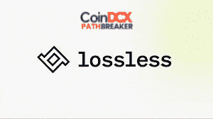

最近发生的关于 **$LUNA** 的事件确实让人们注意到了协议&在加密领域的相关漏洞。如果整个 Terra 的惨败发生在一个迷因币上，这完全是情有可原的&我们可能会在 Twitter 上对此一笑置之——但是当一个拥有可靠协议的十大加密技术在定价方面暴跌，并且今天的交易价格比柴犬还低时会发生什么……嗯，这简直是一场灾难，彻底摧毁了投资者的情绪。

这就是为什么我将报道一个帮助加密项目降低协议攻击风险的项目的精华&实际上使这些攻击成为过去…我们正在谈论**无损$LSS**

**项目**:无损

**硬币报价器:** $LSS

项目报价来自$LSS 中型文章:

"*马克·库班最近将 DeFi 的爆炸性增长与“互联网的早期”相提并论。主要的资产管理公司和金融服务巨头正在进入 DeFi 生态系统:各种 DeFi 项目锁定的价值正在飙升。随着 DeFi 的发展，其技术、可访问性和安全性仍处于早期开发阶段。自然地，加密平台成为黑客从不太理想的技术中获利的主要目标。*

*根据 Atlas VPN 所做的研究，仅在 2020 年就有总计 38 亿美元的密码被盗。因为以太坊的智能契约图灵完备性使得许多 DeFi 项目容易被利用和黑客攻击，所以黑客很可能会继续利用早期进入市场的人。我们相信，DeFi 平台必须变得安全和可访问，才能被更广泛地采用。除非所有用户都能以最小的风险进行交易和操作，否则主流 DeFi 不太可能发生。”*

**项目网络地址:**

**以太坊—合同地址:**0x3b 9 be 07d 622 acca ed 78 f 479 BC 0 EDA bfd 6397 e 320

**BNB 智能链—合同地址:**0x f 7686 f 43591302 CD 9 B4 b 9 C4 Fe 1291473 FAE 7d 9 c 9

在无损团队实施**缓解协议**之前，上述合同地址内的流动性已被收回。一旦成功实施，合同将再次生效。

## 无损的独特卖点

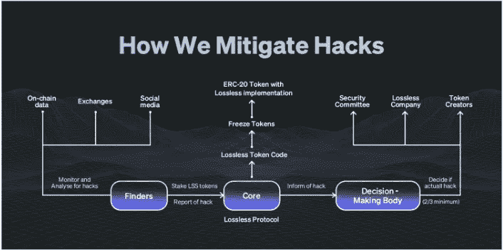

**无损由两个主要元素组成:**

*   **金库&国库协议**:这是针对代币创建者的，用于保护流动性池、国库钱包或任何持有大量代币流动性的东西
*   **黑客缓解协议**:这由 4 个独立的团体一起工作组成。

1.  **无损社区**(在各个级别与协议交互的每个人)
2.  **赏金猎人**(发现并识别欺诈交易)
3.  **赌注者**(他们可以支持他们认为合法的黑客行为以获得报酬，但如果不对，就有失去赌注的风险)
4.  **决策机构:**他们由委员会成员、令牌持有者&组成无损团队，他们每个人都有同等的投票权。黑客攻击需要三分之二的投票才能被确认

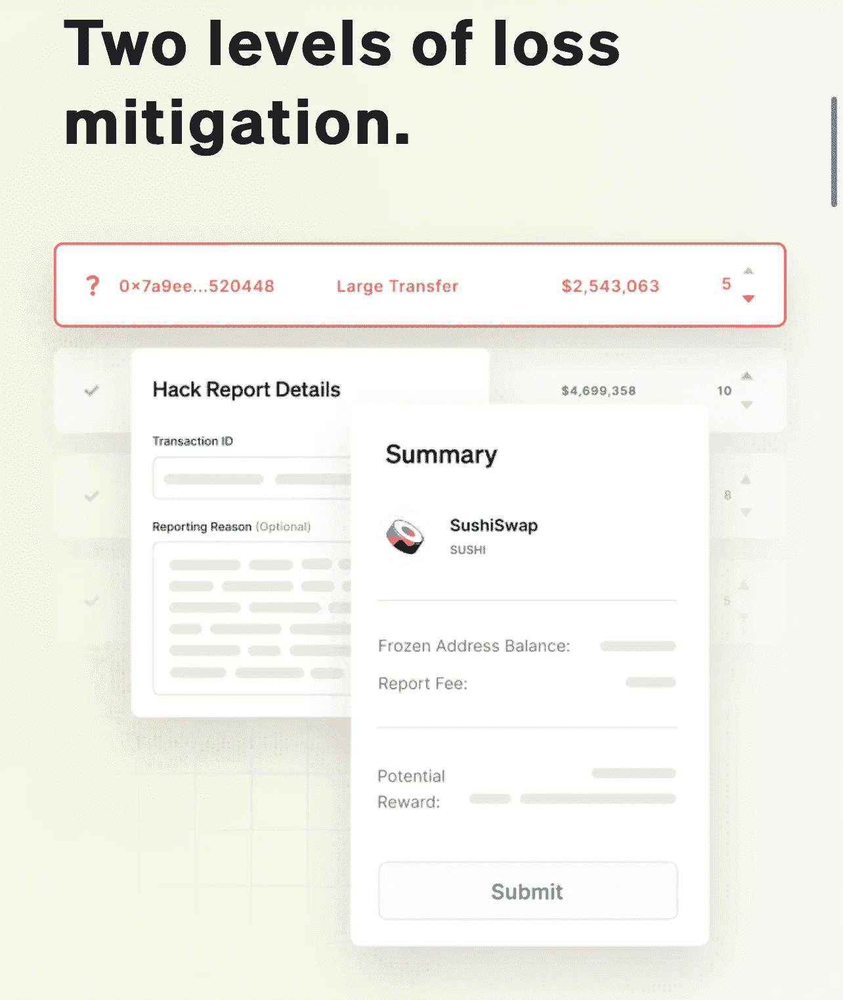

如果报告的交易被发现是合法的，受影响的地址将从黑名单中删除，并有权获得赔偿。举报此事的发现者和任何支持此事的人都将被砍掉股份。

## 无损臭虫奖励计划

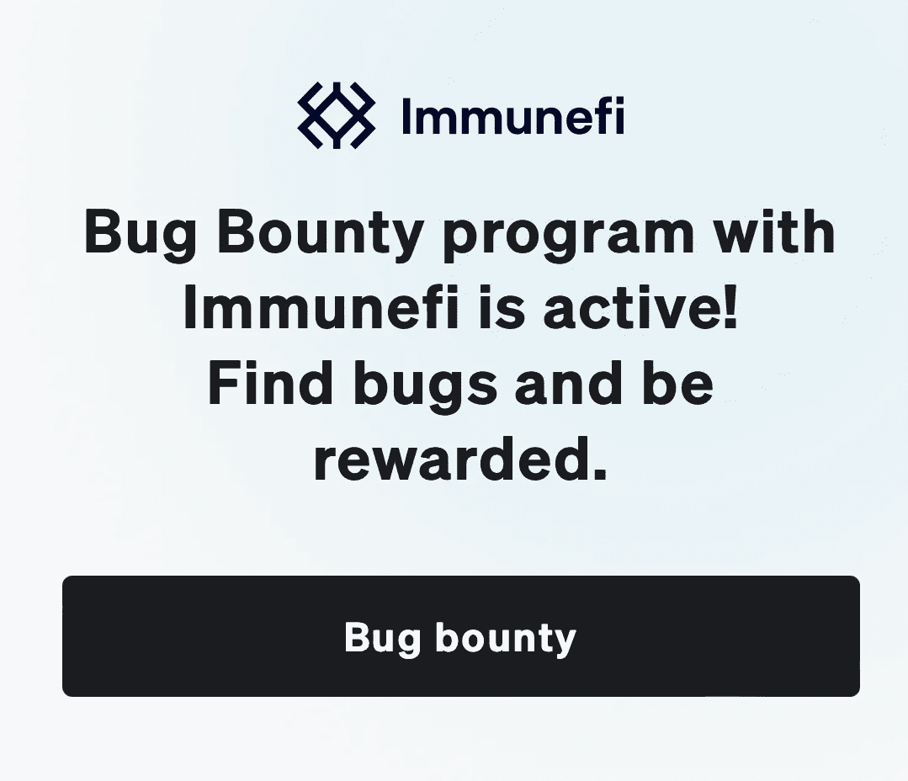

与 Immunefi 的 Bug Bounty $50k 奖励计划

## 无损成功突出显示

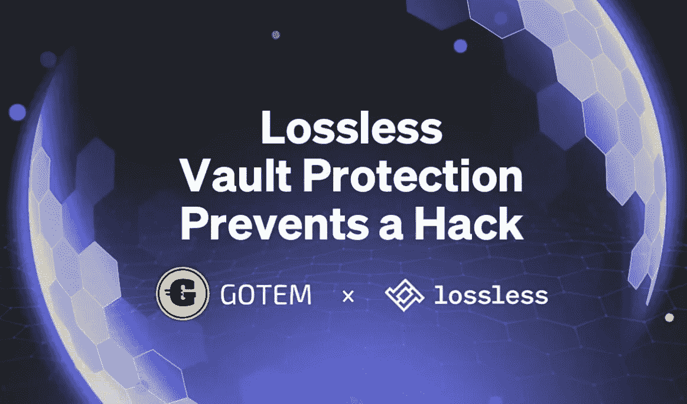

$55,000 saved for gotEM by Lossless Vault

*来源:*[*https://beincrypto . com/lossless-vault-protection-stops-a-hack-and-saves-55000-for-gotem/*](https://beincrypto.com/lossless-vault-protection-stops-a-hack-and-saves-55000-for-gotem/)

**Vulcan Forged** ，基于多边形的游戏代币$PYR 背后的团队，在 2021 年 12 月 13 日进行的一次黑客攻击耗尽了价值 1.4 亿美元的 450 万 PYR 代币后重新启动。在重新启动时，Vulcan Forged 与无损协议相关联，&无损协议建议该组织如何处理在 PYR 重新启动时的黑客攻击&。

**目前 Lossless 有 67 个合作伙伴，超过一半是协议集成(比如 Vulcan Forged)。**

## 无损项目审计报告:

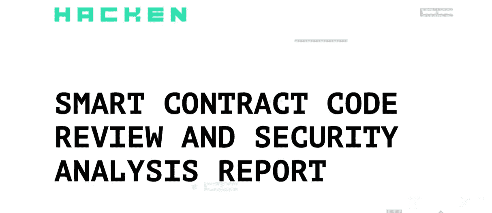

Project Audit report by Hacken

Hacken 于 2021 年 5 月 17 日完成审计。审计评级-“安全可靠”。

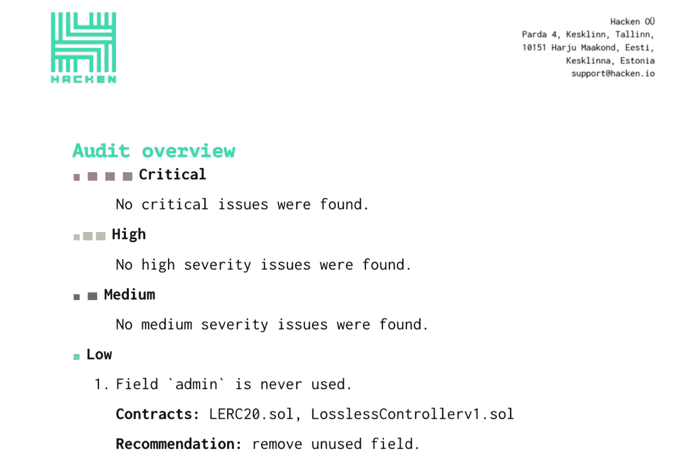

Audit report overview by Hacken

**未发现重大或高风险。**

**全文报道【https://hacken.io/audits/#lossless】:**

**审核 2** 由 [CertiK](https://medium.com/u/48cc71597f8a?source=post_page-----f5aad6ca852b--------------------------------) 于 2021 年 10 月完成

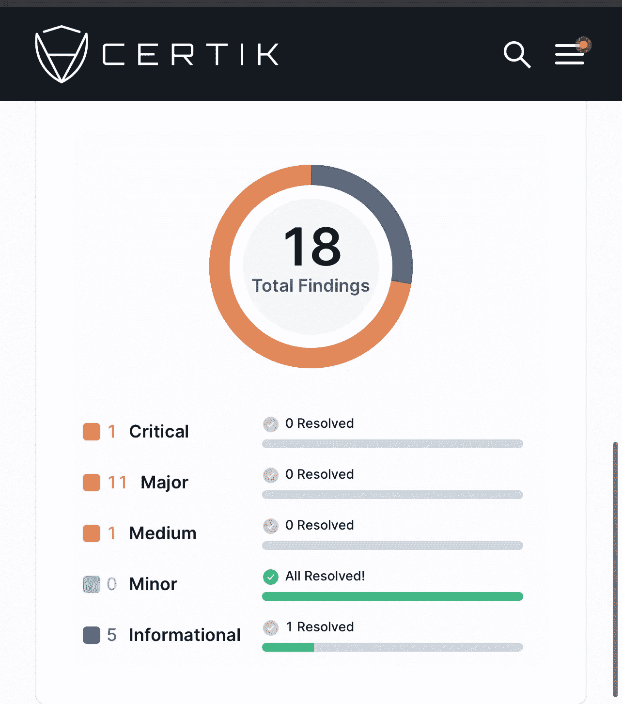

**审计报告概述**:发现 1 个关键问题和 11 个重大问题，均为集中风险。

没有一个风险得到“解决”,但所有风险都有解决方案，包括使用所有权放弃到 **Gnosis multisig、延时锁、硬件钱包和将角色转移到智能合同**

**完整报道**:[https://www.certik.com/projects/lossless](https://www.certik.com/projects/lossless)

## **无损项目组&顾问:**

**核心团队**

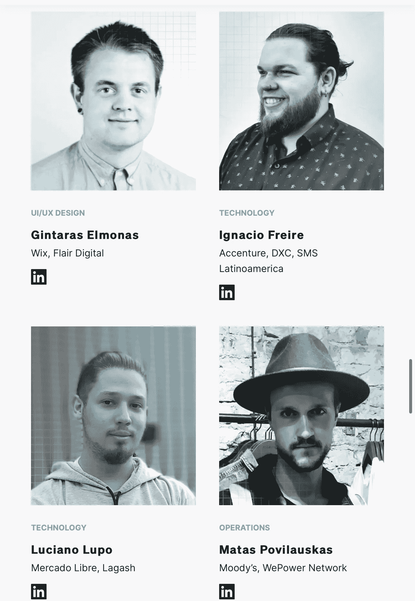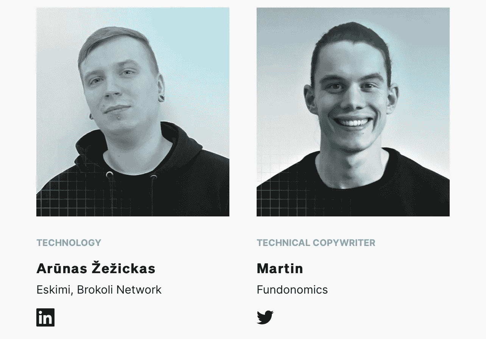

**项目顾问**

这是**完全 dox** ，没有 KYC 审计，但这个团队和项目已经证明，他们在这个领域是游戏规则改变者。我这边没有危险信号🌝

## 项目合作伙伴和/或风险投资者:

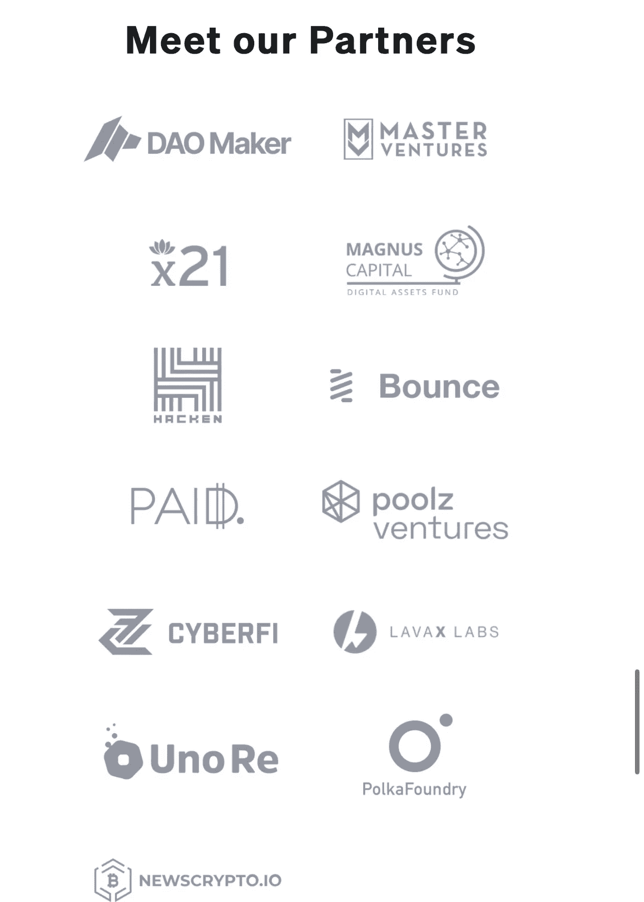

无损项目与 **Hacken Group** (安全审计) **Uno Re** (保险)& **Immunefi** (bug 赏金奖励计划)的合作对我来说绝对是一种享受，我已经开始如此专注于项目的基础方面。这些家伙就像复仇者联盟……秘密集合。

## 无损项目路线图:

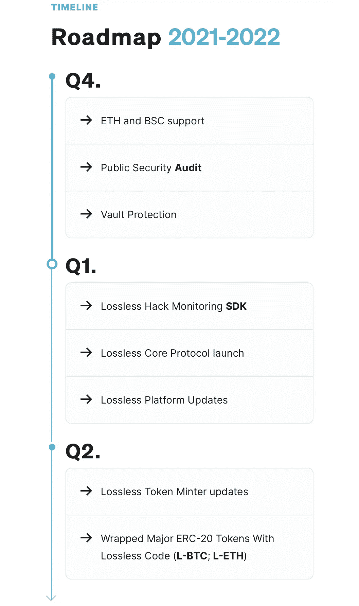

目前的路线图已经非常接近实现。我确信一旦 mainnet 项目上线，路线图将会扩展。

## 无损令牌组学:

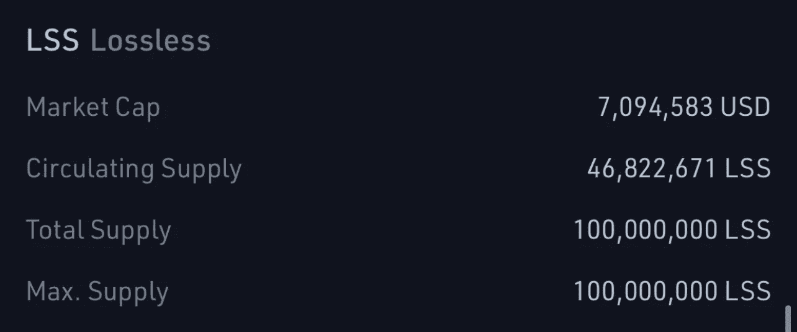

*   $LSS 是本地令牌，用于治理和支付奖励
*   1 亿最大代币供应量；流通供应量 4600 万(根据 coinmarket.com)

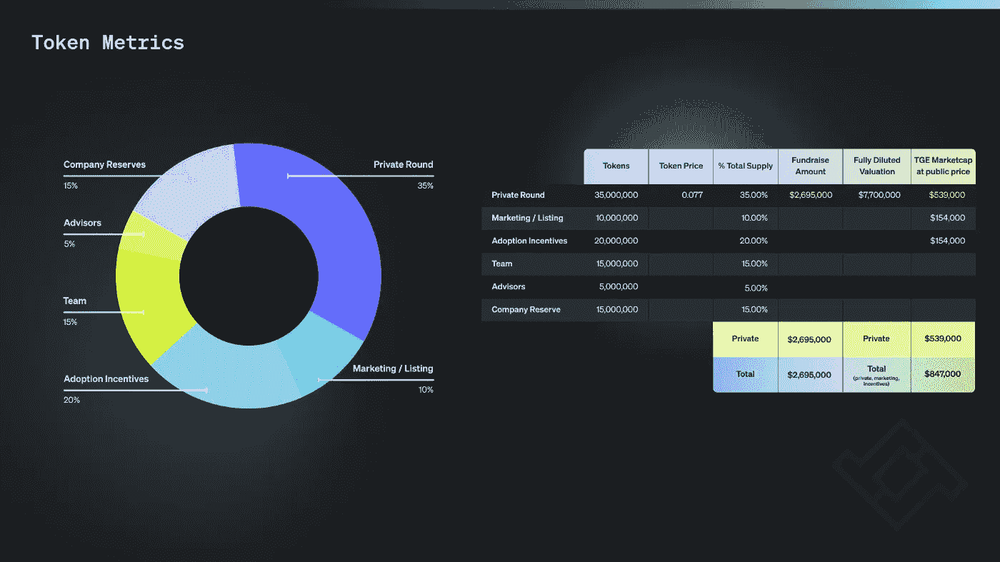

**无损令牌分发**

*   35%分配给私人销售
*   15%分配给团队
*   5%分配给顾问
*   10%分配给营销/上市流动性
*   15%分配至公司储备金
*   20%的拨款用于采纳激励。

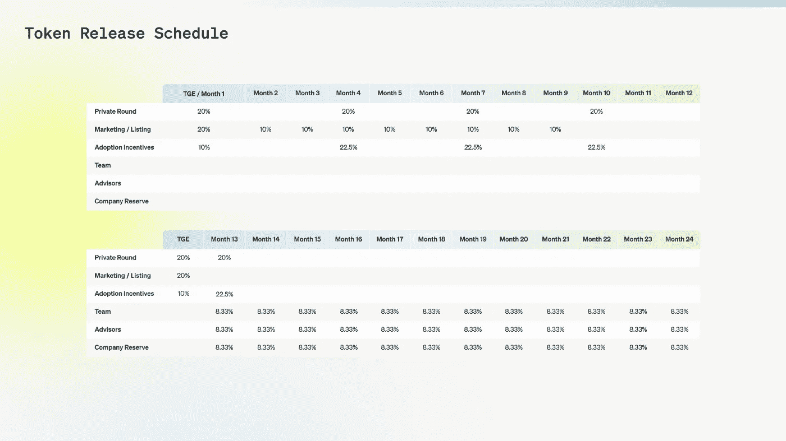

Lossless token vesting schedule

## 网络费用和收费

*   无损收取节省的交易/恢复的被黑资金价值的 7%作为他们的费用
*   他们用这 7%来购买$LSS，并给$LSS 的发现者和下注者分配奖励
*   核心协议赌注金额设定为:发现者 2500 美元 LSS；200 美元 LSS 赌注

## 无损社交媒体链接:

*   **推特**:[https://twitter.com/losslessdefi](https://twitter.com/losslessdefi)
*   **电报**:[https://t.me/losslesscash](https://t.me/losslesscash)
*   **不和**:[https://discord.com/invite/4CUqdMkvgN](https://discord.com/invite/4CUqdMkvgN)
*   **中等**:[https://losslesscash.medium.com/](https://losslesscash.medium.com/)
*   **coin market cap**:[https://coinmarketcap.com/currencies/lossless](https://coinmarketcap.com/currencies/lossless)
*   **领英**:[https://www.linkedin.com/company/losslessdefi/](https://www.linkedin.com/company/losslessdefi/)
*   **白皮书**:[https://lossless-cash.gitbook.io/lossless](https://lossless-cash.gitbook.io/lossless/)
*   **网站**:【https://lossless.cash/ 

## 关键要点:

无损是一个独一无二的项目，服务于一个新的行业产品。减轻协议攻击是当务之急&任何认真保护投资者资金的项目都会转向 Lossless 这样的项目。

无损的工作机制不仅是非常好的计划，但他们的执行与过去的成功已经表明，执行是完美的。我真的很喜欢这个项目&看到它在未来几年巩固自己的顶级地位。

**以上信息不应被视为财务建议，仅用于教育目的。**

非常感谢 CoinDCX 给我这个机会来撰写如此详细的报告，并成为#**coindcxpathbaker**计划的一部分，使我能够与加密领域的每个人分享这些知识。

在此购买加密:

 [## CoinDCX -加密交易所|购买、出售和交易比特币和顶级替代币

### CoinDCX 是印度最大、最安全的加密货币交易所，在这里你可以买卖比特币和其他…

coindcx.com](https://coindcx.com) 

> 加入 Coinmonks [电报频道](https://t.me/coincodecap)和 [Youtube 频道](https://www.youtube.com/c/coinmonks/videos)了解加密交易和投资

# 另外，阅读

*   [OKEx vs KuCoin](https://coincodecap.com/okex-kucoin) | [摄氏替代品](https://coincodecap.com/celsius-alternatives) | [如何购买 VeChain](https://coincodecap.com/buy-vechain)
*   [币安期货交易](https://coincodecap.com/binance-futures-trading)|[3 comas vs Mudrex vs eToro](https://coincodecap.com/mudrex-3commas-etoro)
*   [如何购买 Monero](https://coincodecap.com/buy-monero) | [IDEX 评论](https://coincodecap.com/idex-review) | [BitKan 交易机器人](https://coincodecap.com/bitkan-trading-bot)
*   [CoinDCX 评论](/coinmonks/coindcx-review-8444db3621a2) | [加密保证金交易交易所](https://coincodecap.com/crypto-margin-trading-exchanges)
*   [红狗赌场评论](https://coincodecap.com/red-dog-casino-review) | [Swyftx 评论](https://coincodecap.com/swyftx-review) | [造币厂评论](https://coincodecap.com/coingate-review)