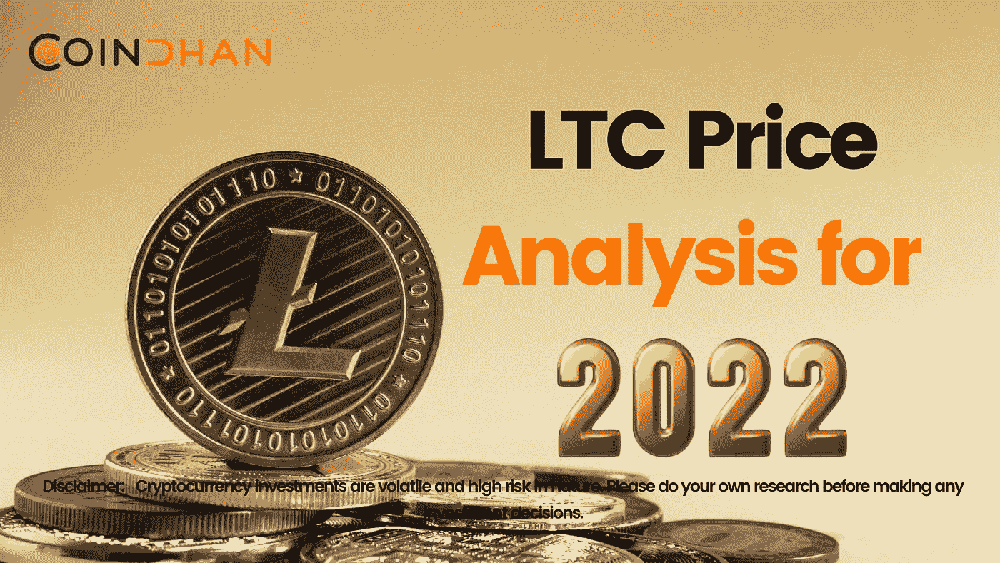
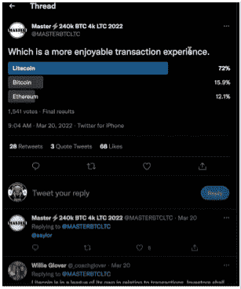
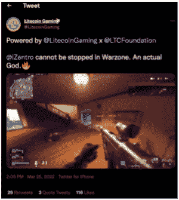
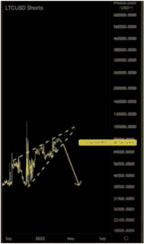
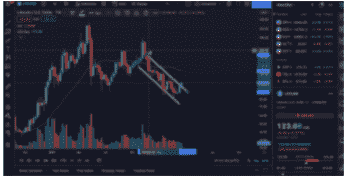
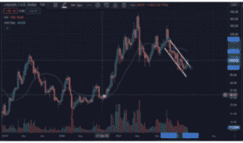
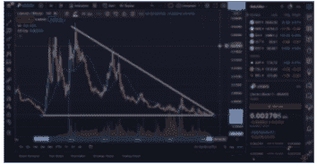

# 2022 年 LTC 价格分析| Coindhan

> 原文：<https://medium.com/coinmonks/ltc-price-analysis-for-2022-coindhan-5c256dd6fd24?source=collection_archive---------78----------------------->

欢迎来到另一个快速的 [CoinDhan 的](https://www.coindhan.com/)密码分析。在今天的分析中，我们即将涵盖莱特币。2022 年对 LTC hodlers 来说是一个好年景，因为根据市值、交易量和社区信任度，硬币在目前排名前 20 的加密货币中从第 22 位跃升至第 20 位。

在更好的交易体验方面，Twitter 上进行了一项民意调查，在 1500 多次投票中，莱特币胜过了比特币和以太坊网络。

最重要的是，最近 iZentro 还采用了 Litecoin，为用户提供了前所未有的游戏体验。

所有这些都印出了莱特币美好的基本面，让投资者看涨长期持有。然而，我们将专注于 Litecoin 的 TA 方面，以提取我们在 2022 年底之前的存储内容。

**TA 为莱特币**[2022](https://blog.coindhan.com/2022/03/22/btc-2022-analysis-coindhan-analysis/)

在从一月份开始的过去几个月里，莱特币已经形成了一个上升三角形，这无疑意味着我们有一个趋势延续。

在这种时候，我们确实看到许多空头被清算，空头交易者在这个过程中被重新赎回。

当看过去三个月的图表时，我们确实看到一个下降的形态正在形成；

然而，显然趋势已经逆转，你可以从 100 美元的价格水平看到，从这里开始有持续的复苏。但由于我们看到 200 日均线在下方，如果在接下来的日子里情况会有所改善，看涨的势头可能会出现，如果它突破下一个阻力位 156 美元，它可能会达到 200 美元。由于 Litecoin 在过去也遵循了类似的趋势，它在今年秋季也备受期待。

从图表中可以看出，去年 LTC 确实从 69 美元跌至 31 美元；然而，很快就出现了持续的购买，将价格推高至 365 美元。然而，不能完全排除牛市情绪。但由于我们目前正处于熊市，很难看到这种势头不断增强。过去，当我们看长期资本/BTC 图表时，

我们确实看到，在过去，LTC 已经打破了 2017 年、2018 年、2021 年和 2022 年的下行趋势，这在某种程度上反映了相同的模式。但如果 LTC 必须触及新的 ATH，它必须突破通道，这可能会进一步推动价格走向更高的一端。话虽如此，如果一切按预期进行，我们很可能会看到到 2022 年底长期资本交易价格在 200 美元左右。

> 加入 Coinmonks [电报频道](https://t.me/coincodecap)和 [Youtube 频道](https://www.youtube.com/c/coinmonks/videos)了解加密交易和投资

# 另外，阅读

*   [OKEx vs KuCoin](https://coincodecap.com/okex-kucoin) | [摄氏替代品](https://coincodecap.com/celsius-alternatives) | [如何购买 VeChain](https://coincodecap.com/buy-vechain)
*   [币安期货交易](https://coincodecap.com/binance-futures-trading)|[3 comas vs Mudrex vs eToro](https://coincodecap.com/mudrex-3commas-etoro)
*   [如何购买 Monero](https://coincodecap.com/buy-monero) | [IDEX 评论](https://coincodecap.com/idex-review) | [BitKan 交易机器人](https://coincodecap.com/bitkan-trading-bot)
*   [CoinDCX 评论](/coinmonks/coindcx-review-8444db3621a2) | [加密保证金交易交易所](https://coincodecap.com/crypto-margin-trading-exchanges)
*   [红狗赌场评论](https://coincodecap.com/red-dog-casino-review) | [Swyftx 评论](https://coincodecap.com/swyftx-review) | [CoinGate 评论](https://coincodecap.com/coingate-review)