# Lum 网络令牌(LUM)-完整的赌注指南

> 原文：<https://medium.com/coinmonks/lum-network-token-lum-complete-staking-guide-af37c3ab4b5?source=collection_archive---------26----------------------->

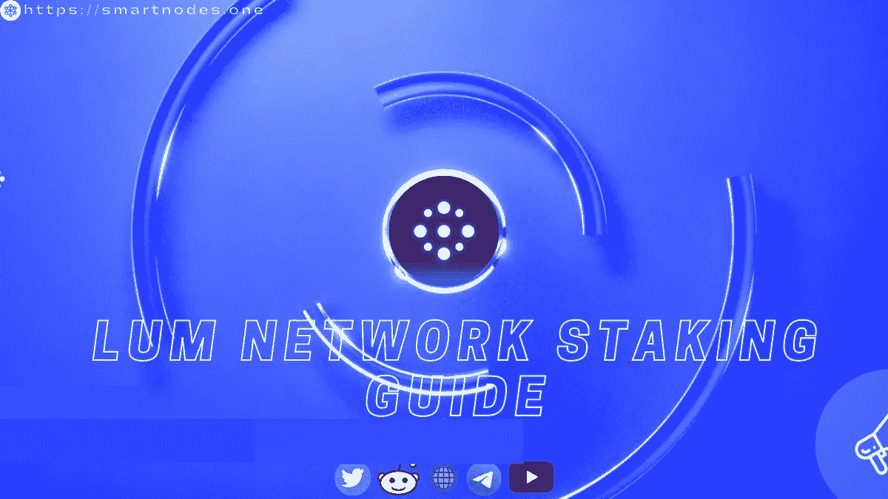

Lum Network Token(LUM)-Complete Staking Guide

**简介 Lum 网络**

企业与客户建立真实信任的分散协议。

*   快速、安全和可持续的开源区块链协议。
*   Lum 网络使用一种利益证明算法来确保网络的稳定性和安全性。
*   在奖励企业和客户的同时，培养他们之间信任的新标准。
*   由它固有的加密资产 LUM 提供动力
*   每个 LUM 持有者都可以参与这个过程，并因此获得奖励

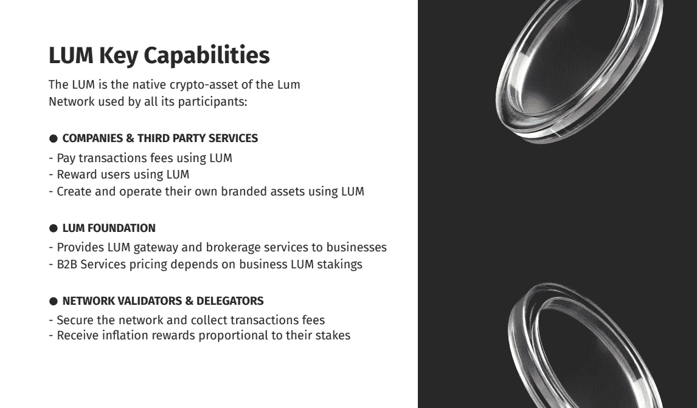

Lum token Capabilities [https://lum.network/](https://lum.network/)

Lum network Introduction by [Popular Cosmos Youtuber Cryptocito](https://www.youtube.com/channel/UCE1JHFSfUWcXVyzV3KGA9Fw)

## **我们在哪里可以买到人民币？**

1.  [渗透 DEX](https://frontier.osmosis.zone/?from=ATOM&to=OSMO)

> [如何使用渗透作用。zone |关于渗透作用你应该知道的一切](https://smartnodes.medium.com/how-to-use-osmosis-zone-everything-you-should-know-about-osmosis-9561a076faff)

S

## 什么是赌注？

锁定是锁定数字资产(LUM 在 [Lum 网络](https://lum.network/)的情况下)的过程，以提供公共区块链的经济安全。

## 赌注有三个主要优点:

**1-固定链条**

*   使用您的 LUM，您可以通过将它们委托给验证器来为分散式网络的安全性做出贡献。

**2-赢取奖励**

*   一旦你将一些 LUM 委托给一个或多个验证者，你就开始获得赌注奖励。

**3-为未来投票**

*   Staking LUM 授予您对治理提案进行投票的权利，并对 [**Lum 网络**的未来做出决定。](https://lum.network/)

## **如何下注 LUM Token？**

在交易所购买后，你需要将这些面值为 **LUM** 的代币转移到一个自我保管的钱包中进行下注。

*   **自保管钱包(流行的宇宙钱包)**

1.  [开普勒](https://wallet.keplr.app/#/dashboard)
2.  [宇宙站](https://wallet.cosmostation.io/cosmos)

将资产转移到新钱包后，打开 S [martnodes.one](https://smartnodes.one/) 来下注您的 **LUM 代币**。

**第一步** —转到代表部分，找到 **LUM 网络(LUM)，** **点击代表。**

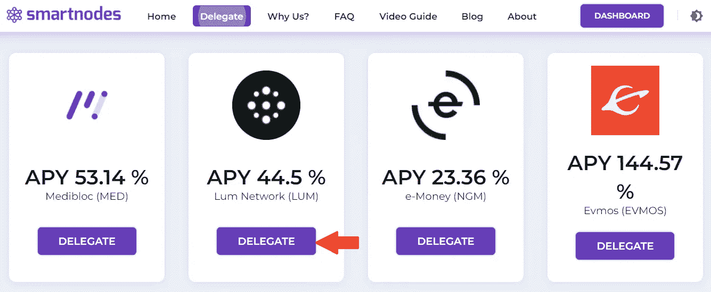

[https://smartnodes.one/](https://smartnodes.one/#home)

**第二步-** **再次点击**进行委托。

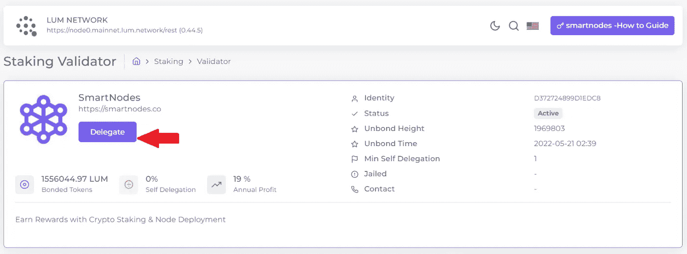

[https://smartnodes.one/#delegate](https://smartnodes.one/#delegate)

**第三步-** 连接你的 Keplr 钱包。

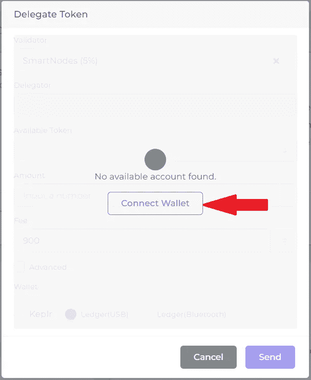

[https://smartnodes.one/blog](https://smartnodes.one/blog)

**第四步-** **选择 Keplr**-点击下一步-点击批准。

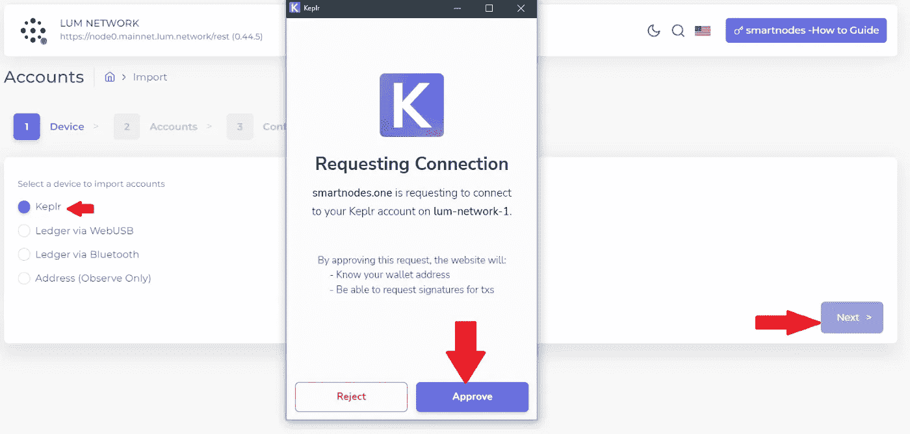

[Requesting Connection to Keplr Wallet](https://www.keplr.app/)

**步骤 5-** 输入帐户名，确保在链的导入地址中选择了 **LUM NETWORK** 。**点击下一步。**

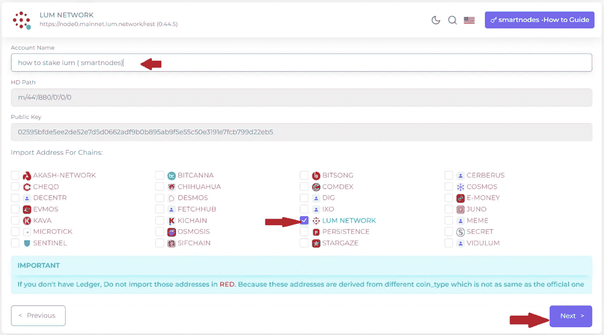

[https://smartnodes.one/dashboard/cosmos](https://smartnodes.one/dashboard/cosmos)

**步骤 6-确认**，检查您的地址是否正确添加，并点击保存。

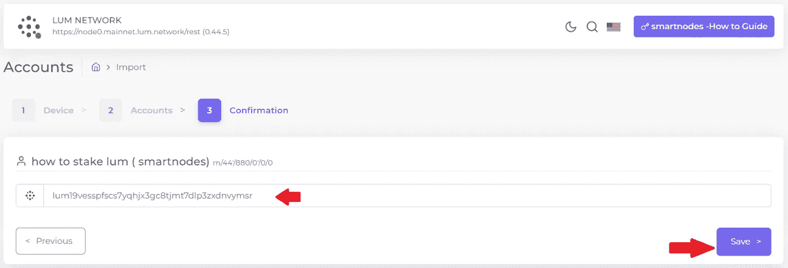

[https://www.keplr.app/#starters](https://www.keplr.app/#starters)

**第 7 步-** 您已成功将您的 **LUM** 代币导入 [Smartnodes.one](http://smartnodes.one/)

接下来，单击“委托”,继续进行立桩。

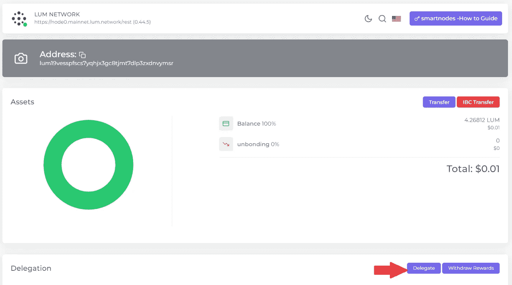

[https://smartnodes.one/dashboard/wallet/accounts](https://smartnodes.one/dashboard/wallet/accounts)

**第八步**——现在选择 [**验证器**](http://smartnodes.one/) ，输入你想要下注的金额，填油费为 800，选择 Keplr 钱包，点击**发送。**

**第九步** - **批准**Keplr 弹出窗口中的交易。

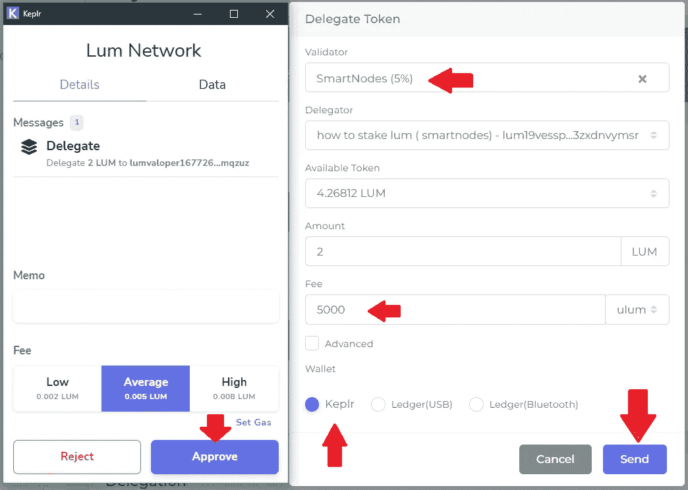

[https://smartnodes.one/dashboard/cosmos](https://smartnodes.one/dashboard/cosmos)

**第 10 步-** 祝贺您，您已经成功地用 Smartnodes 下注了您的 **LUM 代币**(您还可以查看您的资产分配、奖励和余额)。

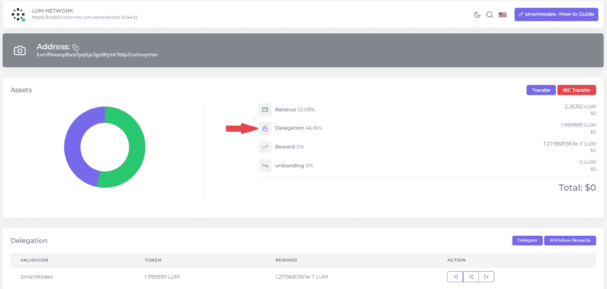

[https://www.keplr.app/#starters](https://www.keplr.app/#starters)

# 关于智能节点

1.  [Smartnodes](http://smartnodes.one/) Validator 是一个提供 100%斜线和双符号退款保护的利益证明服务。
2.  我们在宇宙中非常活跃，尽我们所能给予支持。我们是社区驱动的。 [Smartnodes](https://smartnodes.one/#choose) validator 积极地对提案进行投票，以帮助确保适当的治理。
3.  [Smartnodes](https://smartnodes.one/#faq) 使用的基础设施是最好的，有 10 层安全措施来保护您的资产。
4.  我们目前正在 33 个加密货币链上提供利益相关证明服务(POS ),并在不断增长，请查看我们的验证器节点网站。 [Smartnodes.one](https://smartnodes.one/dashboard/)

socials |[*Reddit*](https://www.reddit.com/r/smart_nodes/)|[|*Twitter*](https://twitter.com/nodes_smart)|[|*网站*](https://smartnodes.one/)|[|*电报*](https://t.me/smartnodesvalidators)*|[|*insta gram*](https://www.instagram.com/smartnodes_validator/)*|*[*不和*](https://discord.gg/TA3UVPwn6D)*

**

> **加入 Coinmonks* [*电报频道*](https://t.me/coincodecap) *和* [*Youtube 频道*](https://www.youtube.com/c/coinmonks/videos) *了解加密交易和投资**

# *另外，阅读*

*   *【T43 商业评论 | [Pionex 评论](https://coincodecap.com/pionex-review-exchange-with-crypto-trading-bot) | [Coinrule 评论](/coinmonks/coinrule-review-2021-a-beginner-friendly-crypto-trading-bot-daf0504848ba)*
*   *[莱杰 vs n rave](/coinmonks/ledger-vs-ngrave-zero-7e40f0c1d694)|[莱杰 nano s vs x](/coinmonks/ledger-nano-s-vs-x-battery-hardware-price-storage-59a6663fe3b0) | [币安评论](/coinmonks/binance-review-ee10d3bf3b6e)*
*   *[Bybit Exchange 审查](/coinmonks/bybit-exchange-review-dbd570019b71) | [Bityard 审查](https://coincodecap.com/bityard-reivew) | [Jet-Bot 审查](https://coincodecap.com/jet-bot-review)*
*   *[3 commas vs crypto hopper](/coinmonks/3commas-vs-pionex-vs-cryptohopper-best-crypto-bot-6a98d2baa203)|[赚取加密利息](/coinmonks/earn-crypto-interest-b10b810fdda3)*
*   *最好的比特币[硬件钱包](/coinmonks/hardware-wallets-dfa1211730c6) | [BitBox02 回顾](/coinmonks/bitbox02-review-your-swiss-bitcoin-hardware-wallet-c36c88fff29)*
*   *[BlockFi vs Celsius](/coinmonks/blockfi-vs-celsius-vs-hodlnaut-8a1cc8c26630)|[Hodlnaut 点评](/coinmonks/hodlnaut-review-best-way-to-hodl-is-to-earn-interest-on-your-bitcoin-6658a8c19edf) | [KuCoin 点评](https://coincodecap.com/kucoin-review)*