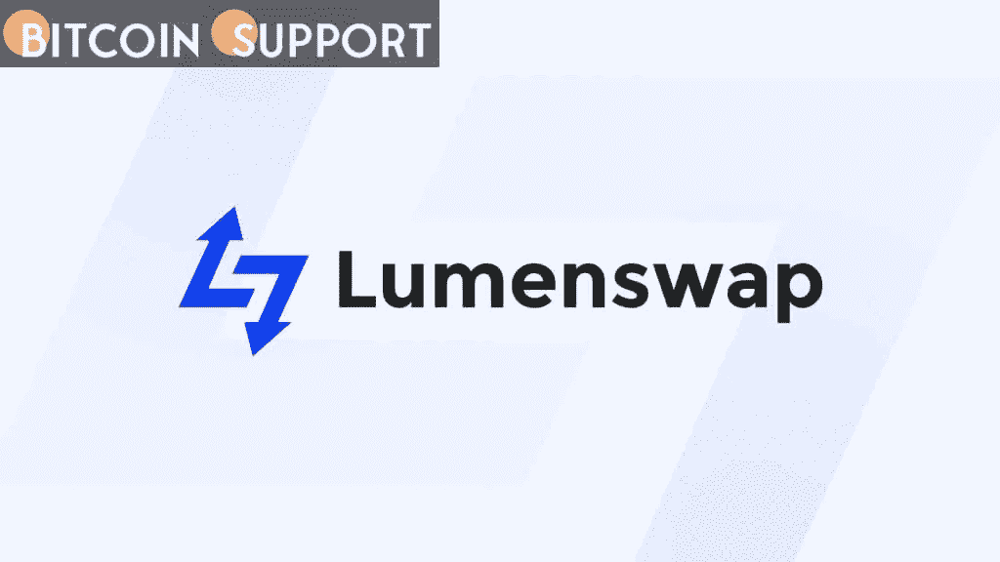

# Lumenswap 宣布推出新产品:DAO

> 原文：<https://medium.com/coinmonks/lumenswap-announces-the-launch-of-a-new-product-dao-5f258e399d63?source=collection_archive---------41----------------------->

**Visit our website:-** [**https://bitcoinsupports.com/**](https://bitcoinsupports.com/)

恒星项目和生态系统以其规模和效用而闻名。市场上目前正在进行许多衍生加密项目，目标是正确利用恒星生态系统的真正力量。Lumenswap 是一个突破性的去中心化交易所，是另一个基于网络的卓越举措，通过用户友好的界面提供互换和交易功能。Stellar network 的开源客户端最近庆祝了一个重要的里程碑，发布了他们的第一个产品 DAO。这个产品基于这样一个前提，即分散的项目不应该被集中管理。DAO 是分散自治组织的首字母缩写，它使区块链成员能够联合控制他们的代码。

把道看作是一个空间，在这里整个社区可以聚在一起决定一个项目的命运。您所需要做的就是拥有治理令牌，以便对项目如何决策有一个有意义的发言权。之所以说星网是最适合这类商品的区块链项目之一，是因为:

**交易费用极少。**

—经济实惠的社区

—业内最棒的用户体验

— Lumenswap 在宣布推出自己的 DAO 平台后，加入了 Stellar 生态系统的雄心勃勃的项目名单。

—lumen swap DAO 客户端详情

lumen swap DAO 客户端基于 Stellar 网络，以最大限度地提高其所有常规功能的效率。因此，这个 DAO 平台成为其他基于恒星的加密计划的社区治理中心。做出开放 DAO 平台的决定是为了防止被任何加密团体关心的运动排挤。一个设计良好的 DAO 平台使项目所有者能够将责任委托给社区成员，并授权他们对项目的未来做出关键决策。在选择 Lumenswap DAO 客户端并与之沟通之前，以下信息至关重要:

所有希望加入 DAO 客户端的项目都必须支付 LSP，这是 Lumenswap 生态系统的激励和治理令牌。Lumenswap 的 DAO 服务将需要总共 50，000 个 LSP 令牌。全部费用将被烧掉，通过贬值来提高个人价值。将根据 Lumenswap 团队制定的一套质量标准来选择符合条件的项目，以便仅适用于实际社区。

DAO 站点将有一个公告板部分，用户可以在那里检查哪些加密项目已经成功链接到 Lumenswap DAO 客户端并创建了治理。

治理信息区域将包括关于治理结构、网站、特定项目和活跃社区成员总数的信息。

在 Lumenswap DAO 客户端上，有演示相关治理的提案，可以根据它们的各种状态进行分类。

要提交建议书，项目必须获得项目小组指定的一定数量的本地资产，为期五天。在 Lumenswap 客户端，创建提案的时间限制是固定的。我的行动是 Lumenswap 客户端的一个有用元素，它允许用户跟踪他们在几个项目中的治理工作。Lumenswap 因此更新了它的社区，允许它将其他基于 Stellar 的项目合并到它的 DAO 客户端中。该产品的首次亮相很容易导致基于恒星的互换项目的未来扩展。Lumenswap 成立不到 8 个月，已经证明了自己是一个可行的仿冒品。Lumenswap 的治理准则通过将控制权下放给社区，使其完全没有权限。根据之前发布的声明，Lumenswap DAO 客户端上的项目列表现在只能通过 DAO 完成。此外，预定拍卖的项目将遵守"道"的手续。现在，项目可以更容易地与 Lumenswap 接口。

由于近年来对社区主导的治理越来越重视，许多项目都在寻求 Lumenswap DAO 平台能够提供的帮助。Lumenswap 通过发布 DAO 平台为真正的去中心化铺平了道路。

**访问我们的网站:-**[**https://bitcoinsupports.com/**](https://bitcoinsupports.com/)

**免责声明:以上为作者观点，不应视为投资建议。读者应该自己做研究。**

> 加入 Coinmonks [电报频道](https://t.me/coincodecap)和 [Youtube 频道](https://www.youtube.com/c/coinmonks/videos)了解加密交易和投资

# 另外，阅读

*   [Botsfolio vs nap bots vs Mudrex](/coinmonks/botsfolio-vs-napbots-vs-mudrex-c81344970c02)|[gate . io 交流回顾](/coinmonks/gate-io-exchange-review-61bf87b7078f)
*   [CoinFLEX 评论](https://coincodecap.com/coinflex-review) | [AEX 交易所评论](https://coincodecap.com/aex-exchange-review) | [UPbit 评论](https://coincodecap.com/upbit-review)
*   [AscendEx 保证金交易](https://coincodecap.com/ascendex-margin-trading) | [Bitfinex 赌注](https://coincodecap.com/bitfinex-staking) | [bitFlyer 审核](https://coincodecap.com/bitflyer-review)
*   [Bitget 评论](https://coincodecap.com/bitget-review) | [双子星 vs BlockFi](https://coincodecap.com/gemini-vs-blockfi) cmd| [OKEx 期货交易](https://coincodecap.com/okex-futures-trading)
*   [AscendEx Staking](https://coincodecap.com/ascendex-staking)|[Bot Ocean Review](https://coincodecap.com/bot-ocean-review)|[最佳比特币钱包](https://coincodecap.com/bitcoin-wallets-india)