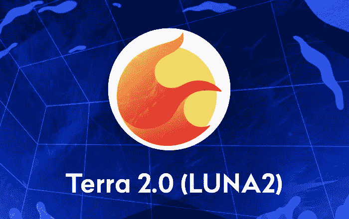

# LUNA 2 价格在大币安空投之前上涨了 90%

> 原文：<https://medium.com/coinmonks/luna-2-price-jumps-90-ahead-of-big-binance-airdrop-357444ae60c7?source=collection_archive---------49----------------------->

在币安空投之前，Terra (LUNA)的价格在一夜之间飙升了约 90%，达到 11.33 美元的盘中高点，但在撰写本文时已回落至 8.26 美元左右。

根据 CoinGecko 的数据，在当前价格下，8.26 美元的涨幅代表着过去 24 小时内的 35%的涨幅。但总体而言，自上周末以 18.87 美元的开盘价上市以来，该股已下跌 56%。

社区成员在 MEXC Global exchange 上发布了价格飙升至 12 美元的截图，Twitter 用户 bull_bnb 强调了一些飙升的时刻，因为他们注意到价格在 30 分钟内上涨了约 2 美元

币安是帮助 Terra 生态系统重新启动的几家交易所之一，将从世界协调时周二早上 6:00 开始向合格用户发起多年空投活动，并开放令牌交易。

虽然该项目旨在根据跆拳道的复兴计划重新确立自己的地位，但旁观者在短期内预测，一旦币安站上线，价格将进一步下跌。

许多投资者在推特上发泄他们对迄今为止 Terra 其他黯淡空投的愤怒，推特用户 cryptocevo 周一在推特上说:

“在 LUNA 上损失了 50k，空投了＄112，更喜欢完整的地毯。那小小的空投就像伤口上多了一针盐。”

今天早些时候，经过验证的 terra_money Twitter 账户承认，迄今为止空投存在问题，并发誓很快找到解决方案。