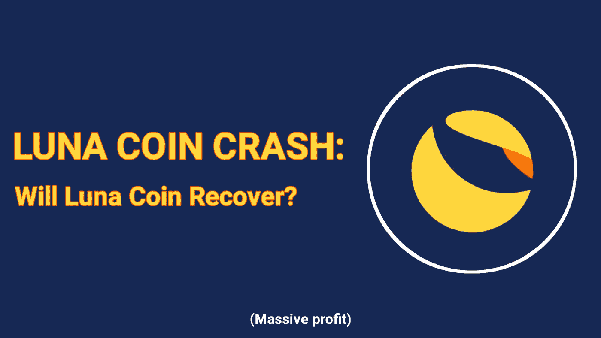
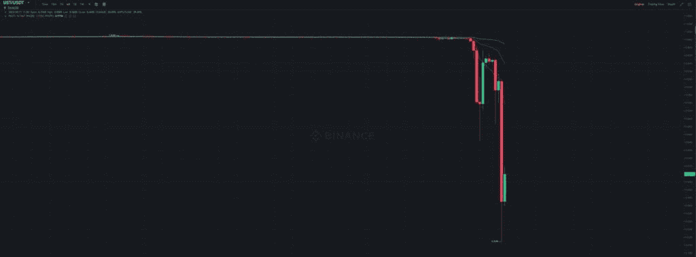
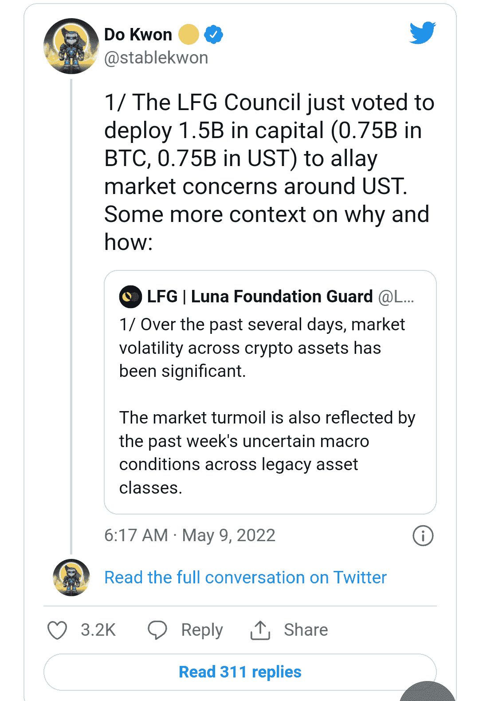
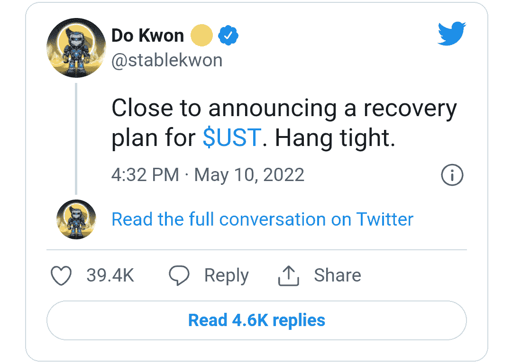

# 月神币崩溃——月神币会恢复吗？

> 原文：<https://medium.com/coinmonks/luna-coin-crash-will-luna-coin-recover-1dc8933155bc?source=collection_archive---------0----------------------->

最近 luna 从其历史高点大幅下跌，很多人都在想 luna 币和它的稳定币(UST)是否已经崩溃，而比特币的价格从 35k 美元跌至 29k 美元，大多数加密新手开始哀叹 BTC 价格下跌；在社交媒体上引发更多 FUD。

***也读作:*** [*空投即付 2022*](/coinmonks/airdrops-that-pay-instantly-2022-aaacbb36251f)

有人说“BTC 将在 2022 年 5 月底前跌至 1 万美元”，这一直是社交媒体上的话题。与此同时，人们似乎对加密市场非常小心，因为它的波动性。

luna 社区已经将 luna 视为一个永远无法恢复并回到其历史高点的项目，因此本文详细介绍了关于 luna 硬币崩溃的每个事实以及它是否会恢复。

# 月神硬币碰撞

戏剧性的崩盘意味着其市值从 400 多亿美元降至仅 15 亿美元，导致领先加密货币的投资者遭受前所未有的损失。

Luna 从 119 美元的 ATH 下跌，目前交易价格为 1.24 美元。在撰写本文时，UST 也跌破了与美元挂钩的汇率，目前交易价格为 0.6 美元。投资者因 UST 事件损失惨重

领先的币安加密交易所一度暂停了 Terra (LUNA)网络的提款，这意味着即使那些想出售的人也不能。

最有趣的事情是:上述与美元挂钩的泰拉稳定币(UST)贬值了近 80%。与此同时，UST 价格在 2022 年 5 月 11 日跌至 0.225 USDT。

因此，2022 年 5 月 11 日，luna 价格也暴跌至 4 美元左右(币安)，在过去几天里下跌了约 90%。

部分投资了露娜稳币的用户；开始在社交媒体(Reddit)上抱怨

Reddit 用户 No-Forever 写道:“我应该在 100 美元的时候套现，这样我就能拿到 25000 美元了。”“但是我变得贪婪，希望得到更多的钱，这样我至少可以为我的家人买一套房子。我猜那时没有房子和存款。”

“我损失了超过 450，000 美元，我无法支付银行，”Terra 论坛的一名用户成员写道。“我很快就会失去我的家。我会变得无家可归。自杀是我唯一的出路。”

一些成员在看到他们的资产一夜之间变得一文不值后分享了自杀帖子，而其他人则通过分享世界各地自杀热线的链接来提供支持。

# 月神币会恢复吗？

Terra 的首席执行官“Do Kwon”在 2022 年 5 月 9 日表示，Luna Foundation Guard Council 投票决定在 BTC 和 UST 部署 15 亿美元的资本——为了捍卫盯住政策，该团队承诺拯救算法稳定币，尽管许多投资者认为该项目已经结束。

UST 可能仍然如此努力地倾倒垃圾的主要原因是用户仍然在焚烧 UST 和薄荷露娜，因此 terra 首席执行官道权说他们正在制定恢复计划

# 结论

在投资算法稳定性时要谨慎。如果你不了解加密市场及其波动性，建议你远离交易，以避免我知道的情况。

如果团队成功并使 UST 与美元挂钩，现在购买并持有 UST 的用户将获得巨额利润，但这可能有风险，因为团队可能无法将 UST 与美元挂钩。

但是注意，这不是财务建议。

月神币是骗局还是真正的加密货币？

查看关于露娜的最新消息

[https://youtu.be/INMET47vWuE](https://youtu.be/INMET47vWuE)

加入电报频道了解更多更新

*   https://t.me/+6ek5FpdVW89jNjE0

> 加入 Coinmonks [电报频道](https://t.me/coincodecap)和 [Youtube 频道](https://www.youtube.com/c/coinmonks/videos)了解加密交易和投资

# 另外，阅读

*   [Bookmap 评论](https://coincodecap.com/bookmap-review-2021-best-trading-software) | [美国 5 大最佳加密交易所](https://coincodecap.com/crypto-exchange-usa)
*   最佳加密[硬件钱包](/coinmonks/hardware-wallets-dfa1211730c6) | [Bitbns 评论](/coinmonks/bitbns-review-38256a07e161)
*   [新加坡十大最佳加密交易所](https://coincodecap.com/crypto-exchange-in-singapore) | [购买 AXS](https://coincodecap.com/buy-axs-token)
*   [红狗赌场评论](https://coincodecap.com/red-dog-casino-review) | [Swyftx 评论](https://coincodecap.com/swyftx-review) | [CoinGate 评论](https://coincodecap.com/coingate-review)
*   [投资印度的最佳密码](https://coincodecap.com/best-crypto-to-invest-in-india-in-2021)|[WazirX P2P](https://coincodecap.com/wazirx-p2p)|[Hi Dollar Review](https://coincodecap.com/hi-dollar-review)
*   [加拿大最好的加密交易机器人](https://coincodecap.com/5-best-crypto-trading-bots-in-canada) | [库币评论](https://coincodecap.com/kucoin-review)