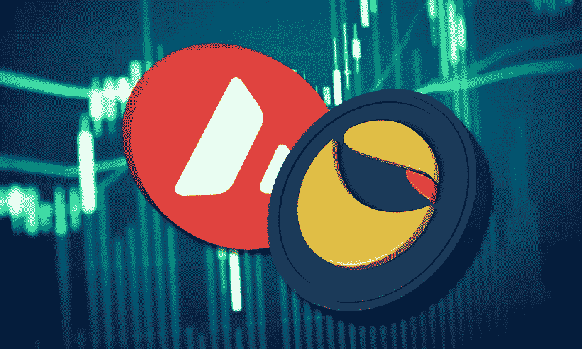
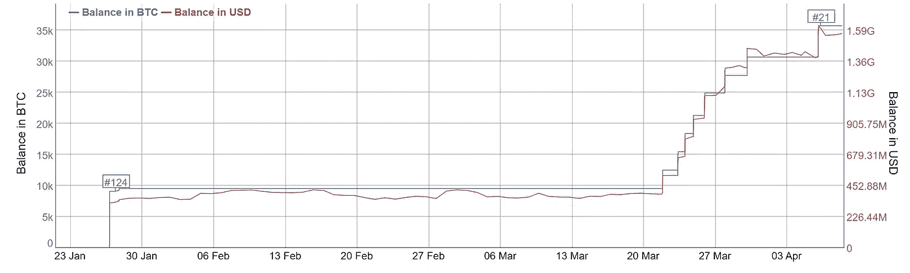
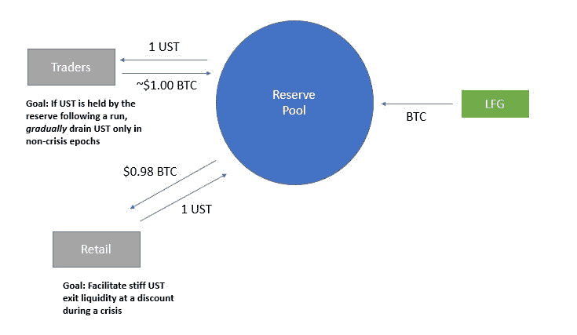

# Luna Foundation Guard 刚刚和 BTC 一起为他们的稳定币储备增加了 1 亿美元的 AVAX！

> 原文：<https://medium.com/coinmonks/luna-foundation-guard-just-added-100m-avax-to-their-stablecoin-reserve-alongside-with-btc-79bcd14d198c?source=collection_archive---------35----------------------->

Luna Foundation Guard (LFG)是一家总部位于新加坡的非营利组织，旨在支持 Terra 区块链，致力于经济主权、安全和开源软件，帮助建立真正的去中心化经济。

他们昨天发布了一项声明，称他们获得了 1 亿美元的 AVAX 代币，将被添加到他们的 Stablecoin 储备中。这将有更多的支持，通过分散到他们的非相关资产池来支持 UST 的联系汇率。

## 但是$BTC 和现在的$AVAX 是如何支持与 UST 挂钩的呢？

Jump Capital 提出了储备模式，即 LFG 可以动用其 BTC 储备来捍卫美元与 UST 挂钩的汇率，从而支持 LFG Stable Kwon 迅速买入美元。

迄今为止，LFG 已经购买了价值 1，563，913，928.42 美元的 BTC，这是一个惊人的 35，767 个比特币。

Buying of $BTC by the LFG

## 但是，当 UST 美元供大于求时，这种储备怎么能支持美元与 UST 挂钩呢？

我们知道，每铸造 1 美元的 UST 需要燃烧价值 1 美元的月神，反之亦然，简单的供求关系。

假设如果 UST 美元跌破挂钩汇率，零售商可以从储备池中拿出 1 美元 UST 兑换 0.98 美元 BTC。

也就是说，只有当$UST 的交易价格低于 0.98 美元时，零售商才能以折扣价从储备中购买$BTC！

## 但是当$UST 换回盯住美元时会发生什么呢？

Reserve Pool model

参与者将被激励以$UST 的溢价出售他们的$BTC。这个模型是如此简单，但需要一些大脑能量！

## 在所有的 L1 中，为什么是$AVAX？

LFG 选择$AVAX 是因为他们快速增长的生态系统和庞大的粉丝群。

从他们对多元宇宙的大规模激励计划到将$sAVAX 整合到 Anchor 协议中，我看不出 Stable Kwon 为什么不选择$AVAX。

我相信 LFG 将开始增加更多的 L1 到他们稳定的货币储备中，有点像 ETF 来分散风险。

有关$AVAX 的更多信息，请查看下面的我的主题:

“特别是，Avalanche 的子网是在利基用例中构建下一代可扩展 Web3 应用的强大方法。”

也就是说，Terra 基金会取笑我们说，他们将与$AVAX 合作开发一个新的游戏子网！

## 但为什么不是$ETH 呢？

我相信$AVAX 拥有比巨兽$ETH 更强大的社区。特别是最近的$AVAX 激励计划将$UST 带到了$AVAX，这很有意义。

## 但是 ETH2.0 和合并呢？？？

检查我的线程如下:

> 加入 Coinmonks [电报频道](https://t.me/coincodecap)和 [Youtube 频道](https://www.youtube.com/c/coinmonks/videos)了解加密交易和投资

# 另外，阅读

*   [3 商业评论](/coinmonks/3commas-review-an-excellent-crypto-trading-bot-2020-1313a58bec92) | [Pionex 评论](https://coincodecap.com/pionex-review-exchange-with-crypto-trading-bot) | [Coinrule 评论](/coinmonks/coinrule-review-2021-a-beginner-friendly-crypto-trading-bot-daf0504848ba)
*   [莱杰 vs n rave](/coinmonks/ledger-vs-ngrave-zero-7e40f0c1d694)|[莱杰 nano s vs x](/coinmonks/ledger-nano-s-vs-x-battery-hardware-price-storage-59a6663fe3b0) | [币安评论](/coinmonks/binance-review-ee10d3bf3b6e)
*   [Bybit Exchange 审查](/coinmonks/bybit-exchange-review-dbd570019b71) | [Bityard 审查](https://coincodecap.com/bityard-reivew) | [Jet-Bot 审查](https://coincodecap.com/jet-bot-review)
*   [3 commas vs crypto hopper](/coinmonks/3commas-vs-pionex-vs-cryptohopper-best-crypto-bot-6a98d2baa203)|[赚取加密利息](/coinmonks/earn-crypto-interest-b10b810fdda3)
*   最好的比特币[硬件钱包](/coinmonks/hardware-wallets-dfa1211730c6) | [BitBox02 回顾](/coinmonks/bitbox02-review-your-swiss-bitcoin-hardware-wallet-c36c88fff29)