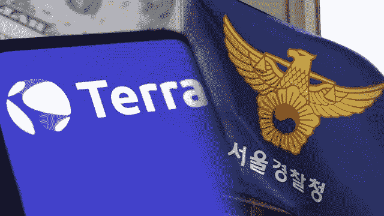

# 卢娜基金会警卫队(LFG)请求韩国警方冻结其资产

> 原文：<https://medium.com/coinmonks/luna-foundation-guard-lfg-assets-petitioned-to-be-frozen-by-the-korean-police-force-b0911610284a?source=collection_archive---------69----------------------->

据韩国国家广播公司 KBS 报道，韩国警方正在采取行动，锁定与非营利组织露娜基金会卫队有关的资产。

该出版物指出，首尔警察厅要求多个交易所阻止卢纳基金会卫队(LFG)提取任何公司资金。

然而，根据 KBS 的说法，交易所没有法律义务这样做，这意味着是否会采取这些行动是明确规定的。

报道称，警方表示，在发现线索显示 LFG 内部存在挪用资金的情况后，他们进行了干预。

在最近的 Terra meltdown 事件中，stablecoin TerraUSD (UST)的价值跌至 0.10 美元以下，一些投资者已经起诉了 Terraform Labs 的创始人 Do Kwon。

据《朝鲜日报》报道，关于最近 Terra 生态系统的崩溃，韩国立法者将在周一和周二会见韩国五大交易所的代表。

据新闻 PIM 报道，这些公司是 Upbit、Bithumb、Coinone、Korbit 和 Gopax。他们可能不得不回答自己是否也应该对代币持有者的资金损失负责。

> 加入 Coinmonks [电报频道](https://t.me/coincodecap)和 [Youtube 频道](https://www.youtube.com/c/coinmonks/videos)了解加密交易和投资

# 另外，阅读

*   [如何在加拿大购买加密货币？](https://coincodecap.com/how-to-buy-cryptocurrency-in-canada)
*   [无聊猿游艇俱乐部(BAYC)回顾](https://coincodecap.com/bored-ape-yacht-club-bayc-review) | [拜比特 vs 比特币基地](https://coincodecap.com/bybit-vs-coinbase)
*   [5 款最佳加密交易终端](https://coincodecap.com/crypto-trading-terminals) | [最佳 DeFi 应用](https://coincodecap.com/best-defi-apps)
*   [比特币基地 vs 瓦济克斯](https://coincodecap.com/coinbase-vs-wazirx) | [比特鲁点评](https://coincodecap.com/bitrue-review) | [波洛涅克斯 vs 比特鲁](https://coincodecap.com/poloniex-vs-bittrex)
*   [德国最佳加密交易所](https://coincodecap.com/crypto-exchanges-in-germany) | [Arbitrum:第二层解决方案](https://coincodecap.com/arbitrum)
*   [币安交易机器人](/coinmonks/binance-trading-bots-d0d57bb62c4c) | [OKEx 评论](/coinmonks/okex-review-6b369304110f) | [阿塔尼评论](https://coincodecap.com/atani-review)
*   [最佳加密交易信号电报](/coinmonks/best-crypto-signals-telegram-5785cdbc4b2b) | [MoonXBT 评论](/coinmonks/moonxbt-review-6e4ab26d037)