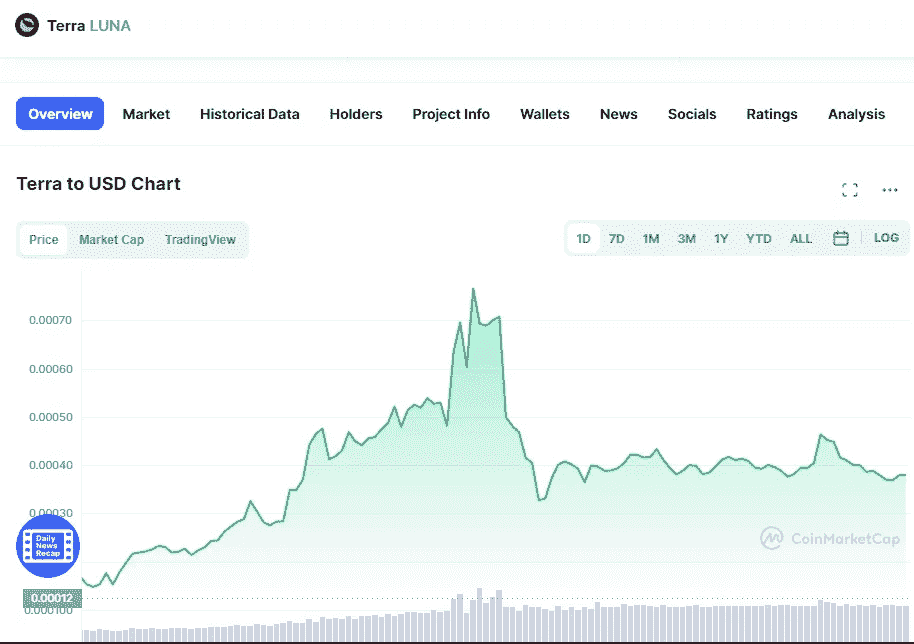

# 露娜今天涨了 1500%。是时候买了吗？

> 原文：<https://medium.com/coinmonks/luna-has-made-15x-today-is-time-to-buy-4faa9e11a818?source=collection_archive---------3----------------------->

Source photo [Terra price today, LUNA to USD live, marketcap and chart | CoinMarketCap](https://coinmarketcap.com/currencies/terra-luna/)

仅在之前的 24 小时内，月神代币的价值就增加了 1500%。现在每枚硬币的平均售价为 0.00049 美元。在严重故障后，Terra 早些时候报告说，其区块链已重新开始生产区块。另一方面，验证者决定完全停止链上交换。