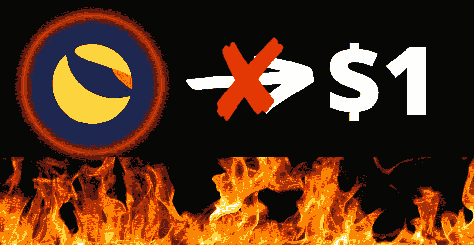
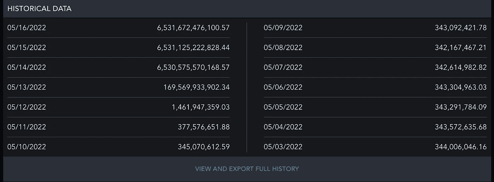

# 卢娜不打算要 1 美元

> 原文：<https://medium.com/coinmonks/luna-isnt-going-to-1-757cb46b2faf?source=collection_archive---------9----------------------->

我在 Twitter 上看到许多人说，向 LUNA 投资 100 美元，如果它回到 1 美元，你就会赚几百万。这就是为什么卢娜不可能去 1 美元。5 月 8 日，当 LUNA 在 60 美元左右时，其发行量约为 3.42 亿份，如下所示。

如果你看看上面的图片，当 UST 取消盯住美元时，LUNA 的流通供应量上升到了 6.5 万亿。这意味着以 1 美元计算，LUNA 的市值将超过 6 万亿美元。根据 CoinMarketCap 的数据，这将接近苹果市值的 3 倍，大约是加密技术总市值的 6 倍。这是不可能发生的，几周前 LUNA 的价格不应该被用来衡量它能涨到多高，因为那时供应少得多。

除非数万亿的硬币被烧掉，否则卢娜不可能得到 1 美元。感谢阅读，并考虑关注我更多这样的内容。

> 加入 Coinmonks [电报频道](https://t.me/coincodecap)和 [Youtube 频道](https://www.youtube.com/c/coinmonks/videos)了解加密交易和投资

# 另外，阅读

*   [杠杆令牌](/coinmonks/leveraged-token-3f5257808b22) | [最佳密码交易所](/coinmonks/crypto-exchange-dd2f9d6f3769) | [Paxful 点评](/coinmonks/paxful-review-4daf2354ab70)
*   [加密套利](/coinmonks/crypto-arbitrage-guide-how-to-make-money-as-a-beginner-62bfe5c868f6)指南| [如何做空比特币](/coinmonks/how-to-short-bitcoin-568a2d0b4ae5)
*   [币安期货交易](https://coincodecap.com/binance-futures-trading)|[3 comas vs Mudrex vs eToro](https://coincodecap.com/mudrex-3commas-etoro)
*   [如何购买 Monero](https://coincodecap.com/buy-monero) | [IDEX 评论](https://coincodecap.com/idex-review) | [BitKan 交易机器人](https://coincodecap.com/bitkan-trading-bot)
*   [尤霍德勒 vs 考尼洛 vs 霍德诺特](/coinmonks/youhodler-vs-coinloan-vs-hodlnaut-b1050acde55a) | [Cryptohopper vs 哈斯博特](https://coincodecap.com/cryptohopper-vs-haasbot)
*   [顶级付费加密货币和区块链课程](https://coincodecap.com/blockchain-courses)
*   [MXC 交易所评论](/coinmonks/mxc-exchange-review-3af0ec1cba8c) | [Pionex vs 币安](https://coincodecap.com/pionex-vs-binance) | [Pionex 套利机器人](https://coincodecap.com/pionex-arbitrage-bot)