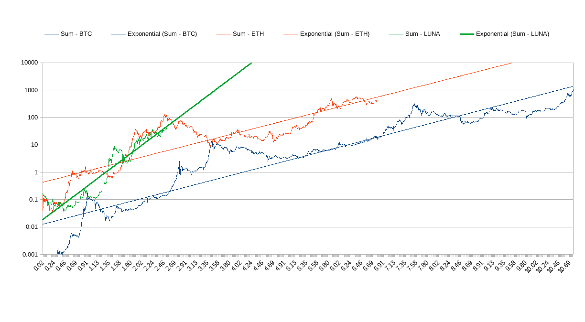
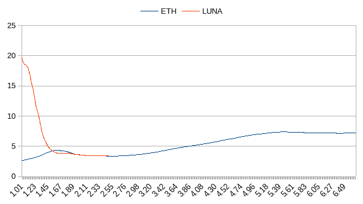
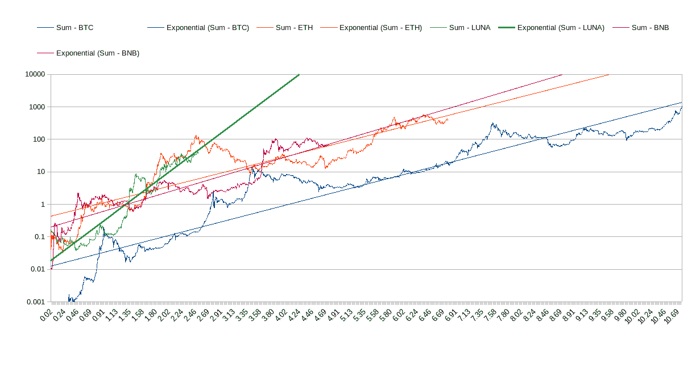

# 月亮，下一颗最亮的星，还是堕落的天使？

> 原文：<https://medium.com/coinmonks/luna-next-brightest-star-or-a-fallen-angel-ca6caa4a0eba?source=collection_archive---------54----------------------->

正如文章 [*如何识别&追踪下一个万亿美元资产*](https://link.medium.com/pzqDjF5hGob) 中所述，这一系列文章的目的是试图通过检查其趋势以及趋势的稳定性，找到有望在不到 10 年内达到 1 万亿美元市值的潜在资产。尽管该方法得出的结论是 [$LINK 脱颖而出成为投资的最佳候选人](/coinmonks/why-link-is-the-top-candidate-for-1t-asset-bb34bba36353)， [$BNB 预计将在未来几年成为以太坊的继承人](https://link.medium.com/F8yhKquFPob)， **$LUNA 是迄今为止最令人惊讶的资产，它预计将在最短的几年内达到 1 万亿美元的市值，即截至 2022 年 4 月 7 日，总共 3.45 年或从现在起 0.97 年。**因此，应该问的问题是$LUNA 是要成为下一颗最亮的星还是堕落的天使。

首先需要做的是看看$LUNA 的趋势以及 BTC 和以太坊自各自推出日期以来在同一时间框架内的历史趋势。

LUNA historical chart along with Bitcoin and Ethereum

$LUNA 前 2.5 年的趋势几乎与早期以太坊的趋势重叠，使其当前趋势线在 3.5 年拦截了$1T 的目标规模，几乎与以太坊自推出以来在 2.5 年的趋势相同。

目标年份的图表表明，尽管$LUNA 的第一年落后于以太坊，将目标年份推高至 20 年，但后来的巨大发展将目标年份降至与以太坊相同的水平，即 3.5 年，当时他们都是 2.5 岁。

Target Years Of $1T Market Capitalization

所以，接下来的问题就是$LUNA 的走势是要和以太坊保持紧密还是按兵不动在目前的水平甚至更低。如果有人认为$LUNA 很好地保持了自己的趋势，并保持在轨道上，直到它在 3.5 年年底或 1 年内达到预测的 1T 美元，这相当于比特币之后在 10.5 年内万亿化的下一个资产将是仅在 3.5 年内达到其 1T 美元里程碑的资产，这比比特币下一个挑战者的模型确定的 7.5 ~ 10 年的目标短得多， 甚至意味着$LUNA 的市值将在 1 年内超过以太坊，因为$LUNA 的市值现在只有以太坊的 10%。

如果你选择相信目前$LUNA 已经被极大地高估，那么如果$LUNA 成为另一个 1T 美元的幸存候选，那么它的未来可能会是什么样的呢？$BNB 的道路也许能提供一些线索。

如果以太坊将在 7.5 年内继比特币之后万亿化的观点盛行，并且其追随者将进一步缩短旅程， **$LUNA 可能会在恢复上升趋势前巩固 1 或 2 年，当其万亿化时逐渐重置其趋势目标为 5-7 年**。

总之， **$LUNA 已经证明了自己是一项令人惊叹的资产，有潜力成为下一个 1 万亿美元的资产，但由于其当前的目标年指向 3.5 年，它显然被高估了，预计将在一段时间内建立一个新的基础，以便未来在总共 5-7 年内提升到 1 万亿美元的目标**。

*请注意，本文不作为投资建议，只应被视为提供信息。*

> 加入 Coinmonks [电报频道](https://t.me/coincodecap)和 [Youtube 频道](https://www.youtube.com/c/coinmonks/videos)了解加密交易和投资

# 另外，阅读

*   [XT.COM 评论](https://coincodecap.com/profittradingapp-for-binance)币安评论 |
*   [SmithBot 评论](https://coincodecap.com/smithbot-review) | [4 款最佳免费开源交易机器人](https://coincodecap.com/free-open-source-trading-bots)
*   [比特币基地僵尸程序](/coinmonks/coinbase-bots-ac6359e897f3) | [AscendEX 审查](/coinmonks/ascendex-review-53e829cf75fa) | [OKEx 交易僵尸程序](/coinmonks/okex-trading-bots-234920f61e60)
*   [如何在印度购买比特币？](/coinmonks/buy-bitcoin-in-india-feb50ddfef94) | [瓦济克斯审查](/coinmonks/wazirx-review-5c811b074f5b)
*   [隐翅虫替代品](/coinmonks/cryptohopper-alternatives-d67287b16d27) | [HitBTC 审查](/coinmonks/hitbtc-review-c5143c5d53c2)