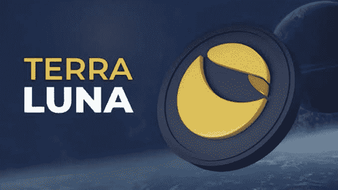
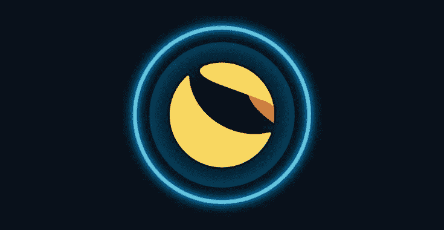

# Luna 价格预测—2023 年的预期| Luna 会再次达到 1 美元吗？

> 原文：<https://medium.com/coinmonks/luna-price-prediction-what-to-expect-in-2023-will-luna-reach-1-again-c5b74def234b?source=collection_archive---------11----------------------->

由于 Luna coin 的崩溃，它已经获得了很大的牵引力，许多投资者仍然相信它会复苏，而一些人对 luna coin 失去了希望

卢纳硬币崩溃影响了加密市场，首席执行官和整个团队想挽救它稳定的硬币(UST)和重新盯住美元，他们铸造和印刷更多的卢纳来拯救 UST，但无济于事。他们救不了 UST，恢复卢娜现在是个问题。

许多投资者恳求知道 luna 的价格预测，以及一年后 luna 会再次达到 1 美元吗？这篇文章详细介绍了这些信息，请仔细阅读。

# 什么是地球露娜？

Terra 是一个区块链协议，使用固定挂钩的稳定货币来推动价格稳定的全球支付系统。根据其白皮书，Terra 将价格稳定性和法定货币的广泛采用与比特币(BTC)的审查阻力相结合，并提供快速和负担得起的结算。

Terra 上的开发始于 2018 年 1 月，其 mainnet 于 2019 年 4 月正式上线。截至 2021 年 9 月，它提供了与美元、韩元、蒙古图格里克和国际货币基金组织特别提款权货币篮子挂钩的稳定货币，并打算推出更多选项。

Terra 的原生令牌 LUNA 用于稳定协议稳定币的价格。LUNA 持有者还能够提交治理提案并进行投票，这赋予了它治理令牌的功能。

# Terra Luna 价格预测 2022–2031

2022 — $0.000227

2023 — $0.000293

2024 — $0.000302

2025 — $0.000389

2026 — $0.000367

2027 — $0.000478

2028 — $0.000632

2029 — $0.000791

2030 — $0.000876

2031 — $0.00104

# Luna 会再次达到 1 美元吗？

露娜团队正在考虑如何让露娜康复，但另一方面，他们能让露娜康复吗？这是非常困难的，因为它需要公众和财政的大量关注来推动这个项目。

团队需要社区再次信任他们，给他们第二次机会，但是由于巨大的资金损失和生命损失，社区已经厌倦了这个项目。

Luna 对其投资者造成了更大的伤害，由于某些原因，再次投资 [luna](https://coinmarketcap.com/currencies/terra-luna) 不值得，luna 可能无法达到 1 美元，请参见下面视频中的原因。

【https://youtu.be/INMET47vWuE 号

**亦读；** [月神币崩溃——月神币会恢复吗？](/coinmonks/luna-coin-crash-will-luna-coin-recover-1dc8933155bc?source=your_stories_page-------------------------------------)

# 最终想法

月神令牌和 UST 是相互依赖的，因为 Terra 生态系统的成功是采用 UST 作为稳定令牌的结果。露娜支持 UST，当对 UST 的需求上升时，她被烧伤了。随着哥伦布-5 这样的升级，LUNA 的供应从长远来看可能会变得高度通缩。

另一方面，如果 UST 被认为不稳定，卢娜的价值也会降低。虫洞黑客入侵后，UST 暂时失去了它的联系，导致卢娜的价格暂时暴跌。

请注意，这不是一条投资建议，bulliscoming 的同事都不是财务顾问。

**加入群组获取更多更新**

 [## 加密门户社区

### 欢迎来到加密门户社区。我们在这里下车👇-加密新闻和更新⛅-CRYPTO 宝石和信号🚥-已验证&…

t.me](https://t.me/+6ek5FpdVW89jNjE0) 

> 加入 Coinmonks [电报频道](https://t.me/coincodecap)和 [Youtube 频道](https://www.youtube.com/c/coinmonks/videos)了解加密交易和投资

# 另外，阅读

*   [如何购买 Monero](https://coincodecap.com/buy-monero) | [IDEX 评论](https://coincodecap.com/idex-review) | [BitKan 交易机器人](https://coincodecap.com/bitkan-trading-bot)
*   [CoinDCX 评论](/coinmonks/coindcx-review-8444db3621a2) | [加密保证金交易交易所](https://coincodecap.com/crypto-margin-trading-exchanges)
*   [红狗赌场评论](https://coincodecap.com/red-dog-casino-review) | [Swyftx 评论](https://coincodecap.com/swyftx-review) | [CoinGate 评论](https://coincodecap.com/coingate-review)
*   [Bookmap 评论](https://coincodecap.com/bookmap-review-2021-best-trading-software) | [美国 5 大最佳加密交易所](https://coincodecap.com/crypto-exchange-usa)
*   [如何在 FTX 交易所交易期货](https://coincodecap.com/ftx-futures-trading) | [OKEx vs 币安](https://coincodecap.com/okex-vs-binance)
*   [CoinLoan 审核](https://coincodecap.com/coinloan-review) | [YouHodler 审核](/coinmonks/youhodler-4-easy-ways-to-make-money-98969b9689f2) | [BlockFi 审核](https://coincodecap.com/blockfi-review)
*   XT.COM 评论 | [币安评论](https://coincodecap.com/xt-com-review)