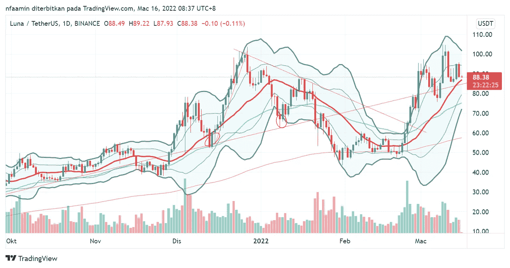
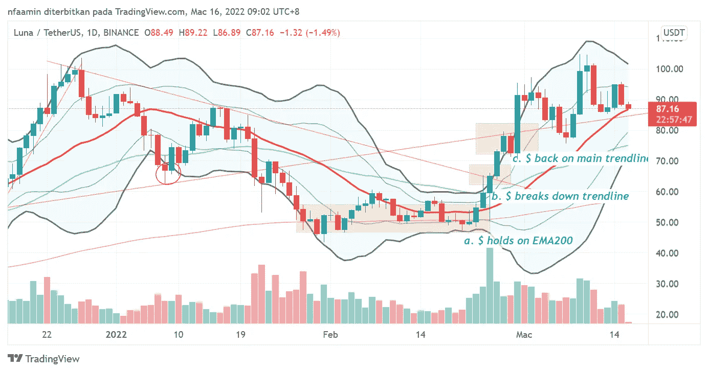
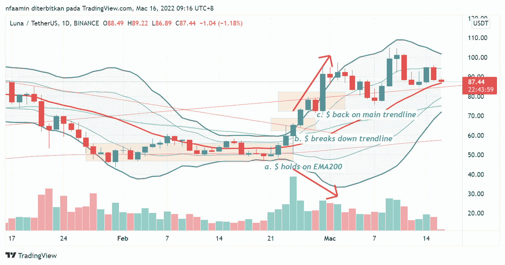
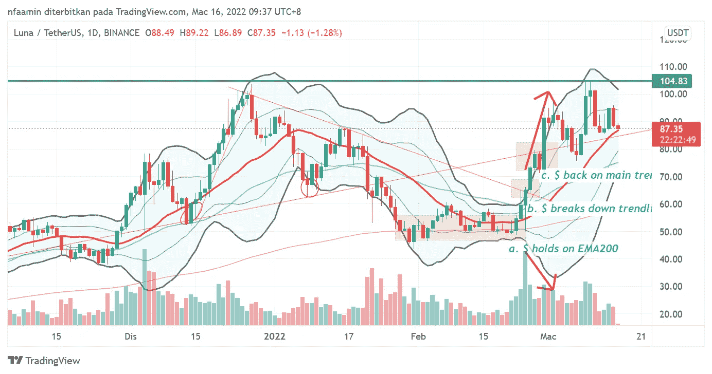

# 如何交易$LUNA

> 原文：<https://medium.com/coinmonks/luna-price-update-363f7c4c2afb?source=collection_archive---------44----------------------->

我第一次开始分享关于$LUNA [在这里](/@farhanaamin/simplest-way-to-trade-luna-7c434b8eb791)。这篇文章的主要目的是谈论**趋势线**。我在一月份开始写，然后在二月份写了一篇后续文章。2 个月后，我仍然在这里根据绘制的趋势线更新图表。关注我获取更多图表分析。

> 我必须提醒你，这不是财务建议。这里分享的一切只为教育。在投资任何硬币/代币之前，一定要做好自己的研究。根据你的个人情况，这对 DYOR 很重要。

使用 1 月 1 日绘制的相同趋势线，我只是将其延伸到最新的价格走势。让我们开始吧。

> 如果我们很快看到反弹，我个人会把价格目标定在下跌趋势线上。但是如果美元不能保持在 EMA200 以上，我就不会碰它。如果失去 EMA200 的支持，它可能会继续下跌。

这是我在二月份的评论。我在 2 月份画了下降趋势线，因为$LUNA 正在形成更低的高点和更低的低点。当然，如果它打破了下降趋势线，向上移动是可以看到的。这已经发生了。

让我们仔细看看日线图。

为了更好地解释这一点，我把它分成几部分。

a)**价格维持在 EMA200** (粉线)支撑位将近一个月。**体积**在此期间**变小**。价格**动作**也变得**不那么波动**。如果你观察布林线**和**，它会变得**更窄**。通常这是突破的信号，但是我们永远不知道美元是会上涨还是下跌。所以总是最好将**设置止损**在布林带下轨附近！记得要 ***管理好自己的风险。***

b)当美元突破布林带上轨时，我们现在可以确认这是一个**上行突破**。一旦突破下降趋势线，美元反弹到主趋势线，因为这是下一个要测试的阻力。

c)**主趋势线现在是阻力**。$设法在第二次移动时打破它。但是成交量和$在这里显示出背离。请参考下表中的箭头。

**$在向上移动，但是音量在减小**。这是一个**看跌背离**。上涨几天后，美元回落到 3 月 7 日的趋势线。证实了之前的看跌背离。$设法抓住趋势线作为支撑，反弹到新的 ATH。

请注意:

1.  如果美元未能打破新 ATH，这可能是一个双顶。绿线现在是$LUNA 的当前阻力。
2.  $ **需要守住主趋势线作为支撑**。如果失败，你需要寻找手表的下一个支持。大约是 75-78 美元。
3.  **布林线**再次变窄**。这意味着价格将会暴涨。但是向哪个方向呢？**
4.  **$是**以上**均**EMA 50**&**EMA 200**。这很好。这是看涨的。**
5.  **您需要观察**高/低或低高/低**的形成，以检查趋势线是否仍然有效。**

**记住，DYOR。我在这里分享我的分析只是为了教育。如果这对你有任何好处，请点击 ***按钮*** 。如果你有什么要补充/询问/讨论的，请评论。我很乐意整天谈论图表！**

****关注我**获取更多分析！**

> **加入 Coinmonks [电报频道](https://t.me/coincodecap)和 [Youtube 频道](https://www.youtube.com/c/coinmonks/videos)了解加密交易和投资**

# **另外，阅读**

*   **[OKEx vs KuCoin](https://coincodecap.com/okex-kucoin) | [摄氏替代品](https://coincodecap.com/celsius-alternatives) | [如何购买 VeChain](https://coincodecap.com/buy-vechain)**
*   **[币安期货交易](https://coincodecap.com/binance-futures-trading)|[3 commas vs Mudrex vs eToro](https://coincodecap.com/mudrex-3commas-etoro)**
*   **[如何购买 Monero](https://coincodecap.com/buy-monero) | [IDEX 评论](https://coincodecap.com/idex-review) | [BitKan 交易机器人](https://coincodecap.com/bitkan-trading-bot)**
*   **[CoinDCX 评论](/coinmonks/coindcx-review-8444db3621a2) | [加密保证金交易交易所](https://coincodecap.com/crypto-margin-trading-exchanges)**
*   **[红狗赌场评论](https://coincodecap.com/red-dog-casino-review) | [Swyftx 评论](https://coincodecap.com/swyftx-review) | [CoinGate 评论](https://coincodecap.com/coingate-review)**
*   **[Bookmap 点评](https://coincodecap.com/bookmap-review-2021-best-trading-software) | [美国 5 大最佳加密交易所](https://coincodecap.com/crypto-exchange-usa)**