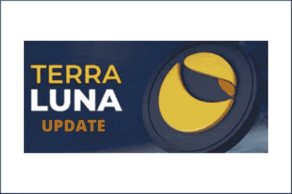
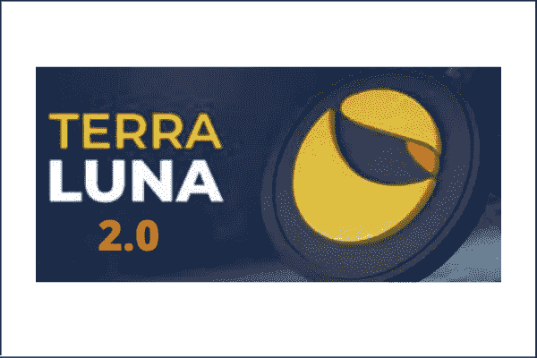

# 月球更新:拯救地球生态系统的计划

> 原文：<https://medium.com/coinmonks/luna-update-the-rescue-plan-for-the-terra-ecosystem-8a176c8acd41?source=collection_archive---------54----------------------->

过去几周(2022 年 5 月)，加密领域遭遇了有史以来最大的惨败。

我们目睹了地球生态系统的崩溃，它把稳定的 UST 拖了出来。

*的确，强大的是如何倒下的！*

除了剥夺投资者一生的积蓄之外，它还让许多人猜测 Terra 生态系统是一去不复返了，还是还有希望。

这篇文章将让你了解道权和他的团队正在采取的步骤，以确保他们重新站起来。

*阅读愉快！*

# Terra 2.0:露娜当前更新

Terra 的团队已经提出了一个治理提案 [(Prop。【1623 年为新区块链。](https://agora.terra.money/t/terra-ecosystem-revival-plan-2-amended/18498)

现在，一个 ***【新区块链】*** 并不是指现有链条的一个[加密货币叉](https://www.nigeriabitcoincommunity.com/cryptocurrency-fork/)。

相反，它指的是创造一个全新的链条。

“叉子”的事情是，新链追溯其历史到原始链。

但 Terra 2.0 不会。

如果合适。1623 上线，我们将有一个全新的区块链，将从创世纪块 0 创建。

没有过去的历史将与以前的链共享。

这个新区块链将是 Terra，并将拥有 Luna(露娜)作为它的象征。它将不会与任何稳定之地联系在一起。

旧区块链现在将是 Terra Classic，它的标志将是 Luna Classic (LUNC)。它将保持地球生态系统的稳定。

由于 Terra 是一个新的链，来自 Terra Classic 的 DApps 将不得不迁移到新的链。

最流行的 DApps 如[光谱协议](https://twitter.com/SpecProtocol/status/1528772120926629889?cxt=HHwWgsDRpZ2JpbcqAAAA)、 [Astroport](https://astroport.medium.com/astroport-terra-2-0-a-new-path-forward-b7b328171e4b) 、 [Prism 协议](https://mobile.twitter.com/prism_protocol?lang=en)、 [Stader labs](https://twitter.com/staderlabs?lang=en) 等。已经表示支持迁移到 Terra 2.0。

让我们看看 Terra 2.0 计划如果最终通过将如何执行。

向下滚动。

# 这将如何工作？

建议新的 LUNA 代币将按以下比例空投给 LUNC 持有者、赌注者、剩余 UST 持有者和 Terra Classis 上的基本应用程序开发者:

# DApps 开发者

将迁移到 Terra 2.0 的 DApps 开发人员将收到以下内容:

*   **紧急分配:**总供应量的 0.5%
*   这将在网络发布后立即提供，以便在他们开发产品时为跑道提供资金。
*   *注意，如果产品在一年后没有推出，资金将被退回。*
*   **开发商调整计划:**总供应量的 1.5%
*   生活在 Terra Classic 的协议团队将会分配这些资源
*   这将由攻击前快照的最后 30 天 TVL 加权，即 1 年悬崖，此后 3 年归属。
*   *将为 TVL 不适用的应用程序提供便利。*
*   **开发商开采计划:**总供应量的 8%
*   重要的应用程序开发人员将从采矿项目收益中获利
*   这将与 4 年内每个季度的 TVL 量成比例。

# LUNA 令牌分发

*   **社区池:** 30%
*   **攻击前月神持有者:** 35%
*   **攻击前 aUST 持有者:** 10%
*   攻击后月神持有者: 10%
*   **袭击后 UST 持有者:** 15%

***注:***

*   ***攻击前快照将在 Terra Classic block 7544910(2022 . 05 . 07 23:00:04+08:00)***

*   ****约 30%的代币将在创世纪发行，而剩余的 70%将在 2-4 年内授予，有 6 个月的悬崖*** 。 ***这个要看你的钱包大小。****
*   ****查看*** [***此处***](https://agora.terra.money/t/terra-ecosystem-revival-plan-2-amended/18498) ***了解更多关于*** 的详细信息*

*但是…*

*   *这个团队能完成这件事吗？*
*   *这个计划对泰拉链的复兴有希望吗？*
*   *这会安抚那些获得 rekt 的投资者吗？*

*请在下面的部分找到我对这些问题的看法。*

# *我对 Terra 2.0 的看法:是还是不是？*

*首先，我想明确地声明，这里所说的任何观点都仅仅是“我的观点”。*

*它不应该以任何方式被误解为一条财务建议。*

*金融咨询还不是我专业投资组合的一部分。*

*好的……空气清除了！我来说说我对 Terra 2.0 的看法。*

*我仍然属于那种认为 Terra 团队是:*

*   *要么还是迷茫*
*   *或者只是做个鬼脸，看起来正在做些什么来挽回局面*

*请听我解释。*

# *月神硬币燃烧地址特技*

*事情是这样的:在 2022 年 5 月 21 日[,应社区的请求，道权发布了一个 LUNA 钱包地址](https://twitter.com/stablekwon/status/1528004028851859456),以发送他们的令牌供焚烧。*

*这是为了减少 LUNA 在流通中的数量，帮助挽救这一局面。*

*但是在 2022 年 5 月 23 日的，他又回来说社区应该停止这样做。*

**喜欢:**

**‘你怎么能公布一个硬币焚烧地址，然后两天后又出来说，除非你想丢掉代币，否则没有必要把代币送到那里？’**

*除此之外，他还加了一个相邻的注释，即***’…。希望没有任何混乱。****

*光是这一行为就已经造成了混乱。*

*当被问及为什么要发出这封邮件时，他得到的答复是，这是为了[***‘信息目的****’，因为社区一直在要求这封邮件。*](https://twitter.com/joshuahitchiker/status/1528565403613425664)*

*我的意思是:为什么首先公布地址，然后又收回呢？*

*它就像社区*(就像饥饿的狗)*被扔了一块骨头，等待合适的狗粮*(在这种情况下，一个持久的解决方案)*出现。*

# *分配计划*

*查看分配计划，其中规定只有 30%将在 genesis 上解锁，其余的将在 2-4 年内完成。*

*这间接意味着投资者将在 2-4 年内收回大部分资金。*

*对我来说，这有点不公平。*

*生命因此而丧失，许多仍然活着的人失去了他们一生的积蓄。*

**都是因为什么？他们带着 Terra vision 跑。**

*别误会我的意思。*

*我知道投资的黄金法则是，我们应该只投资我们愿意失去的东西。*

*但是这里的指责应该更多地指向 Terra 团队，因为他们的行动有点太晚了。*

*他们一直告诉社区说“一切都很好”，直到事态失控。*

*就在那时，团队从沉睡中醒来，以纠正已经奄奄一息的局面。*

*所以，对我来说，第一步是尽快拿回投资者的资金。*

# *还有更多吗？*

*新闻报道，韩国警方已经将 Terra 实验室置于他们的监视之下。*

*现在，失败的项目已经成为一个需要调查的罪行。*

*嗯……除非 Terra 的计划中出现更多的消息和明确性，否则对我来说这是一个否定。*

*对我来说，未选中的框仍然很多。*

**现在，到最后一部分了！**

# *结论*

*现在你有了 Terra/Luna 传奇的更新！*

*希望你喜欢阅读它？*

*从目前[的统计数据来看](https://station.terra.money/proposal/1623) (25/05/2022)，社区似乎肯定了这个提议。*

*你可以从我的想法中推断出，我仍然不清楚车队的前进方向。*

*我猜这又是一场我们不得不坐以待毙的比赛。*

*但是无论 Terra/Luna 之路通向何方，我都会不断更新最新的信息。*

*请在下面的评论区让我知道你的想法。我会留意的。*

*最后，如果你使用下面你最喜欢的*社交媒体按钮来分享这篇文章，我会非常感激。**

**在我的下一篇文章中再见！**

*你也可以看看这些:*

*   *[加密市场崩盘传奇:幕后要点](https://www.nigeriabitcoincommunity.com/crypto-crash/)*
*   *[熊市:塞翁失马焉知非福(如何在熊市中茁壮成长)](https://www.nigeriabitcoincommunity.com/bull-bear-markets/)*

**原载于*[*https://www.nigeriabitcoincommunity.com*](https://www.nigeriabitcoincommunity.com/luna-update/)*

> *加入 Coinmonks [电报频道](https://t.me/coincodecap)和 [Youtube 频道](https://www.youtube.com/c/coinmonks/videos)了解加密交易和投资*

# *另外，阅读*

*   *[Bookmap 评论](https://coincodecap.com/bookmap-review-2021-best-trading-software) | [美国 5 大最佳加密交易所](https://coincodecap.com/crypto-exchange-usa)*
*   *最佳加密[硬件钱包](/coinmonks/hardware-wallets-dfa1211730c6) | [Bitbns 评论](/coinmonks/bitbns-review-38256a07e161)*
*   *[新加坡十大最佳加密交易所](https://coincodecap.com/crypto-exchange-in-singapore) | [收购 AXS](https://coincodecap.com/buy-axs-token)*
*   *[红狗赌场评论](https://coincodecap.com/red-dog-casino-review) | [Swyftx 评论](https://coincodecap.com/swyftx-review) | [CoinGate 评论](https://coincodecap.com/coingate-review)*
*   *[投资印度的最佳加密软件](https://coincodecap.com/best-crypto-to-invest-in-india-in-2021)|[WazirX P2P](https://coincodecap.com/wazirx-p2p)|[Hi Dollar Review](https://coincodecap.com/hi-dollar-review)*