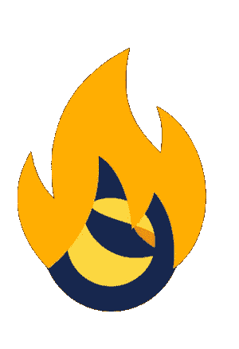

# 卢纳伯恩

> 原文：<https://medium.com/coinmonks/lunaburn-65e63f45f58e?source=collection_archive---------39----------------------->

我创造 LunaBurn 只是为了烧死 Luna。我不想再看着并等待道权做正确的事。在我看来，烧掉露娜是唯一的办法。也许你想支持我的这个项目，并进一步扩大它。在 pinksale 上，你可以找到一个公平的启动代币销售，为 pancakeswap 上的流动性池筹集流动性。所有资金和代币都将进入资金池，锁定 10 年。

预售:[https://www . pink Sale . finance/launch pad/0x 8554 fbf 2 bb 8d 6 a 87 e2c 0528946699 DD 5 C3 fa 7230？chain=BSC](https://www.pinksale.finance/launchpad/0x8554fBf2bb8d6A87E2C0528946699DD5c3fa7230?chain=BSC)

卢纳伯恩税:12%

在 BUSD 的 5% →归你
5% →归营销钱包，我用它从币安买 Luna，寄到 Burning 地址(terra 1 sk 06 e 3 dye xuq 4 shw 77y 3 dsv 480 XV 42 MQ 73 anxu)。我计划每周日都这样做。
2% →流动性池

LunaBurn 的合同地址:0 xf 97 b 87 cc 3 f 9 ed 7 C1 F3 de 5 fa 41 CAC 055 e 095 aa 3a 4

营销钱包地址:0x 79736755 b 02 F9 b 2504 b 2e 9 f 70 c 47 f 75 ce 3c e7a 05

所有募集资金将在 DEX 上市时添加。我不会保留任何代币，也不会从预售中收取任何款项。我正在筹集流动资金。

#燃烧的月亮

 [## 卢纳伯恩

### 月神之火:月神之火是一个令牌，它的唯一目的是燃烧月神。代币背后没有公司，没有大…

www.reddit.com](https://www.reddit.com/r/LunaBurn/) 

【https://twitter.com/DennisB200792 

> 加入 Coinmonks [电报频道](https://t.me/coincodecap)和 [Youtube 频道](https://www.youtube.com/c/coinmonks/videos)了解加密交易和投资

# 另外，阅读

*   [如何在印度购买比特币？](/coinmonks/buy-bitcoin-in-india-feb50ddfef94) | [WazirX 审查](/coinmonks/wazirx-review-5c811b074f5b)
*   [CryptoHopper 替代品](/coinmonks/cryptohopper-alternatives-d67287b16d27) | [HitBTC 审查](/coinmonks/hitbtc-review-c5143c5d53c2)
*   [CBET 评论](https://coincodecap.com/cbet-casino-review) | [库科恩 vs 比特币基地](https://coincodecap.com/kucoin-vs-coinbase)
*   [折叠 App 审核](https://coincodecap.com/fold-app-review) | [Kucoin 交易机器人](/coinmonks/kucoin-trading-bot-automate-your-trades-8cf0ca2138e0) | [Probit 审核](https://coincodecap.com/probit-review)
*   [如何匿名购买比特币](https://coincodecap.com/buy-bitcoin-anonymously) | [比特币现金钱包](https://coincodecap.com/bitcoin-cash-wallets)
*   [币安 vs FTX](https://coincodecap.com/binance-vs-ftx) | [最佳(SOL)索拉纳钱包](https://coincodecap.com/solana-wallets)